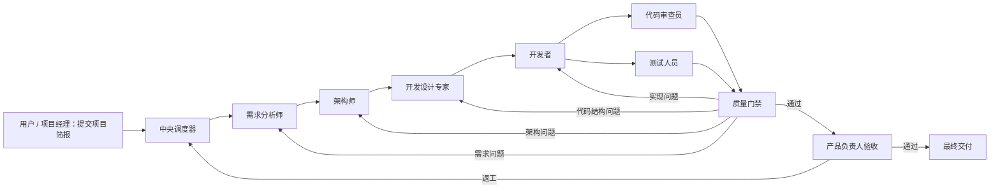

# 多 Agent 协同工具产品需求文档（PRD）

**文档版本：** V1.0 Draft  
**编写日期：** 2026-07-16  
**目标版本：** MVP  
**关联文档：** [多 Agent 协同工具市场调研与可行性报告](./多Agent协同工具市场调研与可行性报告.md)  
**文档状态：** 待产品、架构与研发联合评审

---

## 1. 文档目的

本文档把市场调研和可行性分析转化为可设计、可开发、可测试、可验收的产品需求，主要回答以下问题：

1. 用户如何创建和管理一支由多个 Agent 组成的 AI 团队；
2. 如何为每个角色独立指定职责、Skill、工具权限和大模型；
3. 多个角色如何在中央调度器控制下协同、并行、返工和恢复；
4. 角色之间如何通过结构化工件交接，而不是仅传递聊天消息；
5. 如何保证 Agent 只能使用已授权能力，并对执行过程进行隔离和审计；
6. 如何通过质量门禁确认任务真正完成，而不是由 Agent 自行宣告完成；
7. 首个“网站开发团队”模板如何从项目简报持续运行到最终交付。

本文档是产品评审、交互设计、架构设计、研发拆解、测试计划和 MVP 验收的共同依据。技术组件选型可以调整，但本文定义的产品行为、权限边界、状态语义和验收目标不应被底层框架替代。

---

## 2. 产品概述

### 2.1 产品定位

本产品是一套面向复杂任务交付的“受控 AI 团队操作系统”。用户可以配置多个 Agent 角色，每个角色具有明确职责、独立模型、限定 Skill、限定工具和结构化交付物；中央调度器根据确定性工作流组织角色执行，依据验证规则和人工审批推进、暂停或返工，直至任务满足完成条件。

产品不以“多个 Agent 自由聊天”为核心，而以以下能力为核心：

- 角色有明确责任边界；
- Skill、模型和工具权限可配置且可强制执行；
- 调度过程可恢复、可追踪、可限制；
- 中间成果是有 schema、版本和血缘的工件；
- 质量门禁可以自动验证，也可以要求人工审批；
- 失败可以定位到具体步骤、具体角色和具体工件版本；
- 用户能够看到质量、进度、成本和风险。

### 2.2 核心价值

| 价值 | 用户获得的结果 |
|---|---|
| 可组织 | 将复杂任务拆成不同专业角色，并复用团队模板 |
| 可控制 | 限制角色能看到的 Skill、能调用的工具、能访问的资源和能使用的模型 |
| 可交付 | 每个步骤产生明确、结构化、可检查的工件 |
| 可恢复 | 执行中断后从最近检查点继续，不需要重跑整条对话 |
| 可验收 | 通过 schema、规则、自动测试、评审和人工审批确认结果 |
| 可治理 | 追踪模型费用、工具调用、权限决策、变更和审批历史 |

### 2.3 首个落地场景

MVP 首先支持“网站开发团队”模板，覆盖以下业务链路：



---

## 3. 产品目标、成功标准与非目标

### 3.1 MVP 产品目标

| 编号 | 目标 | 可衡量结果 |
|---|---|---|
| OBJ-01 | 用户能够搭建受控的多角色 AI 团队 | 至少支持 7 个网站开发业务角色，角色配置可独立版本化 |
| OBJ-02 | 每个角色可使用不同大模型 | 每个角色可配置主模型、兼容备用模型、参数和预算 |
| OBJ-03 | 每个角色只能使用指定 Skill 和工具 | 未授权能力不暴露；伪造调用在网关层被拒绝并记录 |
| OBJ-04 | 调度器可靠推进复杂流程 | 支持顺序、并行、条件、返工、人工审批、暂停、恢复和取消 |
| OBJ-05 | 角色之间通过工件交付 | 需求、架构、代码骨架、代码、审查、测试、验收均有版本化工件 |
| OBJ-06 | 用户能判断任务是否真正完成 | 每个步骤有完成条件；最终交付必须通过质量门禁和产品验收 |
| OBJ-07 | 执行成本和风险可控 | 支持预算、最大步数、超时、重试、并发限制和高风险工具审批 |

### 3.2 MVP 成功指标

MVP 内测阶段使用 20–50 个真实网站开发任务进行评估，建议目标如下：

- 不少于 90% 的运行能够正确保留状态并在服务重启后恢复；
- 100% 的未授权工具调用被 Tool Gateway 拒绝并产生审计记录；
- 100% 的已接受任务具有完整工件血缘，能追踪至初始项目简报；
- 不少于 80% 的任务无需人工修复工作流状态即可进入最终验收；
- 所有自动返工均能定位目标角色和具体失败项，不出现无目标的整流程重跑；
- 用户可以按项目、运行、角色和模型查看 token、费用、耗时和失败次数；
- 代码类任务不会在未验收前直接修改权威分支或生产环境。

以上为 MVP 目标值，不代表正式商业 SLA。正式指标应在内测基线形成后重新确认。

### 3.3 MVP 非目标

以下内容不属于第一版：

- Agent 自由创建无限数量的新 Agent；
- 由 LLM 无限制动态生成和执行任意工作流；
- Skill 公共市场、付费分成和第三方开放生态；
- 跨组织 Agent 联邦或通用 A2A 网络；
- 长期人格记忆和跨项目的隐式个人记忆；
- 自动执行生产发布、付款、删库、发版等不可逆高风险操作；
- Kubernetes 多集群、百万 Agent 并发和跨地域灾备；
- 替代 Git 托管、项目管理、CI/CD 或专业测试平台的全部功能。

---

## 4. 产品原则与关键定义

### 4.1 产品原则

1. **确定性外层、智能内层：** 工作流边、状态、预算、重试和终止条件由确定性代码控制；LLM 只能在调度器允许的范围内进行分析和选择。
2. **默认拒绝：** 未明确授权的 Skill、工具、路径、域名、凭据和模型均不可使用。
3. **工件优先：** 下游角色消费已提交并通过验证的工件，不依赖完整聊天历史作为唯一事实源。
4. **提交不等于通过：** Agent 只能提交结果，不能自行将任务标记为验收通过。
5. **配置冻结：** 一次运行开始后，使用角色、Skill、模型、流程和策略的版本快照；后续发布的新版本不应静默改变运行中任务。
6. **历史不可覆盖：** 返工生成新 attempt 和新工件版本，旧结果保留用于比较、审计和回滚。
7. **最小上下文：** 每个角色只获得完成当前任务所需的工件、Skill 和工具描述。
8. **副作用可控：** 对外写入操作必须支持审批、幂等、审计和必要的补偿机制。

### 4.2 关键术语

| 术语 | 定义 |
|---|---|
| Agent | 一次具体执行中的智能执行单元，由角色版本、Skill 集、模型策略、能力策略和任务上下文实例化 |
| Role | 可复用的角色定义，包含职责、边界、输入输出契约和可承接任务类型 |
| Skill | 版本化的知识、方法、规范、模板和检查清单；不等同于执行权限 |
| Tool | 可以产生实际动作的能力，例如文件读写、shell、浏览器、GitHub、数据库或部署接口 |
| Capability Policy | 对工具、资源、参数、路径、网络和操作级别进行限制的运行时策略 |
| Model Policy | 角色可使用的主模型、备用模型、参数、能力约束、预算和数据合规规则 |
| Workflow Template | 可版本化的工作流定义，包含节点、边、条件、并行、审批、返工和终止条件 |
| Workflow Run | 用户基于某个工作流版本启动的一次完整业务运行 |
| Task | 工作流中的一个待执行节点实例，可由 Agent、确定性程序或人工处理 |
| Attempt | Task 的一次执行尝试；重试或返工会创建新的 Attempt |
| Artifact | 角色或程序提交的结构化交付物，具有类型、schema、版本、哈希和血缘 |
| Review | 对工件或任务的自动/人工评审记录，包含检查项、证据和决策 |
| Quality Gate | 汇总多个验证结果并决定通过、返工、等待人工或失败的门禁节点 |
| Scheduler | 唯一有权创建任务、接受提交并改变工作流状态的中央调度组件 |
| Agent Runner | 在隔离环境中执行单个 Agent Attempt 的运行组件 |

### 4.3 Skill 与 Tool 的强制区分

- Skill 回答“应该怎样做”，例如如何写 PRD、如何设计 API、如何执行 OWASP 审查；
- Tool 回答“可以实际做什么”，例如读取仓库、执行测试、访问浏览器、调用 GitHub；
- Skill 中声明“需要 shell”不代表自动获得 shell 权限；
- Tool 的最终授权来自 Capability Policy 和运行时能力令牌；
- UI 必须分别展示“已绑定 Skill”和“已授权工具”，避免用户误以为绑定 Skill 就等同于授予执行权限。

---

## 5. 用户、职责与产品权限

### 5.1 产品用户类型

| 用户类型 | 主要目标 | 典型权限 |
|---|---|---|
| 平台管理员 | 维护平台安全和公共资源 | 管理模型提供商、全局工具、策略模板、租户、审计和系统配额 |
| 组织管理员 | 管理组织内团队和资源 | 管理成员、项目、组织级 Skill、模型可见范围和预算 |
| 团队设计者 | 设计可复用 AI 团队 | 创建角色、绑定 Skill/工具/模型、设计和发布工作流模板 |
| 项目负责人 | 发起任务并跟踪交付 | 创建项目、选择模板、提供输入、设置预算、暂停/取消运行、处理澄清 |
| 审批人 | 对敏感操作或阶段成果做决定 | 查看必要上下文，批准、拒绝或要求修改，不可任意改写历史结果 |
| 观察者 | 查看过程和结果 | 只读运行、工件、成本和报告；不可发起执行或审批 |

### 5.2 权限要求

#### IAM-001 组织与项目边界

- 所有角色、Skill、工作流、运行、工件和审计记录必须归属组织；
- 项目资源默认仅项目成员可见；
- 跨项目复用必须通过发布为组织级资源或显式授权实现；
- MVP 明确采用单组织私有部署，不提供共享多租户 SaaS；
- 数据模型和 API 仍保留 `tenant_id/organization_id` 边界，避免阻断后续多组织扩展；
- 后续部署扩展为中央 Scheduler、GitHub 协调仓库和多台 Docker 节点；跨节点不自建 HTTP；
- `maf/control` 是跨机器唯一事实源，中央 SQLite 是可重建投影；节点只写事件分支和任务分支；
- 节点不拥有最终调度真相，Task 分配、assignment epoch、验收和最终状态由中央 Scheduler 写入 control。

#### IAM-002 产品 RBAC

- 系统至少提供管理员、设计者、项目负责人、审批人、观察者五类权限集；
- 同一用户可以具有多个权限集；
- 所有写操作必须由后端校验权限，不能依赖前端隐藏按钮；
- 高风险配置变更必须记录变更前后值、操作者、时间和原因。

#### IAM-003 Agent 能力身份

- Agent 不继承发起人的全部权限；
- 每个 Attempt 获得短期、最小化、与 `run_id + task_id + attempt_id` 绑定的能力令牌；
- 令牌必须限制角色、工具、资源范围、有效期和最大调用次数；
- Attempt 终止、取消或超时后，令牌立即失效。

#### IAM-004 审批职责分离

- 提交某工件的 Agent 不得作为该工件的最终验收者；
- 开发者与代码审查员应使用不同的角色实例；
- 产品验收默认由独立产品负责人或人工审批人执行；
- 对审批人不足的场景，系统应明确标记“非独立审批”，不得伪装为职责已分离。

---

## 6. 核心用户流程

### 6.1 首次配置流程

1. 平台管理员配置可用模型提供商和模型目录；
2. 平台管理员或组织管理员注册 Tool/MCP 服务并定义基础策略；
3. 团队设计者创建或导入 Skill，测试后发布 Skill 版本；
4. 团队设计者创建角色，填写职责、边界、输入输出并绑定 Skill；
5. 团队设计者为角色指定 Model Policy 和 Capability Policy；
6. 团队设计者在工作流设计器中连接角色、验证器、并行节点、质量门禁和审批节点；
7. 系统执行静态检查和试运行；
8. 设计者发布工作流版本，供项目负责人选择。

### 6.2 项目运行流程

1. 项目负责人创建项目并选择已发布的工作流版本；
2. 填写项目简报、验收目标、代码仓库、预算和截止条件；
3. 系统执行启动前检查，生成不可变运行快照；
4. Scheduler 创建首批可执行任务；
5. Agent Runner 按角色配置执行任务并提交工件；
6. Scheduler 执行 schema、规则、测试和审批门禁；
7. 通过则推进下游任务；失败则按原因路由到负责角色返工；
8. 遇到歧义、高风险操作或预算不足时暂停并请求人工处理；
9. 最终验收通过后，系统生成交付包和运行总结；
10. 项目负责人下载、导出或将结果合并到目标仓库。

### 6.3 运行恢复流程

1. 系统在每个任务状态变化、工件提交和外部副作用前后保存 checkpoint；
2. 服务重启后，Scheduler 读取未结束运行及租约状态；
3. 已提交但未验证的任务从验证阶段继续；
4. 正在执行且租约过期的任务进入可恢复状态，依据幂等策略重试；
5. 已完成的外部副作用不得因恢复而重复执行；
6. 无法自动确认的任务进入人工检查，而不是自动假定成功或失败。

---

## 7. 详细功能需求

### 7.1 项目与工作空间管理

#### PRJ-001 创建项目

项目负责人能够创建项目，并至少填写：

- 项目名称和说明；
- 业务目标和期望交付物；
- 所属组织和可见成员；
- 默认工作流模板；
- 预算上限和期望截止时间；
- 可选代码仓库、默认分支和指定 base commit；
- 数据敏感级别和允许的模型提供商范围。

**验收标准：**

- 缺少名称、目标或工作流时不能启动运行；
- 项目创建后拥有稳定 ID，名称修改不影响历史引用；
- 非项目成员无法通过 UI 或 API 读取项目工件；
- 代码仓库无法访问时应在启动前报告，不进入 Agent 执行阶段。

#### PRJ-002 项目输入资料

- 支持文本、Markdown、结构化表单和附件作为项目输入；
- 附件保存原始文件名、MIME、大小、哈希和上传者；
- 输入资料可以标记为“必须使用”“参考资料”“敏感资料”；
- 敏感资料只向明确授权的角色提供；
- 输入资料修改后产生新版本，运行中的任务仍使用启动时快照，除非由用户发起变更流程。

#### PRJ-003 项目变更请求

- 项目运行中，用户修改目标或验收标准时必须创建 `ProjectChangeRequest`；
- Scheduler 计算潜在受影响节点，要求用户确认返工范围和新增预算；
- 变更批准后生成新项目输入版本，并使受影响的已完成任务进入“待重新评估”状态；
- 禁止直接覆盖原始需求而不留下历史记录。

### 7.2 模型提供商与 Model Policy

#### MOD-001 模型提供商管理

- 首批目标模型/编码 Agent 包括 Codex、GLM、DeepSeek、MiniMax 和 Kimi Code；
- 用户自行配置模型中转服务或模型厂商连接，包括连接名称、网站/API 基础地址、协议类型、模型标识、API Key、超时和可见范围；
- 优先通过 OpenAI-compatible 等通用协议适配；对协议不兼容的目标模型提供独立 Provider Adapter；
- “连接”和“模型”分开管理：一个中转连接可以登记多个模型，一个角色绑定准确的连接与模型组合；
- 凭据存入服务端密钥存储，不在前端、Prompt、日志和工件中返回明文；
- 提供连接测试，区分鉴权失败、模型不存在、限流、超时和网络错误；
- 连接测试还应验证工具调用、结构化输出、上下文长度等角色所需能力，不能只验证 HTTP 可达；
- 禁用连接后，新任务不可使用，运行中任务按其 fallback 规则处理。

#### MOD-002 模型目录与能力矩阵

每个模型记录以下能力：

- 上下文长度和最大输出；
- 是否支持工具调用、结构化输出、视觉输入和流式响应；
- 输入/输出价格或自定义计费方式；
- 数据区域、保留策略和合规标签；
- 推荐任务类型和已知限制；
- 平台兼容状态：未验证、已验证、受限、已禁用。

系统不得仅根据模型名称推测关键能力；管理员可以修正能力配置，并通过 contract test 验证。

#### MOD-003 角色级模型策略

每个角色版本必须绑定一个 Model Policy，至少包含：

- 主模型；
- 0–7 个有优先级的备用模型；
- temperature、top_p、最大输出 token 等允许参数；
- 单次 Attempt、单 Task、单 Run 的 token 和金额上限；
- 调用超时、最大重试次数和并发限制；
- 必需能力，例如 tool calling 或严格结构化输出；
- 允许传输的数据敏感级别和提供商区域；
- fallback 触发错误范围。

#### MOD-004 模型 fallback

- 仅对超时、限流、服务不可用等可重试错误执行 fallback；
- 鉴权失败、策略拒绝、上下文含禁止数据、schema 持续不兼容时不得静默 fallback；
- 备用模型必须满足角色要求的能力和合规标签；
- 每次切换记录原模型、目标模型、原因、重试次数和成本；
- fallback 后仍需通过相同输出 schema 和质量门禁。

#### MOD-005 预算控制

- 运行启动时预估预算并提示风险；
- 达到 80% 时在控制台显示预警；
- 达到硬上限时停止创建新的模型调用，运行进入 `WAITING_HUMAN`；
- 用户可以追加预算、终止运行或要求使用更低成本模型继续；
- 预算调整产生审计记录，不修改已发生费用。

**本模块验收标准：**

- 两个不同角色可在同一次运行中实际使用两个不同模型；
- 主模型模拟 429 后，兼容备用模型按策略接管；
- 未满足视觉或结构化输出能力的模型不能绑定到有该要求的角色；
- 超预算后不再发生新的模型费用，除非审批人明确追加预算。

### 7.3 Skill Registry

#### SKL-001 创建与导入 Skill

- 支持从表单创建或从包含 `SKILL.md` 的目录/压缩包导入；
- Skill 至少包含名称、说明、适用场景、正文、owner、版本和可见范围；
- 可包含模板、示例、参考资料、脚本和测试数据；
- 导入时检查路径穿越、绝对路径、符号链接逃逸、超大文件和不允许的可执行文件；
- 导入不会自动发布，也不会自动给任何角色授权。

#### SKL-002 Skill 生命周期

Skill 版本状态为：

```text
DRAFT → TESTING → PUBLISHED → DEPRECATED → ARCHIVED
```

- 已发布版本内容不可原地修改；
- 修改必须创建新版本；
- Deprecated 版本可供历史运行恢复，但新角色默认不可绑定；
- Archived 版本不在普通选择器中出现，但历史工件和运行仍可解析；
- 发布和废弃必须记录操作者、原因和测试结果。

#### SKL-003 Role-Skill 强绑定

- Role Version 通过 `RoleSkillBinding` 绑定准确的 Skill 版本和内容哈希；
- 支持“必需”和“可选启用”两类绑定；
- Agent 只能看到当前 Role Version 已绑定 Skill 的元数据；
- Agent 请求读取正文时，服务端再次检查 role、task、skill version 和内容哈希；
- 未绑定的 Skill 即使存在于同一组织或工作区，也不能被搜索或读取；
- 删除前端配置或伪造 `read_skill` 参数不能绕过服务端检查。

#### SKL-004 渐进式加载

- 初始 Prompt 只注入 Skill 名称、简介和适用条件，避免一次性占满上下文；
- Agent 确认需要时再读取正文或指定参考文件；
- 每次读取记录 Skill 版本、文件路径、内容哈希和消耗 token；
- Skill 内相对路径只能解析到该 Skill 包边界内；
- Skill 内容被裁剪或无法读取时必须向 Agent 明示，禁止假装已加载。

#### SKL-005 Skill 依赖与兼容性

- Skill 可以声明依赖 Skill、最低平台版本、支持模型能力和所需 Tool 类型；
- 发布前检测循环依赖和缺失依赖；
- Skill 所需 Tool 不在角色权限中时，角色配置显示冲突，但不能自动扩权；
- 工作流发布前必须解决所有必需依赖和权限冲突。

#### SKL-006 Skill 评测

- 每个 Skill 版本可关联测试集、期望输出 schema 和评分规则；
- 支持比较不同模型与 Skill 版本组合的成功率、成本和耗时；
- 新版本低于组织设置的质量阈值时不能直接替换生产版本；
- 运行结果可作为评测样本，但包含敏感数据时需脱敏或取得授权。

**本模块验收标准：**

- 角色 A 绑定 Skill 1、角色 B 绑定 Skill 2 时，A 无法列出或读取 Skill 2；
- Skill 新版本发布后，已启动运行继续使用旧版本快照；
- 包含 `../` 或越界符号链接的 Skill 导入被拒绝；
- Skill 声明 shell 依赖但角色未授权 shell 时，发布检查明确失败且不会自动授予。

### 7.4 Tool Registry 与 Capability Policy

#### TOL-001 工具注册

- 支持原生工具、HTTP/OpenAPI 工具和 MCP 工具；
- 保存工具名称、说明、输入 JSON Schema、输出 schema、风险等级、owner 和版本；
- MCP 工具可通过 `tools/list` 同步，但同步结果需审核后才对角色可用；
- 工具 schema 变化后生成新版本或兼容性警告；
- 已禁用工具不得用于新 Attempt。

#### TOL-002 工具风险分级

| 等级 | 定义 | 默认处理 |
|---|---|---|
| R0 只读低风险 | 读取授权资料、查询状态 | 可按策略自动执行 |
| R1 可逆写入 | 写入隔离工作区、创建草稿 | 记录审计，可配置审批 |
| R2 外部副作用 | 发消息、提交 PR、修改共享系统 | 默认需要审批或严格幂等 |
| R3 高风险不可逆 | 生产发布、付款、删除生产数据 | MVP 禁用 |

#### TOL-003 能力策略

Capability Policy 至少支持以下限制维度：

- 允许/拒绝的工具和工具版本；
- 允许的文件根目录、读写模式和文件类型；
- 允许访问的域名、HTTP 方法和网络协议；
- 允许的数据库、schema、表和操作类型；
- 允许的代码仓库、分支和 Git 操作；
- 参数范围、单次调用数据量、调用频率和总次数；
- 风险等级对应的人工审批要求；
- 当前项目、任务、角色、时间、环境和数据敏感级别。

策略采用 default-deny：没有匹配的 Allow 决策即拒绝。

#### TOL-004 双层强制

- Agent Runner 只向模型发送已授权工具的 schema；
- Tool Gateway 在每次执行前独立验证能力令牌和参数；
- 即使模型伪造工具名或直接调用 Tool Gateway，也必须被拒绝；
- 权限拒绝以结构化错误返回，且不能泄露工具是否属于其他项目或角色；
- 所有允许和拒绝决策都记录策略版本、输入上下文和决策结果。

#### TOL-005 凭据代理

- Agent 不直接获取长期 API Key、数据库密码或 SSH Key；
- Tool Gateway 根据授权在服务端注入凭据并代执行；
- 日志和模型上下文自动脱敏常见密钥格式；
- 凭据轮换不要求修改 Role 或 Skill；
- 凭据访问记录可按项目和工具审计。

#### TOL-006 人工审批

- 审批卡片显示调用目的、工具、关键参数、影响资源、风险等级和发起角色；
- 审批人可以批准一次、拒绝或在允许范围内修改参数；
- 批准只对当前 `attempt_id + tool_call_id` 有效，不能成为永久授权；
- 审批超时按策略拒绝或保持等待，不能默认通过；
- 参数发生实质变化后必须重新评估策略，必要时重新审批。

**本模块验收标准：**

- 模型上下文中不存在未授权工具 schema；
- 手工构造未授权调用返回策略拒绝，实际工具未被执行；
- 代码角色只能写入隔离工作区，不能写入主工作区；
- R2 工具在未批准前不产生外部副作用；
- 审计日志不出现明文凭据。

### 7.5 Role Registry

#### ROL-001 创建角色

角色定义至少包含：

- 名称、说明、业务目标；
- 职责范围和明确禁止事项；
- 系统指令模板；
- 可承接的任务类型；
- 必需输入工件类型；
- 允许输出工件类型及 schema；
- Skill 绑定；
- Model Policy；
- Capability Policy；
- 默认超时、最大步骤和最大返工次数；
- owner、审批人、可见范围和标签。

#### ROL-002 角色版本

- 角色状态支持 Draft、Published、Deprecated、Archived；
- 已发布角色修改时创建新版本；
- Role Version 固定引用 Skill、Model Policy 和 Capability Policy 的具体版本；
- 已运行的 Role Version 不可删除，只能归档；
- UI 可比较两个角色版本的职责、Skill、模型和权限差异。

#### ROL-003 职责边界校验

- 工作流发布时检查相邻角色的输入输出类型是否兼容；
- 角色输出 schema 不满足下游输入时禁止发布；
- 同一角色同时承担提交与最终审批时显示职责冲突；
- 角色没有任何 Skill 可以允许，但必须显式确认；
- 角色没有工具时默认为纯推理角色，不自动提供文件或网络访问。

#### ROL-004 角色试运行

- 设计者可使用样例输入对单个角色试运行；
- 试运行使用独立预算、隔离工作区和非生产凭据；
- 系统展示最终 Prompt 构成、Skill 加载、工具暴露、模型调用和 schema 校验结果；
- 试运行通过不等于角色自动发布。

**本模块验收标准：**

- 同一工作流的五个角色可以绑定五个不同模型；
- 角色版本升级不改变历史运行和正在运行的任务；
- 输入输出不兼容的角色连接无法发布；
- 纯推理角色无法因模型自行请求而获得 shell 或网络工具。

### 7.6 Workflow Designer 与版本管理

#### WFL-001 节点类型

MVP 至少支持：

| 节点 | 用途 |
|---|---|
| Start | 定义运行入口和必填输入 |
| Agent Task | 由指定 Role Version 执行 |
| Deterministic Function | 执行 schema 转换、计算、规则或集成代码 |
| Parallel Split/Join | 并行启动多分支并按策略汇总 |
| Condition | 根据结构化数据和规则选择允许的下一条边 |
| Quality Gate | 汇总验证、Review 和测试结果做门禁决策 |
| Human Approval | 暂停并等待指定审批人处理 |
| Rework Router | 根据失败类别返回指定上游节点 |
| End | 定义成功、失败或取消的终态及交付清单 |

#### WFL-002 边与条件

- 每条边包含来源、目标、触发条件、优先级和上下文映射；
- 条件优先使用结构化表达式，不依赖自由文本模糊匹配；
- LLM 路由只能从静态声明的候选边中选择；
- 候选边为空或输出无效时进入异常处理，不允许跳到任意节点；
- 多条条件同时满足时按明确优先级或并行规则处理。

#### WFL-003 并行与汇合

- 支持等待全部、满足任意、达到 N 个成功三种 Join 策略；
- 网站模板中的代码审查和功能测试使用“等待全部”；
- 某分支失败时，其他分支结果仍保留；
- Join 节点明确处理成功、失败、取消和超时分支；
- 并行数量受运行和组织并发配额限制。

#### WFL-004 返工配置

- 每个验证失败类型配置目标节点、携带工件、最大次数和升级策略；
- 返工必须创建新 Task Attempt，不覆盖原结果；
- 返工上下文包含具体失败项、证据、受影响工件和期望修复标准；
- 达到最大返工次数后进入人工处理或失败终态；
- 禁止没有退出条件的返工环。

#### WFL-005 工作流静态校验

发布前必须检查：

- 存在且仅存在一个有效 Start；
- 至少有一个可达 End；
- 不存在不可达节点；
- 所有循环均有次数、预算或人工退出条件；
- 上下游工件类型和 schema 兼容；
- 角色、Skill、模型、工具策略均为可用版本；
- 所有并行分支有明确汇合或终止语义；
- 所有高风险工具存在审批节点或被禁用；
- 所有必需输入能够从项目输入或上游工件获得。

#### WFL-006 版本、发布与回滚

- Draft 工作流可以编辑和试运行；
- Published 版本不可原地修改；
- 新版本可从旧版本复制，并展示节点和配置差异；
- 新运行默认使用最新已发布版本，用户也可选择允许使用的旧版本；
- 运行中不自动升级工作流；
- 回滚是将旧版本重新设为默认，不删除新版本。

**本模块验收标准：**

- 用户能在 UI 中创建顺序、并行、条件、返工和人工审批流程；
- 含无限循环、孤立节点或 schema 不匹配的工作流不能发布；
- 修改已发布模板后会产生新版本；
- 运行详情能显示实际使用的完整工作流版本快照。

### 7.7 Scheduler 与运行控制

#### SCH-001 唯一状态控制权

- 只有 Scheduler 可以创建正式 Task、改变 Task/Run 状态、接受工件和推进工作流；
- Agent、模型、Tool、前端均不能直接写入终态；
- 所有状态转换经过统一状态机校验；
- 非法或重复状态事件被拒绝并记录。

#### SCH-002 运行启动前检查

启动前检查至少包括：

- 项目必填输入完整；
- 工作流、角色、Skill、Policy 和模型版本可用；
- 模型连接和 Tool 依赖可用；
- 预算、并发和存储配额满足最低要求；
- 代码仓库及 base commit 可读取；
- 必需审批人存在；
- 数据合规规则与模型提供商兼容。

检查失败时返回逐项错误，运行保持 Draft，不消耗模型费用。

#### SCH-003 运行快照

启动时生成不可变快照，包含：

- 工作流图及版本；
- 所有 Role Version；
- Skill 版本与内容哈希；
- Model/Capability Policy 版本；
- 项目输入版本；
- 预算、超时、并发和终止条件；
- 代码仓库 base commit；
- 发起人和启动时间。

#### SCH-004 Git 任务分配与 fencing

- Scheduler 仅派发依赖已满足的 Task；
- Scheduler 将功能级任务写入受保护的 `maf/control`；
- 节点通过 `maf/node/<node-id>` 提交认领申请，不直接修改 control；
- 接受申请时生成 `assignment_id` 和递增 `assignment_epoch`；
- 节点必须 fetch 到 control 确认分配后才能开始；
- 进度和提交事件必须携带 epoch 与 based-on control commit；
- 超时重新分配时 epoch 递增，旧节点不得覆盖新结果；
- 重复 event_id 不得造成重复状态转换或外部副作用。

#### SCH-005 暂停、恢复与取消

- 用户可以请求暂停运行；系统停止创建新任务，已执行到安全点的 Attempt 保存状态；
- 等待审批、等待用户澄清、预算不足可以自动暂停；
- 恢复前重新检查依赖、配额、凭据和版本可用性；
- 取消后在 control 中取消未执行任务；活动节点下一次 fetch 后停止；
- 已产生的工件、费用和审计记录保留；
- 取消不自动回滚外部副作用，应显示补偿建议或状态。

#### SCH-006 完成判定

运行成功必须同时满足：

- 到达 Success End 节点；
- 所有必需 Task 均为 Accepted；
- 所有必需工件存在且通过 schema 验证；
- 质量门禁和产品验收通过；
- 没有未处理的高风险审批或阻断缺陷；
- 交付清单生成成功。

Agent 说“已完成”只能作为提交摘要，不能触发运行成功。

#### SCH-007 防失控限制

- 每个 Run 配置最大 Task 数、最大模型调用数、最大工具调用数、最大返工总数、最长运行时间和硬预算；
- 达到软阈值产生告警；
- 达到硬阈值停止继续调度并等待人工处理；
- Scheduler 检测重复输出哈希、重复失败原因和无进展循环；
- 同一阻断原因连续出现三次时，标记为 `BLOCKED_CANDIDATE` 并要求审计，不继续盲目重试。

### 7.8 Task、Attempt 与 Agent Runner

#### RUN-001 Task 输入包

Scheduler 为 Task 生成最小输入包，包含：

- 任务目标、完成条件和禁止事项；
- 当前 Role Version；
- 允许的 Skill 元数据；
- 已授权 Tool schema；
- 上游已接受工件的必要字段或引用；
- 返工原因和验证证据（如适用）；
- 预算、超时、最大步骤和输出 schema；
- 当前项目与隔离工作区信息。

不应默认把整个运行聊天记录发送给所有角色。

#### RUN-002 Agent 执行循环

- Agent 在限定步骤数内进行模型调用、Skill 读取和 Tool 调用；
- 每一步记录模型、输入摘要、输出摘要、工具调用和 token；
- 上下文接近限制时按策略压缩，但必须保持工具调用与结果的原子配对；
- 孤立、缺失或重复的 tool result 不进入后续模型上下文；
- 截断发生时向模型明确说明已丢弃的内容范围；
- Agent 可以请求澄清、提交工件或报告阻断，不可自行改变流程图。

#### RUN-003 结构化提交

Agent 提交必须包含：

- 输出工件及类型；
- 执行摘要；
- 使用的输入工件版本；
- 自检清单；
- 已知风险和未解决问题；
- 测试或验证证据；
- 建议的下一步，但建议不具有调度权。

缺少必填字段时，提交保持 Draft 或被验证器拒绝。

#### RUN-004 Attempt 生命周期

```text
CREATED → ASSIGNED → PREPARING → RUNNING → SUBMITTED → VALIDATING
                                                   ├→ ACCEPTED
                                                   ├→ REWORK_REQUIRED
                                                   ├→ WAITING_HUMAN
                                                   └→ FAILED / CANCELLED
```

- 系统重试创建新的 Attempt 或明确递增 attempt number；
- 同一 Attempt 的事件必须幂等；
- 失败记录标准错误码、阶段、可重试性和诊断信息；
- Accepted 后结果不可被 Agent 修改。

#### RUN-005 Goal 完成审计

- 对长任务可采用“两阶段完成”：首次完成请求进入 `AUDITING`，系统重新注入目标、完成条件和证据清单；
- 第二阶段由独立验证器或 Reviewer 检查证据后才进入 Accepted；
- 审计不得由原 Agent 仅凭相同自然语言声明绕过；
- 对连续相同阻断原因进行计数，达到阈值后转人工或标记 Blocked。

### 7.9 Artifact Store 与工件治理

#### ART-001 工件通用元数据

每个 Artifact 至少包含：

- `artifact_id`、`artifact_type`、`schema_version`；
- 业务版本和 Attempt 版本；
- `organization_id`、`project_id`、`run_id`、`task_id`；
- 生产者 Role/Agent/程序；
- 创建时间、内容地址、大小、MIME 和内容哈希；
- 输入工件引用和血缘关系；
- 验证状态、Review 状态和敏感级别；
- 保留策略和可见范围。

#### ART-002 工件不可变与版本化

- Submitted 工件内容不可原地覆盖；
- 修改产生新 Artifact Version；
- 相同内容可以去重存储，但业务版本和血缘仍分别记录；
- 删除操作优先采用逻辑删除并受保留策略限制；
- 历史运行必须能够定位当时使用的确切内容哈希。

#### ART-003 Schema Registry

- 每类结构化工件关联 JSON Schema、YAML schema、Pydantic/等价契约或明确验证器；
- schema 本身版本化；
- 支持向后兼容、向前兼容和破坏性变更标记；
- 工作流发布时验证上下游 schema 兼容；
- 结构化验证失败返回字段路径、期望类型和实际值摘要。

#### ART-004 工件血缘

- 能从最终交付向上追踪到代码、蓝图、架构、需求和项目简报；
- 能从某个需求项向下查看对应设计、实现、测试和验收证据；
- 返工后保留新旧分支血缘；
- UI 支持查看“由哪些输入生成”和“影响哪些下游工件”。

#### ART-005 工件验证

验证顺序建议为：

1. 文件完整性和病毒/安全扫描；
2. schema 校验；
3. 确定性业务规则；
4. 构建、测试或静态分析；
5. LLM Reviewer（如配置）；
6. 人工审批（如配置）。

任一强制步骤失败时不得进入 Accepted。

#### ART-006 交付包

最终运行生成交付清单，至少包括：

- 最终需求与验收标准；
- 架构说明、ADR 和 API 契约；
- CodebaseBlueprint 和实现计划；
- 最终代码引用、commit/patch 和构建产物；
- 代码审查报告、测试报告和产品验收报告；
- 已知问题、豁免项、成本和运行摘要；
- 每项内容的版本和哈希。

### 7.10 Review、质量门禁与人工协作

#### REV-001 Review 结构

Review 至少包含：

- 被审工件和版本；
- Reviewer 身份或角色；
- 检查清单版本；
- 每个检查项的结果：Pass、Fail、Warning、Not Applicable；
- 证据引用和问题严重级别；
- 总体决策：Approve、Reject、Request Changes；
- 时间和签名/审计信息。

#### REV-002 自动验证器

- 支持 schema、lint、单元测试、构建、依赖规则、覆盖率、安全扫描等确定性验证器；
- 验证器使用固定版本和可复现配置；
- 保存命令、环境摘要、退出码、报告和日志引用；
- 验证器失败与执行环境失败必须区分；
- 不能将“测试未运行”当作“测试通过”。

#### REV-003 LLM Reviewer

- LLM Reviewer 默认只读，不拥有被审角色的写权限；
- Reviewer 必须基于明确 rubric 和结构化输出；
- 关键结论引用具体工件位置或测试证据；
- Reviewer 输出不能替代必须执行的确定性测试；
- Reviewer 与生产者使用同模型时应标记同源风险，可配置要求不同模型。

#### REV-004 Quality Gate 决策

- Gate 按配置汇总多个 Review 和验证器；
- 阻断缺陷导致返工；非阻断缺陷可以警告通过或要求豁免；
- Gate 依据问题分类选择返工角色；
- 无法分类时进入人工分诊，不随机路由；
- 豁免必须记录审批人、理由、范围和有效期。

#### REV-005 用户澄清

- Agent 遇到关键歧义时可提交结构化 `ClarificationRequest`；
- 请求包含问题、背景、可选方案、推荐项和不回答的影响；
- Scheduler 暂停依赖该答案的分支，其他独立分支可以继续；
- 用户回复成为版本化输入工件；
- 超时处理可配置为继续使用默认假设、保持等待或取消，默认保持等待。

### 7.11 代码任务隔离与 Git 交付

#### COD-001 隔离工作区

- 每个代码 Attempt 使用 Docker 容器，并在容器挂载范围内使用独立 Git worktree/clone；
- 工作区固定到运行快照中的 base commit；
- Agent 默认不能访问宿主机其他目录、其他项目或主工作区；
- 允许按角色策略进行外网检索、读取公开文档、拉取依赖和复用外部代码/模块；
- 外网访问必须经过域名/协议策略和审计，不允许容器任意访问内网、云元数据地址或生产系统；
- 复用外部代码时必须记录来源 URL、仓库、版本/commit 和内容哈希，并执行恶意代码、依赖漏洞和密钥扫描；
- 本项目用于学习和技术试验，许可证仅作为可选备注，不参与技术选型或质量门禁；来源不明或存在安全风险的代码仍不得直接合入；
- 设置 CPU、内存、磁盘、进程数和运行时间限制。

#### COD-002 权威仓库保护

- MVP 支持 GitHub 仓库和本地 Git 仓库；
- Agent 不直接向受保护分支 push；
- Agent 在隔离区提交 patch、commit、stat、构建和测试证据；
- Scheduler 验证 base commit 未变化；
- GitHub 仓库默认由系统创建工作分支和 Pull Request；本地 Git 仓库创建受控评审分支和平台内合并评审记录；
- 代码审查、测试和产品最终评审确认功能达到目标后，才允许将 PR/评审分支合入主干；
- 只有校验和审批通过后才能创建/更新 PR 或执行合并；
- base commit 已变化时进入 rebase/revalidation 流程，不强行应用。

#### COD-003 Patch 工件

Patch 作为正式 Artifact 持久化，包含：

- base commit、target branch、commit/patch 哈希；
- 修改文件列表和 diff stat；
- 二进制文件说明；
- 构建、测试和静态分析证据；
- 提交摘要、风险和回滚说明；
- 生产者和审批记录。

#### COD-004 两阶段应用

```text
PATCH_SUBMITTED → VALIDATING → REVIEW_PENDING → ACCEPTED → APPLYING → APPLIED/MERGED
```

- 验证前不得应用；
- Accepted 不等于已经合并；
- Apply/Merge 本身使用幂等键并记录目标 commit；
- 应用失败不应丢失已接受的 Patch Artifact；
- 合并后保存最终 commit，与提交 patch 建立关联。

#### COD-005 依赖与脚本安全

- 默认禁止执行仓库中未知的安装钩子和特权脚本；
- 依赖安装和网络访问受策略控制；
- 检测到密钥、恶意路径或可疑二进制时停止并请求审查；
- 构建日志脱敏；
- MVP 不允许容器访问生产凭据。

**本模块验收标准：**

- Agent 修改只能出现在独立 worktree/容器；
- 未审批 Patch 不会改变主分支；
- 服务重启后待审 Patch 仍可查看和继续审批；
- base commit 冲突时停止应用并给出明确处理入口；
- 同一 Merge 请求重试不会生成重复提交或重复 PR。

### 7.12 运行观测、成本与审计

#### OBS-001 运行时间线

- 展示 Run、Task、Attempt 的开始、等待、提交、验证、返工和结束事件；
- 支持按角色、状态、时间和失败类型过滤；
- 并行分支在时间线上可区分；
- 用户可从事件跳转到相关工件、Review、模型调用或工具调用；
- 时间线来自后端事件，不依赖浏览器本地状态。

#### OBS-002 Trace

每次模型和工具调用记录：

- trace ID、run/task/attempt ID；
- 角色、模型或工具版本；
- 开始/结束时间、耗时、状态和重试次数；
- token、费用、缓存命中或调用次数；
- 输入输出摘要或脱敏引用；
- provider request ID；
- fallback 和策略决策信息。

#### OBS-003 成本视图

- 按组织、项目、运行、角色、任务、模型和日期统计费用；
- 区分成功调用、失败调用、重试和 fallback 费用；
- 显示预算、已用、预计剩余和超支风险；
- 价格配置变化不重写历史成本；
- 对无法获得精确 token 的提供商标记为估算值。

#### OBS-004 审计日志

必须审计：

- 登录和权限变更；
- 角色、Skill、工作流、模型和策略的发布/废弃；
- 运行启动、暂停、恢复、取消和预算调整；
- 工件提交、验证、接受、返工和豁免；
- 工具允许/拒绝、敏感操作审批；
- Patch 应用、PR 创建和合并；
- 凭据使用事件，但不记录凭据正文。

审计记录应只追加、可查询、可导出，并限制普通用户删除。

#### OBS-005 诊断视图

- 错误按用户输入、模型、工具、策略、Runner、验证器、调度器和外部依赖分类；
- 显示错误发生阶段、是否可重试、已执行重试和建议处理；
- 支持关联查看同类历史错误；
- 对用户隐藏敏感堆栈，对管理员保留脱敏诊断；
- 不以“未知错误”掩盖明确的策略拒绝、预算耗尽或 schema 错误。

### 7.13 通知与待办

#### NTF-001 待办中心

- 聚合用户澄清、工具审批、工件审批、预算追加和失败分诊；
- 显示所属项目、等待时长、风险和截止时间；
- 已处理待办保留决策历史；
- 无权限用户不能查看待办的敏感上下文。

#### NTF-002 通知渠道

- MVP 仅支持站内通知和站内待办；
- 邮件、Webhook、企业 IM 作为后续扩展，不属于首版交付；
- 支持按事件类型订阅，避免每个模型调用都发送通知；
- 通知只包含摘要和安全链接，不直接携带密钥、完整 Prompt 或敏感工件。

---

## 8. “网站开发团队”模板详细需求

### 8.1 模板输入

启动模板至少要求用户提供：

- 产品/网站名称；
- 目标用户和核心问题；
- 初始功能描述；
- 明确不做的范围；
- 期望技术栈或“由团队建议”；
- 交付形式，例如代码仓库、可运行 Demo、容器镜像；
- 质量要求，例如浏览器范围、性能、安全、可访问性；
- 预算、截止时间和人工审批人；
- 可选现有仓库、设计稿、API、数据样例和竞品资料。

若关键信息不足，需求分析师必须发起澄清，不得虚构业务关键决策。

### 8.2 角色一：需求分析师

**目标：** 将项目简报和用户补充信息转换为清晰、可追踪、可验证的需求规格。

**允许输入：**

- `ProjectBrief`；
- 用户附件和澄清回答；
- 组织级产品规范 Skill；
- 可选竞品或领域资料。

**建议 Skill：**

- 需求澄清；
- 用户故事；
- 验收标准；
- 范围管理；
- 非功能需求清单。

**建议工具权限：**

- 只读项目输入；
- 创建澄清请求；
- 写入本角色工件；
- 如允许联网，只能访问获批资料域名；
- 不允许修改代码仓库、运行 shell 或调用部署工具。

**必须输出 `RequirementsSpec`：**

- 项目背景、目标、成功指标；
- 用户角色与关键场景；
- 功能需求列表，每项具有唯一 ID；
- 用户故事和验收标准；
- 非功能需求；
- 数据与合规要求；
- 业务规则；
- 依赖、假设、风险和不在范围项；
- 需求优先级；
- 未决问题；
- 初始需求追踪矩阵。

**完成条件：**

- 所有 P0 功能都有可测试验收标准；
- 不存在互相冲突且未标记的需求；
- 关键术语定义清楚；
- 未决问题不会阻止架构设计，或已得到人工批准的假设；
- schema 验证通过；
- 产品负责人或配置的需求 Gate 通过。

### 8.3 角色二：架构师

**目标：** 将需求转化为系统级边界、关键技术决策和可验证的架构约束。

**允许输入：**

- 已接受的 `RequirementsSpec`；
- 现有系统/仓库概况；
- 组织技术标准和安全 Skill；
- 约束条件和目标部署环境。

**建议 Skill：**

- 系统架构模式；
- API 和数据架构；
- 威胁建模；
- 性能与可靠性；
- ADR 编写。

**建议工具权限：**

- 只读需求与仓库；
- 生成图表和文档；
- 可选只读依赖分析；
- 不允许实现业务代码、修改生产环境或使用生产凭据。

**必须输出 `ArchitectureSpec`：**

- 系统上下文和组件边界；
- 模块/服务职责；
- 数据模型和存储选择；
- API/事件契约；
- 身份、权限和威胁模型；
- 部署拓扑；
- 性能、可用性、可观测性方案；
- 关键依赖；
- ADR 列表；
- 需求到架构决策的追踪关系；
- 风险与待验证假设。

**完成条件：**

- 每个 P0 需求都有架构落点；
- API、数据和部署边界不互相矛盾；
- 关键非功能目标具有可测量设计；
- 安全边界和高风险依赖已说明；
- 开发设计专家可以据此创建代码结构，无需重新决定系统架构。

### 8.4 角色三：开发设计专家（Tech Lead / Codebase Designer）

**目标：** 将系统架构转换为可编译、可约束、可供多人并行实现的仓库结构和公共接口，但不完成具体业务实现。

**职责边界：**

| 角色 | 负责 | 不负责 |
|---|---|---|
| 架构师 | 系统为什么这样设计；系统、服务、数据和部署边界 | 具体仓库目录和语言级代码骨架 |
| 开发设计专家 | 架构在仓库中如何落地；模块如何依赖；接口与类型如何定义 | 具体业务规则和完整业务流程实现 |
| 开发者 | 在既定边界内实现具体业务逻辑和测试 | 未经批准修改公共接口、模块边界或架构方向 |

**允许输入：**

- `RequirementsSpec`；
- `ArchitectureSpec` 和 ADR；
- API 契约和数据模型；
- 已授权代码仓库；
- 项目技术栈、编码规范和构建规范 Skill。

**建议 Skill：**

- 代码结构设计；
- 模块边界与依赖规则；
- 接口、DTO 和领域类型设计；
- 构建、lint、测试和 CI 基础配置；
- 契约测试和架构测试。

**建议工具权限：**

- 隔离仓库读写；
- shell、构建、lint、依赖分析；
- 允许的包管理器和镜像；
- 不允许生产环境、生产凭据和受保护分支写入。

**允许执行：**

- 创建仓库目录、项目、包和模块结构；
- 定义接口、抽象类、Protocol、DTO、领域类型和错误类型；
- 创建 Controller、Service、Repository 等代码骨架；
- 配置依赖注入、模块装配、构建、lint、测试框架和 CI 基础配置；
- 编写契约测试和架构测试；
- 创建最小 stub 以保证可编译；
- 将待实现部分拆成可独立派发的开发任务；
- 对无法落地的架构提交 `ArchitectureChangeRequest`。

**禁止执行：**

- 编写具体业务规则或完整业务流程实现；
- 静默改变服务、数据库、API 或部署边界；
- 使用生产数据和凭据；
- 绕过架构师直接批准重大架构偏差；
- 创建没有关联实现任务的 TODO/stub。

**必须输出 `CodebaseBlueprint`：**

```text
CodebaseBlueprint
├── repository scaffold
├── module-boundaries.yaml
├── public interfaces and domain types
├── dependency rules
├── build/lint/test configuration
├── architecture and contract tests
├── IMPLEMENTATION_PLAN.md
└── traceability-matrix.yaml
```

**完成条件：**

1. 项目能安装依赖并完成基础构建；
2. 目录、模块和接口与架构文档一致；
3. 公共接口和数据类型有明确 schema；
4. 禁止的依赖可由静态规则或架构测试发现；
5. 每个 stub/TODO 都关联一个开发任务和需求 ID；
6. 骨架中不存在提前写入的具体业务实现；
7. 重大设计偏差已由架构师确认；
8. 多名开发者可以按模块并行实现；
9. CodebaseBlueprint、代码骨架 Patch 和构建证据均已持久化。

### 8.5 角色四：开发者

**目标：** 在已接受的 CodebaseBlueprint 和公共边界内完成具体业务实现、单元测试和必要文档。

**允许输入：**

- `RequirementsSpec`；
- `ArchitectureSpec`；
- `CodebaseBlueprint`；
- 当前实现任务；
- 已接受的代码骨架和目标 base commit；
- 编码、安全和测试 Skill。

**建议工具权限：**

- 指定模块内的隔离仓库读写；
- shell、包管理、构建、lint 和测试；
- 不允许直接修改受保护分支；
- 公共接口和模块边界文件可设为只读或变更需审批。

**必须输出：**

- 代码 Patch/commit；
- 对应需求和实现任务列表；
- 单元测试及结果；
- 构建、lint 和静态分析证据；
- 修改说明、已知风险和回滚提示；
- 对 Blueprint 的偏差说明。

**变更规则：**

- 模块内部实现调整由开发者自行完成；
- 影响公共接口、公共类型或多个模块时，提交 `CodeStructureChangeRequest` 给开发设计专家；
- 影响系统边界、技术路线、部署或关键非功能目标时，由开发设计专家升级为 `ArchitectureChangeRequest`；
- 未批准前不得将提议变更作为既定事实继续扩散。

**完成条件：**

- 当前任务的所有验收标准均有实现和测试证据；
- 相关单元测试通过；
- 项目构建成功；
- 未违反模块依赖规则；
- 无未批准的公共边界变更；
- Patch Artifact 提交完整。

### 8.6 角色五：代码审查员

**目标：** 独立检查代码正确性、安全性、可维护性、性能风险和架构一致性。

**权限：**

- 仓库和 Patch 只读；
- 允许运行静态分析、测试和只读依赖检查；
- 默认不允许修改代码；
- 与开发者分离，建议使用不同模型或至少不同上下文。

**必须输出 `CodeReviewReport`：**

- 审查范围和 base commit；
- 阻断、严重、一般、建议四级问题；
- 每个问题的文件/位置、原因、证据和建议；
- 架构/Blueprint 一致性结论；
- 安全、性能、错误处理和可维护性检查；
- 需求追踪缺口；
- Approve、Request Changes 或 Reject 决策。

**问题路由：**

- 具体业务实现问题 → 开发者；
- 公共接口、模块边界和依赖问题 → 开发设计专家；
- 系统边界或关键技术决策问题 → 架构师；
- 需求自身矛盾或缺失 → 需求分析师。

### 8.7 角色六：测试人员

**目标：** 验证最终功能是否满足需求和验收标准，并覆盖关键边界和回归风险。

**权限：**

- 测试环境、浏览器和测试命令；
- 只读需求、架构、Blueprint 和实现工件；
- 可以写测试脚本和测试报告；
- 不允许操作生产环境或篡改应用代码掩盖缺陷。

**必须输出 `TestReport`：**

- 测试环境、版本、commit 和数据；
- 需求 ID 到测试用例的映射；
- 功能、边界、错误处理和回归结果；
- 必需的兼容性、性能、安全或可访问性结果；
- 缺陷列表、严重级别、复现步骤、证据和建议路由；
- 通过率、阻断项和总体结论；
- 截图、日志、视频或报告引用。

**完成条件：**

- 所有 P0 验收标准至少有一个测试结果；
- 测试未执行项有明确原因且经过豁免；
- 阻断缺陷为零；
- 报告可以复现到准确代码和环境版本。

### 8.8 角色七：产品负责人

**目标：** 基于需求追踪矩阵和可运行结果完成业务验收，而不是只审核自然语言总结。

**权限：**

- 只读全部已接受工件；
- 访问预览环境；
- 创建验收记录和返工请求；
- 不直接修改代码或测试报告。

**必须输出 `AcceptanceReport`：**

- 验收范围和版本；
- 每个 P0/P1 需求的验收结果；
- 代码审查和测试报告结论；
- 业务流程演示结果；
- 已知问题、豁免和延期项；
- Accept、Conditional Accept 或 Reject 决策；
- 最终交付建议。

**完成条件：**

- 所有 P0 需求通过或具有明确且获批的豁免；
- 代码审查和测试质量门禁通过；
- 预览结果可访问且版本与报告一致；
- Reject 时明确指出需求 ID、证据和返工目标。

### 8.9 分层返工规则

| 失败类型 | 默认返回角色 | 必须携带的上下文 |
|---|---|---|
| 需求缺失、矛盾、验收标准不可测试 | 需求分析师 | 问题需求 ID、下游影响、澄清问题 |
| 系统边界、数据/API、部署决策错误 | 架构师 | 失败证据、受影响 ADR、非功能目标 |
| 模块结构、公共接口、依赖规则错误 | 开发设计专家 | 相关 Blueprint、文件、接口和建议约束 |
| 具体逻辑、错误处理、单元测试问题 | 开发者 | 缺陷、复现步骤、期望行为和代码位置 |
| 审查证据不足 | 代码审查员 | 缺失检查项和所需证据 |
| 测试覆盖或环境问题 | 测试人员 | 未覆盖需求、环境诊断和重跑条件 |
| 业务验收不符合预期 | Scheduler 分诊 | 验收失败项、需求 ID、现有证据 |

返工后，Scheduler 必须重新触发所有受影响的下游节点；不受影响的并行分支可以复用已接受结果，但复用决策需记录依据。

### 8.10 最终交付条件

网站开发模板只有满足以下条件才进入成功终态：

1. `RequirementsSpec`、`ArchitectureSpec`、`CodebaseBlueprint`、实现 Patch、`CodeReviewReport`、`TestReport` 和 `AcceptanceReport` 均存在；
2. 所有工件 schema 验证通过且版本血缘完整；
3. 代码可从固定 commit 构建；
4. 阻断级代码审查问题为零；
5. 阻断级测试缺陷为零；
6. 产品负责人已 Accept，或 Conditional Accept 的全部条件有责任人与期限；
7. 最终代码已应用/合并，或用户明确选择以已接受 Patch 交付；
8. 系统生成交付清单、成本摘要和已知问题清单。

---

## 9. 核心领域对象

| 对象 | 关键字段 | 关键约束 |
|---|---|---|
| Organization | id、name、quota、policy | 数据和权限最高隔离边界 |
| Project | id、organization_id、name、members、classification | 运行和工件归属项目 |
| RoleDefinition | id、name、owner、visibility | 可复用角色逻辑标识 |
| RoleVersion | role_id、version、instructions、input/output contract | Published 后不可变 |
| SkillPackage | id、name、owner、visibility | Skill 逻辑标识 |
| SkillVersion | skill_id、version、hash、status、dependencies | Published 后不可变 |
| RoleSkillBinding | role_version_id、skill_version_id、mode | 只能引用可用准确版本 |
| ToolDefinition | id、version、schema、risk_level | schema 和风险级别版本化 |
| CapabilityPolicy | id、version、rules、status | default-deny，后端执行 |
| ModelProfile | provider、model、capabilities、compliance | 不保存明文凭据 |
| ModelPolicy | primary、fallbacks、parameters、budget | fallback 必须属于兼容组 |
| WorkflowTemplate | id、name、owner | 工作流逻辑标识 |
| WorkflowVersion | graph、contracts、limits、status | Published 后不可变 |
| WorkflowRun | project、snapshot、budget、state | 引用完整运行快照 |
| Task | run、node、dependencies、state | 由 Scheduler 创建和变更 |
| Attempt | task、number、lease、runner、state | 每次执行独立记录 |
| Artifact | type、schema、version、hash、lineage | Submitted 后不可覆盖 |
| Review | artifact、reviewer、rubric、decision | 提交者不能最终自审 |
| Approval | subject、approver、decision、scope | 仅对明确对象和版本有效 |
| ToolCall | attempt、tool、arguments_hash、decision、result | 参数和结果按敏感度脱敏 |
| ModelCall | attempt、model、tokens、cost、status | 支持 fallback 链追踪 |
| AuditEvent | actor、action、resource、context、timestamp | 只追加、不可静默删除 |

### 9.1 对象关系原则

- Definition 表示长期逻辑身份，Version 表示不可变发布内容；
- Run 引用 Version 快照，不引用“最新版本”；
- Task 属于 Run 和一个工作流节点；
- Attempt 属于 Task；
- Artifact 属于具体 Attempt 或确定性节点执行；
- Review 明确绑定被审 Artifact Version；
- 最终交付由多个已接受 Artifact 组成，不复制成无法追踪来源的新文本。

---

## 10. 状态机规范

### 10.1 Workflow Run 状态

```text
DRAFT → READY → RUNNING
                  ├→ PAUSING → PAUSED → RUNNING
                  ├→ WAITING_HUMAN → RUNNING
                  ├→ COMPLETED
                  ├→ FAILED
                  └→ CANCELLING → CANCELLED
```

| 状态 | 含义 |
|---|---|
| DRAFT | 配置未完成或启动前检查未通过 |
| READY | 快照已生成，等待调度 |
| RUNNING | 至少有可执行、执行中或待验证任务 |
| PAUSING | 停止派发新任务，等待执行到安全点 |
| PAUSED | 用户主动暂停，可恢复 |
| WAITING_HUMAN | 等待澄清、审批、预算或人工分诊 |
| COMPLETED | 成功终态，完成条件全部满足 |
| FAILED | 不可恢复失败或达到失败策略 |
| CANCELLING | 正撤销租约和排队任务 |
| CANCELLED | 用户或系统取消终态 |

### 10.2 Task 状态

```text
PENDING → READY → ASSIGNED → RUNNING → SUBMITTED → VALIDATING
                                               ├→ ACCEPTED
                                               ├→ REWORK_REQUIRED → READY
                                               ├→ WAITING_HUMAN
                                               ├→ FAILED
                                               └→ CANCELLED
```

### 10.3 Artifact 状态

```text
DRAFT → SUBMITTED → VALIDATING → ACCEPTED
                         ├→ REJECTED
                         └→ CHANGES_REQUESTED → SUPERSEDED（新版本产生）
```

### 10.4 状态转换通用规则

- 所有命令携带幂等键和期望当前版本；
- 状态更新使用乐观锁或等价并发控制；
- 重复事件返回第一次处理结果，不重复产生工件或副作用；
- 状态和事件在同一事务或可靠 outbox 中持久化；
- 终态只能通过显式的新流程处理，不能回退为运行中；
- 人工修改状态必须使用专门的管理员修复操作并完整审计。

---

## 11. 异常处理、重试与恢复

### 11.1 错误分类

| 错误类型 | 示例 | 默认处理 |
|---|---|---|
| USER_INPUT | 缺少需求、仓库不可访问 | 等待用户修正，不自动重试 |
| MODEL_TRANSIENT | 429、5xx、超时 | 指数退避，按兼容组 fallback |
| MODEL_OUTPUT | schema 不合法、缺少字段 | 有限次数自我修复，仍失败则返工/人工 |
| POLICY_DENIED | 未授权工具、路径或数据 | 不重试，记录安全事件 |
| TOOL_TRANSIENT | 外部 API 暂时不可用 | 幂等前提下重试 |
| TOOL_PERMANENT | 参数错误、资源不存在 | 返回 Agent 修正或人工处理 |
| RUNNER_FAILURE | 容器崩溃、租约过期 | 从 checkpoint 创建恢复 Attempt |
| VALIDATION_FAILED | 测试失败、规则不满足 | 按问题类型返工 |
| BUDGET_EXCEEDED | 达到金额/token 上限 | WAITING_HUMAN |
| CONFLICT | base commit 变化、并发版本冲突 | 重新基线并重新验证 |
| INTERNAL | 调度器或存储异常 | 保护状态，告警，恢复后继续 |

### 11.2 重试规则

- 重试策略按模型、工具和节点分别配置；
- 只有标记为可重试且满足幂等条件的操作才能自动重试；
- 指数退避包含抖动和最大间隔；
- 每次重试记入费用和次数；
- 达到上限后执行 fallback、人工处理或失败策略；
- 业务验证失败属于返工，不应伪装成技术重试。

### 11.3 幂等要求

- 启动运行、提交工件、审批、工具副作用、应用 Patch 和发送通知均支持幂等键；
- Tool Gateway 保存外部请求与幂等键的映射；
- 外部系统不支持幂等时，系统在重试前进入人工确认；
- 重复提交相同 Artifact hash 可以返回已有提交，不创建冲突版本；
- exactly-once 无法保证时，应采用 at-least-once + 幂等/去重，不得在 UI 宣称绝对一次。

### 11.4 服务重启恢复

- Task、Attempt、checkpoint、patch、验证结果、审批和状态全部持久化；
- 临时容器可以丢失，但可从 base commit 和持久化工件重建；
- 重启后先处理租约和 in-flight 副作用，再恢复调度；
- 无法判断外部操作结果时创建人工核对待办；
- 恢复过程本身产生审计事件和指标。

---

## 12. 非功能需求

### 12.1 安全

| 编号 | 要求 |
|---|---|
| NFR-SEC-01 | 后端对所有用户和 Agent 请求执行认证与授权 |
| NFR-SEC-02 | 默认拒绝未授权 Tool、Skill、路径、网络、模型和资源访问 |
| NFR-SEC-03 | 长期凭据使用密钥管理服务加密保存，前端和 Agent 不获取明文 |
| NFR-SEC-04 | 数据传输使用 TLS；敏感数据静态加密 |
| NFR-SEC-05 | 代码执行使用非特权隔离环境，并限制文件、网络和资源 |
| NFR-SEC-06 | Prompt、日志、工件和通知执行密钥与个人信息脱敏策略 |
| NFR-SEC-07 | 依赖生成轻量复用清单；记录来源、版本、使用位置和安全扫描结果 |
| NFR-SEC-08 | 安全事件包括越权尝试、密钥检测、沙箱逃逸迹象和异常大量调用 |

### 12.2 可靠性

| 编号 | 要求 |
|---|---|
| NFR-REL-01 | Scheduler 和 Task 状态在服务重启后可恢复 |
| NFR-REL-02 | 所有关键状态转换持久化并可审计 |
| NFR-REL-03 | 队列重复投递不导致重复任务或重复副作用 |
| NFR-REL-04 | Artifact 写入采用内容哈希校验，避免静默损坏 |
| NFR-REL-05 | 运行失败不影响其他项目运行 |
| NFR-REL-06 | 模型和工具外部依赖故障具有明确的超时、熔断和恢复策略 |

MVP 建议服务目标：控制面月可用性 99.5%；已持久化运行恢复成功率 ≥99%。这不是模型提供商可用性承诺。

### 12.3 性能与容量

MVP 建议基线：

- 普通控制面读取请求 P95 ≤ 1 秒，不含模型和外部工具耗时；
- 状态变更和提交请求 P95 ≤ 2 秒，不含大文件上传；
- 运行时间线事件写入后 3 秒内可见；
- 单组织默认同时运行 10 个 Agent Attempt，可配置；
- 单个结构化工件建议 ≤10 MB，大文件走本地 ArtifactStore 文件目录；
- 单个运行支持至少 200 个 Task Attempt 和 1,000 个 trace 事件；
- 系统必须通过队列背压保护，不因瞬时大量任务耗尽 Runner。

最终容量应通过压测确认，不将建议值硬编码到领域模型。

### 12.4 可扩展性

- 模型通过 Provider Adapter 接入；
- 工具通过原生适配器、OpenAPI 或 MCP 接入；
- Scheduler 不依赖某一个 Agent 框架的私有状态作为唯一真相源；
- Artifact schema 可增加新类型；
- 工作流节点采用可扩展类型注册机制；
- Agent Runtime 可先支持一种实现，但对上层暴露稳定执行协议。

### 12.5 可观测性

- 全链路使用统一 trace ID；
- 提供队列积压、运行成功率、任务耗时、模型错误率、工具拒绝率、返工率和成本指标；
- 日志为结构化日志并包含关联 ID；
- 敏感正文默认不进入普通日志；
- 支持按运行导出诊断包，导出前执行脱敏。

### 12.6 可用性与可访问性

- 关键操作提供清晰的状态和下一步，不要求用户理解底层 Agent 框架；
- 破坏性操作二次确认；
- 错误消息区分“用户需要做什么”和“管理员诊断信息”；
- 流程图之外提供列表/键盘可操作视图；
- MVP 目标符合 WCAG 2.1 AA 的关键路径要求；
- 时间、费用和 token 显示单位明确。

### 12.7 数据保留与合规

- 组织可配置运行、日志、工件和审计的保留周期；
- 审计记录保留周期不得短于组织安全要求；
- 删除项目时异步清理关联数据，并保留法律/审计需要的最小记录；
- 模型调用前根据数据分类检查提供商和区域；
- 用户能够查看某工件被发送给过哪些模型和工具；
- 禁止将客户数据默认用于公共评测集或训练用途。

---

## 13. 前端信息架构与页面需求

### 13.1 控制台首页

- 显示运行中、等待人工、失败和最近完成项目；
- 显示本周期费用、预算预警和 Runner/模型健康状态；
- 显示当前用户待办；
- 提供创建项目和进入团队设计器的入口。

### 13.2 角色管理页

- 角色列表、状态、版本、owner 和最近使用情况；
- 角色编辑分为职责、输入输出、Skill、模型、工具权限、限制和测试七个区域；
- 同屏显示 Skill 与 Tool 的区别和权限冲突；
- 提供版本对比、试运行、发布、废弃和复制；
- 发布前展示静态检查结果。

### 13.3 Skill 管理页

- 上传/创建、文件树预览、依赖、版本、测试和使用方；
- 显示哪些角色绑定当前版本；
- 显示需要但未授权的工具声明；
- 支持版本 diff、发布和回滚默认版本；
- 对危险路径、脚本和敏感内容给出阻断或警告。

### 13.4 模型与工具管理页

- 模型连接健康、能力矩阵、价格和合规标签；
- Tool/MCP 列表、schema、风险等级和最近调用；
- 策略模拟：输入角色、任务和参数，查看 Allow/Deny 及原因；
- 凭据仅显示引用和轮换状态，不显示明文；
- 支持禁用和影响范围分析。

### 13.5 工作流设计器

- 拖拽添加节点和连接边；
- 节点配置角色版本、输入映射、输出契约、超时、重试和预算；
- 条件和返工路由使用结构化编辑器；
- 图上显示 schema 不匹配、不可达节点、无限循环和缺失权限；
- 提供试运行、版本 diff、发布和从模板复制；
- 保存 Draft 时允许不完整，发布时必须全部通过校验。

### 13.6 项目运行页

至少包含以下视图：

- **概览：** 当前阶段、进度、预算、阻断和预计下一步；
- **流程图：** 节点实时状态和返工路径；
- **时间线：** 任务、模型、工具、审批和错误事件；
- **工件：** 版本、验证、Review、血缘和 diff；
- **成本：** 按角色/模型/步骤统计；
- **待办：** 澄清、审批、预算和人工分诊；
- **配置快照：** 工作流、角色、Skill、模型和策略版本；
- **运行控制：** 暂停、恢复、取消、追加预算和导出。

### 13.7 工件详情页

- 渲染结构化内容和原始文件；
- 显示生产者、输入、下游、schema、哈希和状态；
- 展示验证结果、Review 和审批；
- 支持版本比较；
- 对代码 Patch 展示 diff stat、文件 diff、测试证据和 base commit；
- 用户不能在详情页直接改写已提交工件，应通过返工创建新版本。

---

## 14. 外部接口与事件需求

### 14.1 API 基本要求

- 使用稳定资源 ID 和显式版本字段；
- 写接口支持幂等键；
- 列表接口支持分页、过滤和排序；
- 错误响应包含稳定错误码、可读信息、关联 trace ID 和可重试标记；
- 所有 API 进行组织和项目权限校验；
- 大文件通过受限流式上传 API 写入本地 ArtifactStore；
- 对外 API 不暴露服务端密钥和内部 Prompt 密文。

### 14.2 领域事件

系统至少产生以下事件：

- `workflow.run.started/paused/resumed/completed/failed/cancelled`；
- `task.created/assigned/submitted/accepted/rework_requested/failed`；
- `artifact.submitted/validated/accepted/rejected`；
- `review.completed`；
- `approval.requested/approved/rejected/expired`；
- `model.call.completed/failed/fallback`；
- `tool.call.allowed/denied/completed/failed`；
- `budget.threshold_reached/exceeded`；
- `code.patch.submitted/applied/merged/conflicted`。

事件包含 event ID、类型、时间、组织、项目、运行、主体和 schema version。事件消费方必须支持去重。

### 14.3 Webhook

- 组织可订阅允许的领域事件；
- Webhook 使用签名、重试、最大投递次数和死信记录；
- 正文仅包含必要元数据和安全链接；
- 订阅者不可通过 Webhook URL 访问未授权工件；
- MVP 可将 Webhook 作为 P1，但事件模型在 P0 中应保留。

---

## 15. MVP 优先级与版本范围

### 15.1 P0：MVP 必须完成

1. 项目、成员和基础 RBAC；
2. 模型提供商、每角色独立模型、fallback 和预算；
3. Skill 上传、版本、Role-Skill 硬绑定和渐进加载；
4. Tool Registry、角色 allowlist、后端策略校验和审批；
5. 角色版本与输入输出契约；
6. 顺序、并行、条件、返工和人工审批节点；
7. 持久化 Scheduler、Task/Attempt 状态和恢复；
8. 结构化 Artifact、schema、版本、血缘和 Review；
9. 隔离代码工作区、Patch Artifact、验证和二阶段应用；
10. 网站开发 7 角色模板及分层返工；
11. 运行时间线、成本、错误、待办和审计；
12. 暂停、恢复、取消、超时、最大步骤和硬预算。

### 15.2 P1：MVP 后优先增强

- 更完整的组织多租户、SSO 和细粒度 RBAC；
- Webhook、企业 IM 和邮件通知；
- Skill 评测中心和 A/B 对比；
- 工作流子流程和模板组合；
- 更多模型协议和模型质量路由；
- PR 自动创建、代码托管平台深度集成；
- 更强的沙箱隔离和镜像治理；
- 需求变更影响分析自动化；
- 运行级回放和时间旅行调试。

### 15.3 P2：中长期能力

- Skill/角色/流程市场；
- 跨组织 Agent 协议；
- 动态团队规模调整；
- 基于历史质量的自动模型和角色推荐；
- 多项目资源优化与组合调度；
- 私有部署、跨地域和企业合规套件。

---

## 16. 端到端验收场景

### UAT-01 多角色多模型

**前置：** 创建需求分析师、架构师、开发设计专家、开发者和测试人员，并分别绑定不同模型。  
**操作：** 启动网站开发运行并执行至测试。  
**预期：** 每个角色调用其绑定模型；Trace 可证明实际模型；任何 fallback 均符合各自策略，不共享错误的父 Agent 模型。

### UAT-02 Skill 硬隔离

**前置：** 需求分析师仅绑定需求 Skill，开发者仅绑定编码 Skill。  
**操作：** 让需求分析师尝试读取编码 Skill。  
**预期：** Skill 不出现在可发现列表；伪造读取请求被后端拒绝；产生审计记录；需求任务可以继续或按策略失败。

### UAT-03 Tool 越权阻断

**前置：** 架构师只有仓库只读权限。  
**操作：** 模型尝试写文件或执行 shell。  
**预期：** 未授权工具 schema 不暴露；伪造调用在 Tool Gateway 被拒绝；主仓库无变化；审计显示策略和拒绝原因。

### UAT-04 工作流并行与汇合

**操作：** 开发者提交实现后同时启动代码审查和功能测试。  
**预期：** 两个 Task 并行；Quality Gate 等待全部结果；其中一个失败不会删除另一个结果；Gate 按失败类型返工。

### UAT-05 开发设计专家边界

**操作：** 运行架构到 CodebaseBlueprint 阶段。  
**预期：** 产出可编译骨架、接口、依赖规则和任务清单；没有完整业务实现；每个 stub/TODO 关联实现任务；Gate 通过后才派发开发任务。

### UAT-06 分层返工

**操作：** 代码审查员报告公共接口设计错误。  
**预期：** Scheduler 返回开发设计专家，而非仅返回开发者；新 Blueprint 版本产生；受影响开发和测试节点重新执行；旧工件保留。

### UAT-07 服务重启恢复

**操作：** 在开发者已提交 Patch、尚未审批时重启服务。  
**预期：** Patch、base commit、验证结果和审批待办不丢失；恢复后从待审阶段继续；不重新执行已完成的模型和工具调用。

### UAT-08 预算硬限制

**操作：** 设置较低预算并触发多个模型调用。  
**预期：** 80% 时预警；达到硬上限后停止新模型调用并等待人工；追加预算后可恢复；费用历史准确。

### UAT-09 Patch 两阶段应用

**操作：** Agent 提交代码但 Review 未通过。  
**预期：** 主分支不变化；Review 通过并批准应用后才产生目标 commit/PR；重复应用请求不会产生重复变更。

### UAT-10 最终完成真实性

**操作：** Agent 在测试失败时声明任务已完成。  
**预期：** Run 不进入 Completed；Quality Gate 创建返工；只有所有必需工件和验收通过后才完成。

### UAT-11 配置版本冻结

**操作：** 运行中发布新版 Skill 和新版角色。  
**预期：** 当前运行继续使用旧快照；新运行默认使用新版本；两个运行的配置快照均可查看。

### UAT-12 人工澄清

**操作：** 需求分析师对关键业务规则发起澄清。  
**预期：** 依赖分支暂停；用户回答被保存为版本化输入；调度恢复；回答可追踪到后续需求和代码。

### UAT-13 模型 fallback

**操作：** 主模型返回可重试 429。  
**预期：** 系统按优先级切换兼容备用模型；记录接管原因和额外成本；输出仍通过同一 schema；鉴权失败不会被错误地无限切换。

### UAT-14 上下文完整性

**操作：** 制造超长对话和多个工具调用。  
**预期：** 工具调用与结果成组保留；孤立结果被排除；截断向 Agent 明示；关键工件引用不因聊天裁剪丢失。

### UAT-15 数据与项目隔离

**操作：** 项目 A 的 Agent 尝试读取项目 B 的文件或工件 ID。  
**预期：** 后端拒绝且不泄露资源细节；不存在跨项目数据；安全审计可查询此次尝试。

---

## 17. 数据分析与运营指标

### 17.1 产品指标

- 创建并发布的团队/工作流模板数；
- 启动运行数、完成率、取消率和人工接管率；
- 从项目创建到最终交付的周期；
- 用户重复使用同一模板的比例；
- 每个项目需要的人工澄清和审批次数。

### 17.2 质量指标

- 各节点一次通过率；
- 按角色和失败类型统计返工率；
- 最早错误来源分布：需求、架构、结构、实现、测试；
- 最终验收通过率；
- 工件 schema 失败率和需求追踪完整率；
- 模型/Skill/角色版本组合的质量得分。

### 17.3 效率与成本指标

- 每个完成项目、角色和任务的 token 与金额；
- 模型调用 P50/P95 延迟；
- Tool 调用成功率和审批等待时间；
- Runner 排队、执行和验证耗时；
- fallback 率、重试率和缓存命中率；
- 因预算上限暂停的运行比例。

### 17.4 安全指标

- Tool/Skill/资源越权拒绝次数；
- 高风险工具审批通过、拒绝和超时比例；
- 密钥或敏感信息检测次数；
- 跨项目访问尝试；
- 沙箱异常终止和资源超限次数。

所有运营分析应使用最小必要数据，不默认收集完整 Prompt 和客户工件正文。

---

## 18. 依赖、约束与风险

### 18.1 外部依赖

- 至少一个稳定的模型网关及多个模型提供商；
- SQLite（WAL）轻量数据库；
- 本地内容寻址 ArtifactStore；
- 任务队列/持久化工作流运行时；
- 容器或等价隔离执行环境；
- Git 仓库；
- Policy Engine 和 Tool/MCP Gateway；
- 可观测性基础设施。

### 18.2 关键风险与产品要求

| 风险 | 产品级要求 |
|---|---|
| 调度无限循环 | 静态循环检查、返工上限、总步数、预算和无进展检测 |
| Prompt 权限形同虚设 | schema 裁剪 + Tool Gateway 后端强制 + sandbox |
| 上游错误放大 | 每阶段工件验证、追踪矩阵和分层返工 |
| 多模型行为差异 | 能力矩阵、contract test、兼容 fallback 组 |
| 成本不可预测 | 角色/任务/运行多级预算和硬停止 |
| 代码结构漂移 | 独立开发设计专家、Blueprint、架构测试和变更审批 |
| 待审结果丢失 | Patch、base commit、验证和审批全部持久化 |
| 外部副作用重复 | 幂等键、审批、状态核对和补偿策略 |
| 外部代码风险 | 记录来源和固定版本；安全、漏洞和密钥扫描；许可证仅作可选备注 |
| 用户难以理解失败 | 标准错误分类、明确责任角色、证据和下一步操作 |

---

## 19. 建议研发里程碑

| 阶段 | 时间 | 主要交付 |
|---|---:|---|
| 技术验证 | 第 1–2 周 | 4 个角色、2 个模型、顺序链、结构化工件、基础 trace |
| 核心运行时 | 第 3–5 周 | Scheduler、状态机、队列、checkpoint、Artifact Store、恢复 |
| 权限与模型层 | 第 6–7 周 | Skill Registry、Role-Skill 绑定、Tool Gateway、Policy、预算和 fallback |
| 网站开发模板 | 第 8–9 周 | 7 个角色、Blueprint、并行审查/测试、分层返工和最终验收 |
| 控制台与观测 | 第 10–11 周 | 工作流编辑、运行时间线、工件、成本、审批和失败诊断 |
| 内测与收敛 | 第 12 周 | 20–50 个任务评测、安全测试、恢复测试和高频失败修复 |

3–5 人团队可在严格控制 P0 范围并复用底层组件的前提下尝试完成该 MVP。若同时要求完整企业多租户、SSO、复杂 RBAC 和高强度沙箱，应单独增加迭代周期。

---

## 20. 已确认的产品与部署决策

以下结论作为 MVP 需求基线；架构和研发设计必须遵守，后续调整应走需求变更流程：

1. **部署形态：** MVP 为单组织私有部署；后续为中央 Scheduler 加多台 Docker 节点。跨机器只使用 Git pull/push 和 GitHub 官方 PR 能力，不提供自建节点 HTTP。
2. **首批模型：** 目标支持 Codex、GLM、DeepSeek、MiniMax 和 Kimi Code。具体协议由模型连接适配层统一处理，并以实际连接能力测试为准。
3. **代码仓库：** MVP 支持 GitHub 和本地 Git。GitHub 使用分支与 Pull Request；本地 Git 使用受控评审分支和平台内合并评审记录。
4. **执行隔离：** Agent Runner 使用 Docker；代码任务在容器内使用独立 worktree/clone，不能直接修改权威工作区。
5. **通知渠道：** MVP 仅提供站内通知和待办，不接入邮件或企业 IM。
6. **代码交付：** 默认创建 PR/合并评审；代码审查、测试与产品最终评审确认功能达到目标后才合入主干。
7. **Artifact 精确字段：** PRD 只定义工件类型、通用元数据和业务约束；各工件的精确字段及 schema 在后续设计文档中输出。
8. **模型连接与费用：** 用户自带模型连接和 API Key，可指定中转网站/API 地址、协议和模型。平台负责安全存储、调用治理和使用量统计，不要求 MVP 统一代收模型费用。
9. **数据治理：** MVP 必须具备数据保留、审计保留和敏感数据分级的默认策略及可配置能力；具体默认期限和分级字段在设计/部署配置中确定。
10. **外网与代码复用：** 允许 Agent 外网检索并尽可能复用成熟项目、代码和模块；所有外部访问受策略和审计控制，复用内容必须保留来源、固定版本、使用位置和安全扫描证据。许可证只作可选备注，不阻断学习项目。
11. **项目性质与轻量化：** 当前项目以学习和技术尝试为目标，技术选型优先复用成熟开源项目并降低部署成本；MVP 使用 SQLite、本地 ArtifactStore、内嵌组件和少量进程，不按商业 SaaS 标准堆叠基础设施。
12. **跨节点事实源：** 受保护的 `maf/control` 分支是唯一权威状态；SQLite 只保存可从 Git 重建的查询投影。
13. **写入权：** 只有中央 Scheduler 可写 control；节点只写自己的事件分支和已分配任务分支。
14. **任务粒度：** Git 只协调功能、模块、文档和测试等粗粒度任务；模型、Tool 和 Agent 内部步骤留在节点本地。

即使当前为单组织和单控制面，核心领域模型仍应通过 Provider Adapter、Repository Adapter、Git Coordination、assignment fencing 和策略配置避免绑定单一模型厂商、单台执行机器或单一代码托管平台。

---

## 21. 总体验收定义（Definition of Done）

MVP 可以被认定为达到产品级交付，必须同时满足：

1. 用户可创建角色，并分别绑定确定版本的 Skill、Model Policy 和 Capability Policy；
2. 至少五个角色可在同一运行中使用五个不同模型；
3. 未授权 Skill 不可发现或读取，未授权 Tool 在 Runner 和 Gateway 两层均受限制；
4. 网站开发模板完整包含需求分析师、架构师、开发设计专家、开发者、代码审查员、测试人员和产品负责人；
5. 开发设计专家能够交付可编译代码骨架、公共接口、依赖规则和实现计划，并与具体开发实现分离；
6. Scheduler 支持顺序、并行、条件、返工、人工审批、暂停、恢复和取消；
7. 所有关键阶段通过版本化 Artifact 交接，且具有 schema、哈希、血缘和 Review；
8. 代码 Agent 在隔离工作区执行，未审批 Patch 不会修改权威分支；
9. 服务重启后可以恢复未结束运行和待审 Patch；
10. 运行详情可追踪角色、模型、Skill、工具、成本、错误、审批和状态变化；
11. 预算、最大步骤、超时、重试和循环上限实际生效；
12. 最终完成只能由质量门禁和产品验收共同确认，Agent 不能自行宣布成功；
13. 第 16 章 P0 端到端验收场景全部通过，且无未关闭的阻断级安全问题。

满足上述条件后，产品才具备从“多 Agent 演示”进入“可控协同交付工具”阶段的基本能力。
