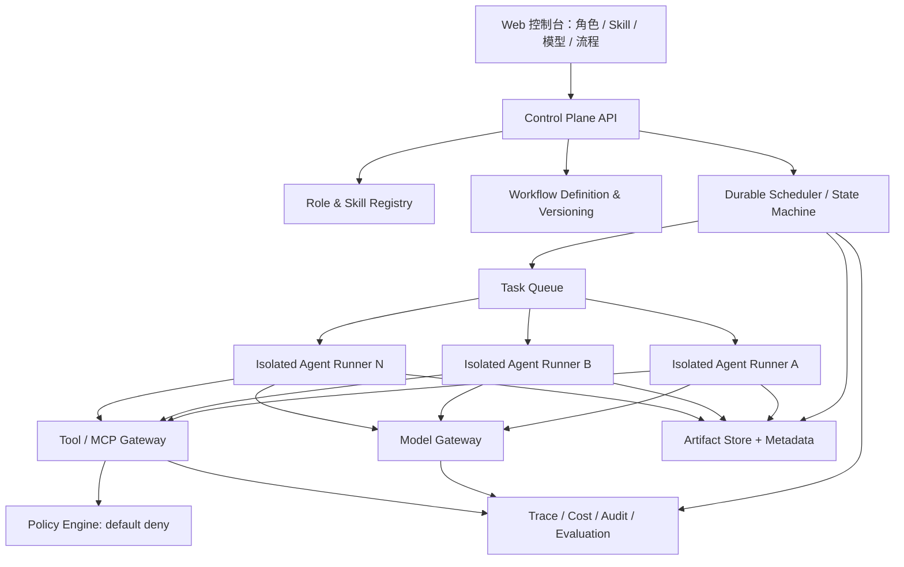
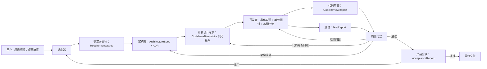

# 多 Agent 协同工具市场调研与可行性报告

**调研日期：** 2026-07-15  
**产品设想：** 用户可创建多个角色，为每个角色限定 Skill、工具和模型；由总调度器组织角色协作，以可验收的中间工件逐步完成复杂任务。

## 一、结论先行

这个想法在技术上可行，而且已有足够多的开源组件可以复用。它不是一个尚未被验证的方向，但也不是简单套一层多 Agent 聊天界面就能形成好产品。

综合判断：

- **技术可行性：高（约 8/10）**。角色、每 Agent 模型、工具调用、调度、检查点、人工审批等能力均已有成熟或接近成熟的实现。
- **产品可行性：中高（约 7/10）**。市场已有 CrewAI、LangGraph、Microsoft Agent Framework、Google ADK、Flowise、n8n 等强产品，但还没有一个产品把“角色组织设计、Skill 强约束、工件交付、质量门禁、模型成本治理”全部做得简单完整。
- **商业差异化难度：中等偏高**。如果定位成“又一个 Agent 编排器”，竞争激烈；如果定位成“面向复杂项目交付的、可治理的 AI 团队操作系统”，差异更清晰。
- **最重要的产品原则：** 工作流的骨架应由确定性代码控制，LLM 只在有限范围内做任务拆解、路由和内容生产。不能把流程正确性完全交给一个“总调度 Agent”的自由判断。

你的需求与现有产品最接近的组合是：

- **CrewAI：** 最接近“角色 + Skill + 每 Agent 模型 + 管理者调度”的概念模型。
- **LangGraph / Microsoft Agent Framework：** 最适合作为可靠、可恢复的工作流运行时参考。
- **Flowise：** 最值得借鉴可视化 Supervisor/Worker 配置体验。
- **MetaGPT：** 最值得借鉴“软件公司 SOP”和文档到代码的工件链。
- **LiteLLM + MCP + OPA：** 分别可复用为模型网关、工具接入协议和权限策略层。

建议先做一个窄而完整的 MVP：只支持“网站开发团队”模板，跑通需求分析 → 架构设计 → 开发 → 测试/代码审查 → 产品验收 → 返工闭环，再抽象成通用平台。

## 二、把需求拆成真正的系统能力

用户描述的“Skill”实际上包含两种不同东西，产品必须分开建模：

1. **知识型 Skill**：方法、规范、模板、检查清单，例如“如何写 PRD”“如何做 OWASP 审查”。本质是版本化的指令和参考资料。
2. **执行型能力（Tool）**：读写文件、调用 GitHub、执行测试、访问数据库、浏览网页、发布应用。本质是可执行权限。

这一点非常关键。CrewAI 的官方文档也明确区分：Skill 向提示词注入方法和上下文，Tool 才提供可调用动作；其 `allowed-tools` 字段仍是实验性元数据，并不会自动配置或强制工具权限。[CrewAI Skills](https://docs.crewai.com/en/concepts/skills)

因此，“Agent 只能使用指定 Skill”应被实现为四层约束，而不是一句系统提示词：

- 只向 Agent 注入已授权的 Skill 内容；
- 只向模型暴露已授权的 Tool/MCP schema；
- Tool Gateway 在执行时再次校验角色、任务、资源和参数；
- Agent 在隔离的文件系统、网络和凭据环境中运行。

仅靠 Prompt 写“禁止使用其他能力”不是安全边界。

建议把核心领域对象定义为：

| 对象 | 关键内容 |
|---|---|
| Role | 角色职责、系统指令、输入/输出契约、可接任务类型 |
| SkillPackage | `SKILL.md`、版本、依赖、参考资料、适用场景 |
| CapabilityPolicy | 允许的工具、MCP 服务、文件路径、网络域名、凭据和操作级别 |
| ModelPolicy | 主模型、备用模型、参数、预算、超时、数据合规级别 |
| WorkflowTemplate | 节点、边、并行、条件、循环、人工审批和终止条件 |
| Task | 目标、负责人、依赖、状态、尝试次数、预算和截止条件 |
| Artifact | 类型、版本、内容地址、生产者、哈希、schema、血缘关系 |
| Review | 验收规则、自动检查结果、评审意见、通过/返工决定 |

## 三、市场与开源生态扫描

### 3.1 代码优先的多 Agent 框架

#### 1. CrewAI

CrewAI 是当前与需求概念最接近的框架。Agent 原生拥有 `role`、`goal`、`llm`、`tools` 等属性，工具默认为空，并可关闭 delegation；每个 Agent 可配置不同 LLM。[CrewAI Agents](https://docs.crewai.com/en/concepts/agents) 它还原生支持文件系统 Skill 包，并区分 Agent 级与 Crew 级 Skill。[CrewAI Skills](https://docs.crewai.com/en/concepts/skills)

编排方面提供顺序流程和层级流程；层级流程中的 manager 负责规划、分派和验证，也可指定独立 `manager_llm` 或自定义 manager Agent。[CrewAI Processes](https://docs.crewai.com/en/concepts/processes)

**与目标的差异：**

- 很接近角色、Skill、模型和经理调度，但“硬权限隔离”仍需自行实现。
- 框架更偏 Python 开发者；要成为多人使用的产品，仍需补齐租户、版本管理、工件库、权限、审计、可视化流程和评测体系。
- manager 的动态决策仍有非确定性，不宜让它独占生产流程控制权。

**可复用：** Agent/Task/Crew 抽象、Skill 目录规范、顺序与层级流程、回调与 tracing 思路。适合最快验证产品概念。

#### 2. LangGraph / LangChain Multi-agent

LangGraph 更像底层的有状态图运行时，而不是现成的“虚拟公司”。它支持 orchestrator-worker、并行、路由等工作流模式，并强调 persistence、streaming 和 debugging。[LangGraph workflows and agents](https://docs.langchain.com/oss/python/langgraph/workflows-agents)

LangChain 的 subagents 模式与设想中的调度器很接近：中央 supervisor 将子 Agent 包装为工具，决定调用谁、传什么输入、如何合并输出；子 Agent 可隔离上下文并可并行执行。[LangChain Subagents](https://docs.langchain.com/oss/python/langchain/multi-agent/subagents)

LangGraph 的强项是生产可靠性：每一步保存 checkpoint，可支持人工介入、记忆、时间旅行调试和失败恢复。[LangGraph Persistence](https://docs.langchain.com/oss/python/langgraph/persistence) 它也支持对敏感工具调用进行批准、修改或拒绝，并在暂停后恢复。[LangChain Human-in-the-loop](https://docs.langchain.com/oss/python/langchain/human-in-the-loop)

**与目标的差异：**

- Role、Skill、Artifact、权限策略都需要你自己设计。
- 学习和工程门槛高于 CrewAI/Flowise，但控制力和长期可扩展性更好。
- 它提供的是运行时原语，不是完整的多 Agent 产品体验。

**可复用：** 状态图、checkpoint、interrupt、并发和 supervisor 模式。最适合成为自研产品的核心编排引擎。

#### 3. Microsoft Agent Framework（以及 AutoGen）

Microsoft Agent Framework 是 AutoGen 与 Semantic Kernel 团队的后继框架，组合了 Agent 抽象、企业中间件、会话状态、遥测以及图工作流；支持 Microsoft Foundry、Anthropic、OpenAI、Ollama 等模型提供方。官方目前仍标记为 public preview。[Microsoft Agent Framework overview](https://learn.microsoft.com/en-us/agent-framework/overview/)

其内置顺序、并行、handoff、group chat 和 Magentic manager 等多 Agent 编排模式，并支持人工批准工具。[Workflow orchestrations](https://learn.microsoft.com/en-us/agent-framework/workflows/orchestrations/) 图工作流提供类型兼容性、连通性校验、消息路由、事件流和 checkpoint 设计。[Workflow Builder](https://learn.microsoft.com/en-us/agent-framework/workflows/workflows)

AutoGen 仍拥有丰富的多 Agent Team 原语，包括 RoundRobin、Selector、MagenticOne、Swarm/Handoff；AutoGen Studio 还提供 Team Builder，可给 Agent 拖入模型和工具并设置终止条件。[AutoGen Teams](https://microsoft.github.io/autogen/stable/user-guide/agentchat-user-guide/tutorial/teams.html) [AutoGen Studio](https://microsoft.github.io/autogen/stable/user-guide/autogenstudio-user-guide/usage.html)

**与目标的差异：**

- Agent Framework 很强但仍在预览期，API 稳定性需要评估。
- AutoGen 更适合原型与研究；如果新建长期项目，应优先评估 Agent Framework 而不是深度绑定旧 AutoGen API。
- Skill 管理、工件契约和租户级强权限仍需要自建产品层。

**可复用：** 企业级中间件、类型安全工作流、事件体系、HITL，以及 AutoGen Studio 的团队编辑体验。若技术栈是 .NET/Azure，这是优先候选。

#### 4. Google Agent Development Kit（ADK）

Google ADK 是模型无关、部署无关的代码优先框架。它支持自定义函数、OpenAPI、MCP 工具、多层子 Agent，并可使用父 Agent 作为协调者；每个 Agent 可独立指定模型。[Google ADK repository](https://github.com/google/adk-python) 它还提供 Sequential、Parallel、Loop 等 Agent 类型、会话/记忆、评测、开发 UI 和 A2A 协议支持。

**与目标的差异：**

- 原生多 Agent 层级和工具生态很强，但用户定义的 Skill 产品体系与强授权层仍需自建。
- 对 Google Cloud/Gemini 最顺手，虽然框架声称模型无关，但跨提供商的能力一致性仍需逐模型测试。
- 可视化界面主要偏开发和调试，不是完整的组织/角色运营后台。

**可复用：** Agent 层级、Runner、会话/工件服务、评测、A2A 和开发 UI。

#### 5. OpenAI Agents SDK

OpenAI Agents SDK 的核心原语很精简：Agent、Tool、Handoff/Agent-as-tool、Guardrail、Session 和 tracing。Handoff 可指定目标 Agent、结构化输入、回调和输入过滤。[OpenAI Agents SDK Handoffs](https://openai.github.io/openai-agents-python/handoffs/) Agent-as-tool 则适合 manager 保持控制权并调用专家 Agent。[OpenAI Agents SDK](https://openai.github.io/openai-agents-python/)

它支持在同一工作流中按 Agent 选择不同模型或提供商，也提供第三方适配路径。[OpenAI Agents SDK Models](https://openai.github.io/openai-agents-python/models/) 其 guardrail、tracing 和 sandbox Agent 对受控执行有借鉴价值。

**与目标的差异：**

- 它是轻量 SDK，不提供开箱即用的可视化组织管理和通用 DAG 产品。
- 复杂、长时间、可恢复的业务流程仍需配合持久化工作流层。
- 跨模型功能并不天然完全一致，尤其 hosted tools、结构化输出和 provider-specific 特性。

**可复用：** Handoff、Agent-as-tool、guardrail、tracing 和简洁的 Agent 配置模型。若主要使用 OpenAI 模型，开发速度会很快。

#### 6. CAMEL

CAMEL 强调角色扮演、Agent society、Workforce、不同模型和工具的组合，适合研究大规模 Agent 协作、动态通信和多角色行为。[CAMEL repository](https://github.com/camel-ai/camel)

**与目标的差异：** 更偏研究、仿真和通用 Agent society；产品治理、可视化配置、交付工件与企业权限不是其主要优势。

**可复用：** Workforce/角色协作模式、critic/reviewer 模式和多 Agent 实验方法，不建议作为第一版产品的唯一基础。

#### 7. MetaGPT

MetaGPT 与“开发一个网站”的例子高度吻合。它内置产品经理、架构师、项目经理、工程师等角色，用 SOP 把一行需求转换为用户故事、竞品分析、需求、数据结构、API、文档和代码；其理念是 `Code = SOP(Team)`。[MetaGPT repository](https://github.com/FoundationAgents/MetaGPT)

**与目标的差异：**

- 它是面向软件开发的预设虚拟公司，而不是让普通用户自由搭建任意角色、Skill、模型和流程的平台。
- SOP 强但通用性、可视化治理、权限隔离和企业运行能力需要外层系统补齐。

**可复用：** 软件交付角色模板、SOP、工件链和“标准文档驱动下一阶段”的思想。非常适合作为首个行业模板参考，而不适合作为整个通用平台的数据模型。

### 3.2 可视化和低代码平台

#### 8. Flowise

Flowise Agentflow V2 提供显式节点编排、Supervisor/Worker 多 Agent 协作、Flow State、checkpoint、HITL 和工具执行审批。Supervisor 可分派任务给多个 Worker，Worker 结果返回 Supervisor；Agent 节点可独立选择模型。[Flowise Agentflow V2](https://docs.flowiseai.com/using-flowise/agentflowv2)

**差异与复用：** 它非常适合作为 UI/交互参考，也可用来快速做概念验证；但原生 Skill 包、强权限沙箱、工件版本与验收契约仍不完整。社区代码大部分采用 Apache 2.0，但仓库中的 enterprise 目录和明确标记文件属于商业许可，复用前必须做代码边界审查。[Flowise license](https://github.com/FlowiseAI/Flowise/blob/main/LICENSE.md)

#### 9. n8n

n8n 的 AI Agent Tool 允许主 Agent 把其他 Agent 当作工具调用，可构成多层级 supervisor，并可给子 Agent 配置职责描述、输出格式、迭代上限和 fallback 模型。[n8n AI Agent Tool](https://docs.n8n.io/integrations/builtin/cluster-nodes/sub-nodes/n8n-nodes-langchain.toolaiagent/)

**差异与复用：** n8n 的优势是大量业务系统连接器、触发器、错误处理和可视化自动化；它更像“自动化平台加 Agent”，而不是角色/Skill/工件优先的 AI 团队平台。其代码是 fair-code，采用 Sustainable Use License 与 Enterprise License，不应在未审查许可的情况下直接 fork 成竞争 SaaS。[n8n repository/license](https://github.com/n8n-io/n8n)

#### 10. Langflow

Langflow 提供模型、Agent、工具、MCP 和数据源的拖拽式编辑。一个 Agent 可切换成 Tool Mode 并连接到主 Agent，从而形成多 Agent 流；每个 Agent 可选择不同模型并只连接指定工具。[Langflow Agents](https://docs.langflow.org/agents) [Langflow agent tools](https://docs.langflow.org/1.8.0/agents-tools)

**差异与复用：** 适合快速组装和参考节点编辑器，但没有你需要的完整角色治理、Skill 生命周期和工件验收系统。项目采用 MIT License，前端/组件层复用相对友好，但仍需做依赖许可证清单。[Langflow license](https://github.com/langflow-ai/langflow/blob/main/LICENSE)

#### 11. Dify

Dify 是完整度较高的 LLM 应用平台，包含可视化 Workflow、模型管理、RAG、Agent、工具插件和自定义 Agent Strategy；插件体系可扩展模型、工具、触发器和推理策略。[Dify plugin types](https://docs.dify.ai/en/develop-plugin/getting-started/choose-plugin-type)

**差异与复用：** 更擅长构建 LLM 应用和单 Agent/工作流，原生“角色组织 + supervisor 多 Agent + Skill 强治理”不是其最清晰的中心抽象。Dify 许可证基于 Apache 2.0 但增加了多租户服务和前端标识限制；若产品计划做多租户 SaaS，直接 fork 需要商业许可评估。[Dify license](https://github.com/langgenius/dify/blob/main/LICENSE)

### 3.3 横向能力对比

说明：`强`表示原生且是主要能力；`中`表示可实现但需要配置或二次开发；`弱`表示不是产品重点。这里评价的是对本产品需求的贴合度，不是项目综合质量。

| 产品/框架 | 角色定义 | Skill 包 | 每 Agent 模型 | 调度/交接 | 持久化恢复 | 可视化 | 强权限隔离 | 最适合复用 |
|---|---:|---:|---:|---:|---:|---:|---:|---|
| CrewAI | 强 | 强 | 强 | 强 | 中 | 中/商业平台 | 中 | 角色、Skill、层级经理 |
| LangGraph | 中 | 中 | 强 | 强 | 强 | 中 | 中 | 状态图、checkpoint、HITL |
| Microsoft Agent Framework | 强 | 中 | 强 | 强 | 强 | 中 | 中 | 企业工作流、事件、类型安全 |
| AutoGen/Studio | 强 | 弱 | 强 | 强 | 中 | 强 | 中 | Team 模式、原型 UI |
| Google ADK | 强 | 中 | 强 | 强 | 中强 | 中 | 中 | Runner、层级 Agent、A2A |
| OpenAI Agents SDK | 强 | 中 | 强 | 强 | 中 | 弱 | 中强/Sandbox | Handoff、guardrail、tracing |
| Flowise | 强 | 弱 | 强 | 强 | 中强 | 强 | 中 | 可视化 Supervisor/Worker |
| n8n | 中 | 弱 | 强 | 中强 | 强 | 强 | 中 | 连接器、业务自动化 |
| Langflow | 中 | 弱 | 强 | 中 | 中 | 强 | 中 | 节点编辑器、Agent-as-tool |
| Dify | 中 | 弱 | 强 | 中 | 中强 | 强 | 中 | 模型/RAG/插件管理 |
| MetaGPT | 强/预设 | 中/预设 SOP | 中 | 强/固定 SOP | 中 | 弱 | 弱 | 软件公司模板与工件链 |

## 四、现有产品与目标产品的核心差距

### 4.1 “可配置”不等于“被强制执行”

多数框架允许给 Agent 传入一个工具列表，但这只是第一层。真正的“只能使用指定能力”还要求：

- 模型看不到未授权工具；
- 运行时拒绝越权工具调用；
- Agent 拿不到其他角色的 API key；
- 文件、网络、数据库按角色和任务隔离；
- 所有拒绝、批准和执行结果都有审计记录。

可复用 OPA 作为策略引擎，把策略决策与执行服务分开；OPA 本身正是为跨微服务、网关和 CI/CD 的 policy-as-code 设计。[Open Policy Agent](https://www.openpolicyagent.org/docs)

### 4.2 大多数框架传递“聊天消息”，而你需要传递“工件”

网站开发不是 Agent 之间聊完就结束。需求分析师应提交结构化的 `RequirementsSpec`，架构师提交 `ArchitectureSpec`，开发设计专家提交 `CodebaseBlueprint` 和可编译代码骨架，开发者提交具体实现、Git commit 与构建产物，测试人员提交 `TestReport`。每个工件都应：

- 有 schema、版本、生产者、时间和内容哈希；
- 可追踪由哪些输入工件生成；
- 可由机器验证，也可由人审核；
- 验收失败时能明确回到哪个角色和哪个版本。

“Artifact-first orchestration”会是比普通多 Agent 聊天更有价值的产品差异。

### 4.3 动态 Agent 调度不能替代业务流程引擎

建议采用混合编排：

- **确定性外层：** DAG、状态机、预算、超时、重试、并行、审批、返工和终止条件。
- **智能内层：** 调度 Agent 在允许的下一节点集合内拆任务、选专家、整理上下文和判断是否需要人工澄清。

这样既保留智能调度，又避免无限循环、重复执行、越权跳步和不可预测成本。

### 4.4 多模型只是入口，模型治理才是产品能力

每角色选模型本身容易实现，困难在于：

- 某模型是否支持 tool calling、结构化输出、视觉或超长上下文；
- 主模型失败后能否安全切换，切换后输出 schema 是否仍兼容；
- 每个角色/任务的 token、金额、并发和延迟预算；
- 数据是否允许发送到对应提供商和地区；
- 模型升级后是否破坏现有流程质量。

LiteLLM 可复用为统一模型网关：其 virtual key 可限制模型访问并追踪 key/user/team 花费，Router 支持负载均衡和 fallback。[LiteLLM Virtual Keys](https://docs.litellm.ai/docs/proxy/virtual_keys) [LiteLLM Routing](https://docs.litellm.ai/docs/routing)

### 4.5 Skill 应当是可版本化、可评测的产品资产

建议兼容 `SKILL.md` 目录格式，但平台层还要补：

- 版本、发布状态、依赖和兼容模型；
- Skill owner 和审批人；
- 可用工具声明与平台实际策略的绑定；
- 测试集和质量得分；
- 升级影响分析和回滚；
- tenant/team/role 三级可见性。

MCP 可作为工具接入标准。其工具通过 `tools/list` 动态发现、以 JSON Schema 描述输入并通过 `tools/call` 执行，适合做统一 Tool Registry；但授权和沙箱仍必须由你的平台负责。[MCP architecture](https://modelcontextprotocol.io/docs/learn/architecture)

## 五、推荐产品架构



### 5.1 控制面

- **Role & Skill Registry：** 管理角色、Skill、Prompt、工具权限、模型策略的版本。
- **Workflow Designer：** DAG 编辑器；节点可以是 Agent、确定性函数、人工审批或子流程。
- **Scheduler：** 唯一有权改变流程状态、创建任务和接受提交的组件。
- **Policy Engine：** 对 `subject-role + action + resource + context` 做 default-deny 决策。
- **Evaluation Center：** 用固定数据集对角色、Skill、模型组合做回归测试。

### 5.2 执行面

- **Agent Runner：** 每次任务生成不可变运行配置，包含准确的 Role、Skill 版本、模型和能力令牌。
- **Model Gateway：** 统一模型 API、路由、fallback、配额、成本和日志脱敏。
- **Tool/MCP Gateway：** 不把真实凭据交给 Agent；网关代执行并校验参数。
- **Sandbox：** 每个任务独立 workspace；默认无外网、最小文件权限、限制 CPU/内存/时间。
- **Artifact Store：** 大文件放对象存储，PostgreSQL 保存 schema、版本、血缘和审核状态。

### 5.3 推荐状态机

```text
DRAFT → READY → ASSIGNED → RUNNING → SUBMITTED → VALIDATING
                                             ├→ ACCEPTED
                                             ├→ REWORK_REQUIRED → ASSIGNED
                                             ├→ WAITING_HUMAN
                                             └→ FAILED / CANCELLED
```

关键规则：

- Agent 只能提交结果，不能自行把任务标成 ACCEPTED；
- Scheduler 依据 schema 校验、自动测试、review 规则或人工审批改变状态；
- 每次返工创建新的 attempt，保留旧工件，不覆盖历史；
- 所有外部副作用工具使用幂等键，避免重试造成重复发布或重复写入。

## 六、网站开发模板应如何落地

原流程建议作两项调整：

- 在架构师和开发者之间增加“开发设计专家（Tech Lead / Codebase Designer）”。架构师负责系统边界和架构决策；开发设计专家把架构转换为可编译的代码骨架、公共接口、领域类型、模块依赖规则和实现任务，但不编写具体业务实现；开发者在既定骨架内完成业务逻辑。
- 代码审查和功能测试是不同职责，应并行后汇总；产品验收应基于需求追踪矩阵，而不是只看自然语言描述。



示例角色配置：

| 角色 | Skill | 工具权限 | 输出契约 | 模型策略 |
|---|---|---|---|---|
| 需求分析师 | 需求澄清、用户故事、验收标准 | 只读输入文档、提问用户 | `requirements.yaml` + PRD | 强推理、低工具需求 |
| 架构师 | 架构模式、威胁建模、ADR | 只读需求、图表生成 | `architecture.md`、ADR、系统边界、API schema | 强推理/长上下文 |
| 开发设计专家 | 代码结构、模块边界、接口设计、依赖规则 | 架构与仓库读写、shell、构建、依赖分析 | `CodebaseBlueprint`、可编译代码骨架、实现任务清单 | 强编码/长上下文/结构化输出稳定 |
| 开发者 | 项目技术栈、编码规范、业务实现 | 既定模块内仓库读写、shell、包管理、测试 | 具体实现、commit、build、unit-test evidence | 强编码模型 |
| 代码审查员 | 安全、性能、可维护性清单 | 仓库只读、静态分析 | `code-review.json` | 强审查模型，与开发者可不同 |
| 测试人员 | 测试设计、边界与回归 | 测试环境、浏览器、测试命令 | `test-report.json`、截图/日志 | 视觉/工具调用能力较强 |
| 产品负责人 | 需求追踪与验收 | 只读所有工件、预览环境 | `acceptance-report.json` | 成本适中、结构化输出稳定 |

### 6.1 开发设计专家的职责边界

| 角色 | 负责的问题 | 不负责的内容 |
|---|---|---|
| 架构师 | 系统为什么这样设计；服务、数据、接口和部署边界是什么 | 仓库目录和具体语言级代码骨架 |
| 开发设计专家 | 架构在代码仓库中应当长什么样；模块如何依赖；开发任务如何拆分 | 具体业务规则和完整业务流程实现 |
| 开发者 | 每个接口和模块的具体业务逻辑如何实现 | 未经批准修改公共接口、模块边界或系统架构 |

开发设计专家的输入包括 `RequirementsSpec`、`ArchitectureSpec`、ADR、API 契约、数据模型、非功能要求和项目技术栈 Skill。其允许执行的工作包括：

- 创建仓库目录、项目、包和模块结构；
- 定义接口、抽象类、Protocol、DTO、领域类型和错误类型；
- 创建 Controller、Service、Repository 等层的代码骨架；
- 配置依赖注入、模块装配、构建、lint、测试框架和 CI 基础配置；
- 编写契约测试与架构测试，约束跨层和跨模块依赖；
- 把待实现部分拆成可独立派发的开发任务；
- 对无法落地或相互冲突的架构设计发起变更请求。

该角色不得编写具体业务规则、静默修改架构边界、连接生产环境或使用生产凭据。为了保证项目可编译，可以创建抛出 `NotImplementedError` 等最小 stub，但每个 stub/TODO 必须关联明确的实现任务。

### 6.2 CodebaseBlueprint 工件契约

```text
CodebaseBlueprint
├── repository scaffold
├── module-boundaries.yaml
├── public interfaces and domain types
├── dependency rules
├── build/lint/test configuration
├── architecture and contract tests
├── IMPLEMENTATION_PLAN.md
└── traceability-matrix.yaml
```

调度器只有在以下条件满足时，才把实现任务交给开发者：

1. 项目能够安装依赖并完成基础构建；
2. 目录、模块和接口与架构文档一致；
3. 公共接口和数据类型具备明确 schema；
4. 不允许的依赖可以被静态规则或架构测试发现；
5. 每个 stub/TODO 都关联一个实现任务；
6. 骨架中没有提前写入具体业务实现；
7. 架构师已确认所有重大设计偏差；
8. 多名开发者可以按模块并行实现，而不需要各自重新设计公共边界。

### 6.3 结构与架构变更控制

- 开发者发现接口不合理时，应提交 `CodeStructureChangeRequest` 给开发设计专家，不能直接修改公共边界；
- 开发设计专家发现架构无法落地时，应提交 `ArchitectureChangeRequest` 给架构师；
- 只影响模块内部实现的调整由开发者自行处理；
- 影响多个模块、公共类型、API 或数据边界的调整必须由开发设计专家批准；
- 影响系统边界、技术路线、部署或非功能目标的调整必须由架构师批准；
- 所有获批变更都产生新版本工件，并由调度器重新触发受影响节点。

## 七、建议复用什么、自己做什么

### 7.1 推荐的产品级组合

**推荐主方案：LangGraph + 自研控制面。**

- LangGraph：编排、状态、checkpoint、interrupt、并发和失败恢复；
- FastAPI/Pydantic：API 与强类型工件契约；
- PostgreSQL：元数据、任务、版本、审计；
- S3/MinIO：工件和运行日志；
- LiteLLM：多模型网关、预算、访问和 fallback；
- MCP：工具接入协议；
- OPA：运行时 capability policy；
- Docker 隔离：MVP 执行沙箱，后续再评估更强的微虚拟机隔离；
- React + React Flow：角色/工作流可视化编辑器；
- OpenTelemetry + 可选 LangSmith/Langfuse：trace 与质量分析。

该方案初期开发量高于直接套 CrewAI，但能把真正的差异化——权限、工件、状态和产品体验——掌握在自己手里。

### 7.2 快速验证方案

**CrewAI + 简单 Web UI + PostgreSQL。**

适合在 2–4 周内验证用户是否愿意配置角色、Skill 和模型，以及网站开发模板是否真的提升交付质量。验证成功后，再决定迁移到更底层的图运行时，或保留 CrewAI 作为一种执行适配器。

### 7.3 Azure/.NET 企业方案

若目标客户主要使用 Azure/.NET，可优先试用 Microsoft Agent Framework；但由于当前为 public preview，应在架构上保留 runtime adapter，避免核心领域模型依赖其具体类结构。

### 7.4 不建议直接复制的部分

- 不直接 fork Dify 做多租户 SaaS，除非已解决其许可证要求；
- 不直接 fork n8n 做竞争性自动化 SaaS，除非获得适用许可；
- 不把 MetaGPT 固定 SOP 当成通用平台内核；
- 不同时混用 CrewAI、LangGraph、AutoGen 三套编排状态，避免出现三个“谁才是调度器”的真相源。

## 八、MVP 范围与路线

### 8.1 第一版必须有

1. 一个“网站开发团队”流程模板；
2. 7 个可编辑业务角色：需求分析师、架构师、开发设计专家、开发者、代码审查员、测试人员、产品负责人；角色绑定 Skill、模型和工具 allowlist；
3. Skill 上传、版本化、启用/禁用；
4. 至少三类模型提供商或 OpenAI-compatible gateway；
5. 顺序、并行、条件、返工、人工审批五类流程控制；
6. 结构化工件与 schema 校验；
7. Docker 隔离的代码工作区和 Git commit 交付；
8. 运行时间线、每 Agent 输入/输出、工具调用、费用和错误；
9. 预算、最大步数、超时、重试和取消；
10. 需求追踪 → 架构 → CodebaseBlueprint → 实现 → 测试 → 产品验收的质量门禁。

### 8.2 第一版暂时不做

- Agent 自由创建任意新 Agent；
- 无限制动态生成工作流；
- Skill 公共市场和收益分成；
- 跨组织 Agent 网络/A2A 联邦；
- 长期人格记忆；
- Kubernetes 多集群和百万级 Agent；
- 自动生产发布、付款、删库等高风险副作用。

### 8.3 12 周参考路线

| 阶段 | 时间 | 结果 |
|---|---:|---|
| 技术验证 | 第 1–2 周 | 需求、架构、代码骨架、实现 4 个角色；2 个模型；1 条顺序链；结构化工件 |
| 核心运行时 | 第 3–5 周 | 状态机、任务队列、checkpoint、retry、artifact store |
| 权限与模型层 | 第 6–7 周 | Skill registry、Tool Gateway、sandbox、模型预算 |
| 网站开发模板 | 第 8–9 周 | 需求、架构、开发设计、实现、审查、测试、验收和分层返工闭环 |
| 控制台与观测 | 第 10–11 周 | DAG 编辑、运行时间线、成本、审批、失败诊断 |
| 内测 | 第 12 周 | 20–50 个真实任务评测、修复高频失败模式 |

一个 3–5 人的小团队可以完成上述 MVP，前提是严格控制范围并复用现有运行时、模型网关和编辑器组件。若还要同时支持企业多租户、SSO、细粒度 RBAC 和高安全代码沙箱，应额外预留至少一个迭代周期。

## 九、主要风险与应对

| 风险 | 具体表现 | 应对 |
|---|---|---|
| 调度不稳定 | 重复派工、漏步骤、无限循环 | 确定性状态机；LLM 只能从允许边中选择；全局步数/预算上限 |
| 权限越界 | Agent 调用未授权工具或读取其他项目 | default-deny、短期能力令牌、Tool Gateway、独立 sandbox |
| 上下文污染 | 前序聊天过长或错误内容影响后序 | 只传经过 schema 校验的工件；按角色裁剪上下文 |
| 错误层层放大 | 错误需求导致错误架构和代码 | 每阶段 verifier；需求追踪；返工到最早错误节点 |
| 代码结构漂移 | 开发者各自修改公共接口，最终实现偏离架构 | 独立 CodebaseBlueprint；架构测试；公共边界变更逐级审批 |
| 成本失控 | 多 Agent 互相讨论、反复 review | 分角色预算、缓存、便宜模型处理机械步骤、并发上限 |
| 质量无法衡量 | 看似完成但功能不可用 | 自动测试 + 规则 + LLM judge + 人工验收；固定回归集 |
| 模型差异 | 换模型后 tool/schema 失败 | 能力矩阵、contract tests、provider adapter、fallback 仅在兼容组内 |
| 副作用重复 | 重试导致重复发布、发信、付款 | 幂等键、审批、补偿动作；高风险操作默认禁用 |
| 许可证风险 | fork 后无法合法提供 SaaS | 首选宽松许可组件；保留 SBOM；上线前做法律审查 |

## 十、最终建议

这个产品值得做，但切入点不要是“让很多 Agent 互相聊天”，而应是：

> **用户设计一支受控的 AI 团队；每个成员有明确职责、Skill、模型、权限和交付物；调度器以可恢复流程和质量门禁推动项目完成。**

最有机会成为核心竞争力的不是 Agent 数量，而是以下五项：

1. Skill 与工具权限真正可治理、可审计；
2. 中间工件有 schema、版本、血缘和验收标准；
3. 确定性工作流与智能调度混合；
4. 多模型的质量、成本、合规和 fallback 一体化；
5. 失败能够定位、返工、恢复，而不是整条对话重新开始。

建议下一步直接产出四份设计资产，再进入编码：

- MVP 产品需求文档（PRD）；
- 核心领域模型和数据库 ERD；
- 工作流/任务/工件状态机规范；
- 网站开发模板的角色、Skill、输入输出 schema 与验收规则。

这四份资产能够验证产品边界，也能直接作为第一支 Agent 团队自身的“设计输入”。
