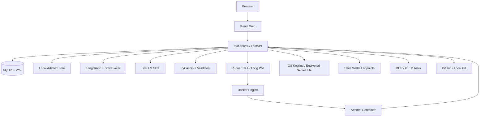
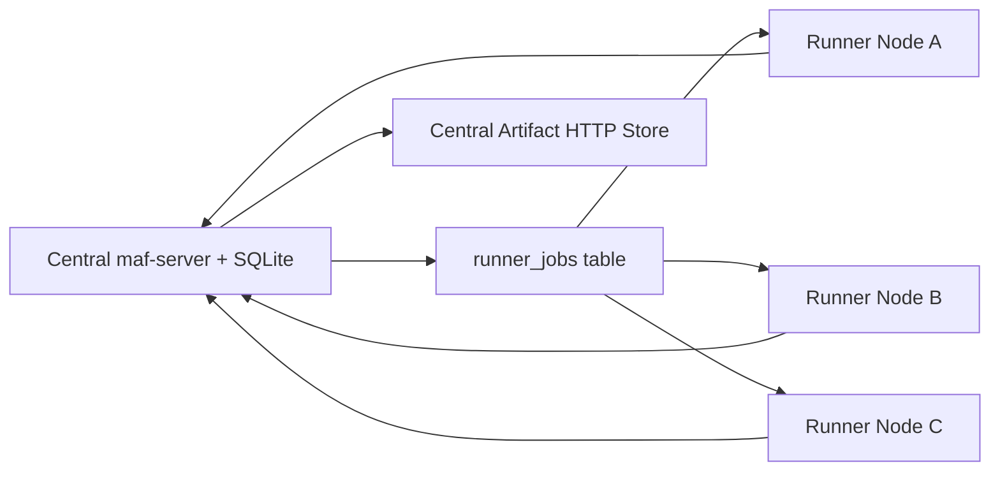
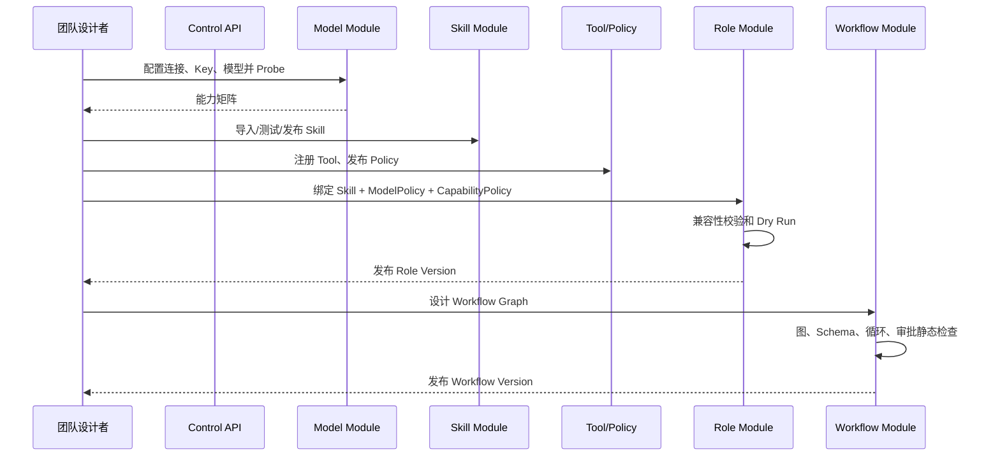
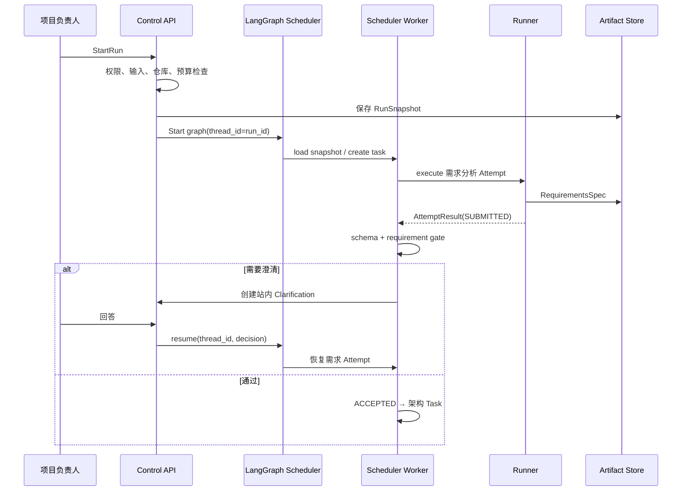
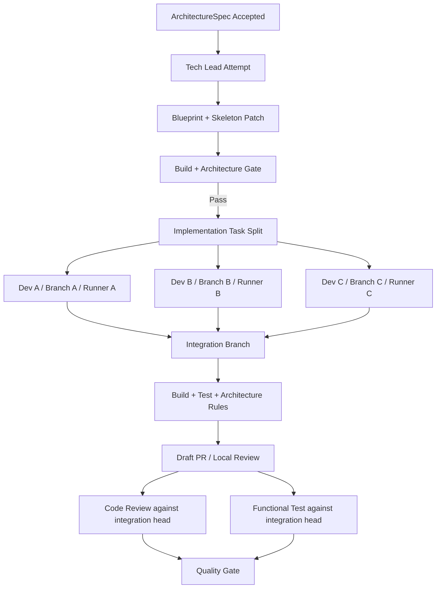
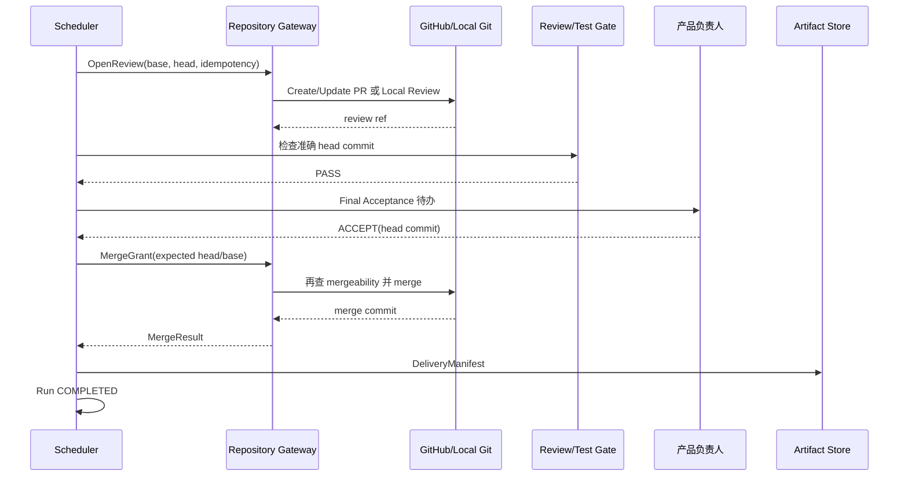

# 多 Agent 协同工具系统设计文档

**文档版本：** V1.1 Lightweight Draft  
**编写日期：** 2026-07-16  
**设计目标：** MVP 可实施，并可平滑演进到多机分布式 Runner  
**上游文档：** [产品需求文档（PRD）](./多Agent协同工具产品需求文档-PRD.md)  
**上游文档：** [需求分析文档](./多Agent协同工具需求分析文档.md)  
**参考文档：** [市场调研与可行性报告](./多Agent协同工具市场调研与可行性报告.md)  
**文档状态：** 待架构、研发、安全、测试联合评审

---

## 1. 设计目标与边界

### 1.1 设计目标

本设计需要同时满足以下目标：

1. 用户可为不同角色配置不同 Skill、模型连接、模型、工具权限和运行限制；
2. Skill 和 Tool 权限由后端强制执行，不能仅依赖 Prompt；
3. 中央 Scheduler 以持久化状态机组织顺序、并行、条件、返工、审批和终止；
4. Agent 通过结构化 Artifact 交接，所有工件具有版本、schema、哈希和血缘；
5. 代码 Agent 在 Docker 隔离环境和独立 Git 分支/worktree 中执行；
6. GitHub 使用 Pull Request，本地 Git 使用平台内合并评审，最终评审后才合入主干；
7. MVP 为单组织私有部署，后续支持多台 Runner 机器并行执行；
8. 首批接入 Codex、GLM、DeepSeek、MiniMax、Kimi Code 或其用户配置的中转服务；
9. 支持外网检索和外部代码复用，同时记录来源、固定版本并执行漏洞、恶意代码和密钥扫描；
10. 服务重启、Runner 宕机、消息重复和外部调用超时后可以安全恢复；
11. 提供足够明确的接口、数据字段、代码结构和伪代码，供研发直接拆分任务。

### 1.2 明确不做

- MVP 不做共享多租户 SaaS；
- MVP 不接入邮件、短信或企业 IM，只做站内通知；
- MVP 不让 Agent 自由创建新 Agent 或动态生成无限工作流；
- MVP 不允许自动操作生产发布、付款或删除生产数据；
- MVP 不使用多个工作流框架共同维护 Run/Task 状态；
- MVP 不把 LangGraph、CrewAI 或模型厂商 Session 作为平台状态真相；
- MVP 不承诺任意“Codex/Kimi Code”产品界面都等价于公开模型 API，实际接入由 Provider Adapter 和连接能力测试决定。

### 1.3 关键设计原则

| 原则 | 设计落实 |
|---|---|
| 唯一调度真相 | LangGraph checkpoint 保存图执行游标；SQLite 领域表保存 Run/Task/Artifact 事实，统一由单个 Scheduler Service 写入 |
| 确定性外层 | Workflow 图、状态、预算、重试和返工由确定性代码处理 |
| 智能内层 | 模型只在单个 Task Attempt 内分析、调用授权工具和生产 Artifact |
| 默认拒绝 | 未绑定 Skill 不可读，未授权 Tool 不暴露且网关再次拒绝 |
| 不可变版本 | Published 配置、Run Snapshot、Submitted Artifact 不原地修改 |
| 大对象外置 | SQLite 只保存元数据和小 JSON；正文、Patch、日志进入本地内容寻址 Artifact 目录 |
| 提交与接受分离 | Runner 提交结果；Validator/Review 产生证据；Scheduler 改为 Accepted |
| 副作用幂等 | 模型、Tool、PR、Merge、通知均携带幂等键或可核对状态 |
| 单机按分布式边界实现 | MVP 可同机部署，但 Runner 通过 runner_jobs、租约和 Artifact HTTP 协议协作 |

---

## 2. 技术选型

### 2.1 技术栈总表

选型顺序固定为：

1. 能直接复用成熟开源库，就不自研同类基础能力；
2. 能以内嵌 Python/TypeScript 库解决，就不新增常驻服务；
3. 能用 SQLite 和本地文件解决，就不引入数据库集群、消息队列和对象存储；
4. 仅自研本产品特有的 Role/Skill 绑定、Artifact 契约、质量门禁和分层返工逻辑；
5. 项目用于学习和技术试验，许可证不作为技术选型排除条件。

| 层次 | 选型 | 用途 | 选择理由 |
|---|---|---|---|
| Web | React + TypeScript + Vite | 管理控制台 | 组件生态成熟，适合复杂管理界面 |
| UI 组件 | Ant Design | 表格、表单、抽屉、审批 | 管理后台组件完整，减少自行拼装 |
| 流程图 | React Flow | Workflow DAG 编辑和运行态展示 | 节点/边编辑能力成熟 |
| 数据请求 | TanStack Query | REST 缓存、重试、失效 | 适合服务端状态 |
| 表单 | React Hook Form + Zod | 复杂表单与前端校验 | 与 TypeScript 类型配合 |
| 控制面 API | Python + FastAPI | REST、SSE、管理 API | 与 Agent/AI 生态一致，开发效率高 |
| DTO/校验 | Pydantic v2 | API、领域命令、配置校验 | 强类型和 JSON Schema 支持 |
| ORM/迁移 | SQLAlchemy 2 + Alembic + aiosqlite | SQLite 数据访问和迁移 | 轻量、单文件、仍保留 ORM 和迁移能力 |
| 图编排 | LangGraph + `langgraph-checkpoint-sqlite` | 节点、条件、并行、checkpoint、interrupt/resume | 复用成熟开源图运行时，无独立服务 |
| 业务数据库 | SQLite（WAL） | 配置、Run/Task、工件元数据、审计、轻量任务队列 | 零外部服务，适合学习和小规模试验 |
| Artifact 存储 | 本地内容寻址文件库 | 文档、Patch、日志、附件 | 目录即可运行；由 server 统一提供上传下载 API |
| 模型适配 | LiteLLM Python SDK + 少量自定义 Adapter | 多模型协议、fallback、用量 | 作为库内嵌，不部署 LiteLLM Proxy |
| 策略引擎 | PyCasbin + Python 参数校验器 | RBAC/ABAC、Tool、路径、网络、Git 授权 | 内嵌授权库，无独立策略服务 |
| Tool 协议 | 原生 Tool Adapter + MCP Client | 文件、shell、浏览器、外部系统 | MCP 负责工具发现/调用，平台负责授权 |
| 执行隔离 | Docker Engine + Python Docker SDK | Agent Attempt 容器 | 符合已确认部署选择，支持资源和网络限制 |
| Git | Git CLI + GitHub REST API | 本地 Git、分支、commit、PR、merge | Git CLI 兼容性最佳；GitHub API 管理 PR |
| HTTP 客户端 | httpx | 模型、HTTP Tool、GitHub | async、流式、连接池 |
| 密钥 | keyring 优先；不可用时 AES-256-GCM + 本地主密钥文件 | 用户模型 Key、GitHub Token、MCP Secret | 复用系统凭据库，避免额外服务 |
| 观测 | structlog + SQLite execution_events/cost_ledger | 时间线、费用、审计和调试日志 | 不部署独立监控栈；后续可选 OpenTelemetry |
| 测试 | pytest、Hypothesis、Testcontainers、Playwright | 单元、属性、集成和 E2E | 覆盖状态机、数据库、容器和 UI |
| 代码质量 | Ruff、mypy/pyright、ESLint、Prettier | 静态检查 | 快速、自动化 |
| 部署 | 本地 Python 进程 + Docker Engine；可选 Docker Compose | 单组织私有部署 | 开发时两条命令即可启动，Agent 仍使用容器隔离 |
| 演进部署 | 中央 server + 多 Docker Host | 小规模分布式 Runner | 继续使用 HTTP claim/submit，不引入集群平台 |

### 2.2 为什么选择 LangGraph + SQLite

本项目定位为学习和技术尝试，首要目标是复用现有开源组件并保持部署简单。LangGraph 已提供图节点、条件路由、checkpoint、interrupt/resume 和线程级持久化；SQLite Checkpointer 适合本地开发和轻量试验。官方文档明确说明 checkpointer 会按 `thread_id` 保存图状态，并列出 `SqliteSaver` 作为本地文件持久化实现：[LangGraph Persistence](https://docs.langchain.com/oss/python/langgraph/persistence)。

设计约束：

- LangGraph 负责“当前图走到哪里”和节点上下文 checkpoint；
- Scheduler Service 负责业务状态、任务租约、预算、返工和完成判定；
- 两者都运行在同一个 server 进程；业务数据使用 `maf.db`，checkpoint 推荐独立 `checkpoints.db`，降低锁竞争；
- LangGraph 节点不直接执行长时间 Docker 任务，而是创建 `runner_jobs` 后 interrupt；
- Runner 提交结果或用户审批后，Scheduler 恢复对应 `thread_id=run_id`；
- Artifact 正文不写 checkpoint，只保存 ID、版本和 hash；
- 如果以后规模超过 SQLite 能力，再通过 Repository/Checkpointer 接口迁移 PostgreSQL 或更强工作流引擎。

### 2.3 为什么采用单体 server

学习型项目不需要拆多个服务。因此采用一个模块化 `server`：

- 单个 FastAPI 进程；
- 各业务模块独立 package、repository、service 和 router；
- 禁止跨模块直接操作对方 ORM 表；
- 跨模块使用应用服务接口或领域事件；
- Model/Tool/Repository Gateway 作为 server 内部模块；
- Runner 保持独立进程，因为它需要 Docker 权限并接触不可信代码；
- 后续需要时再把 Gateway 或 Scheduler 拆出，不改变领域接口。

### 2.4 LiteLLM 的使用边界

LiteLLM 以 Python SDK 形式内嵌，用于常见模型的协议归一、Router、fallback 和用量提取；平台仍保留自己的：

- ProviderConnection/ModelProfile 数据模型；
- Role 级 ModelPolicy；
- 预算和数据合规判断；
- 标准错误码；
- 自定义 Provider Adapter；
- 审计与幂等；
- Codex/Kimi Code 非标准接入适配。

不部署 LiteLLM Proxy，也不使用其数据库作为产品配置真相。官方参考：[LiteLLM Router](https://docs.litellm.ai/docs/routing)。

### 2.5 Casbin 与参数校验器的边界

Casbin 作为内嵌授权库处理 subject/object/action 和 RBAC/ABAC；路径是否越界、URL 是否指向私网、Tool 参数是否超限等资源细节由 Python `CapabilityValidator` 继续校验。Casbin 官方支持 ACL、RBAC、ABAC 等授权模型：[Casbin Overview](https://casbin.org/docs/overview)。

### 2.6 Docker 安全边界

Docker 用于 MVP 隔离，但不视为绝对安全沙箱。必须配置非特权用户、只读根文件系统、最小挂载、CPU/内存/PID 限制、网络策略和镜像 allowlist。Docker 官方支持通过运行参数限制容器 CPU 与内存：[Docker Resource Constraints](https://docs.docker.com/engine/containers/resource_constraints/)。

### 2.7 开源复用与自研边界

| 能力 | 直接复用 | 本项目只补充 |
|---|---|---|
| 图编排/checkpoint | LangGraph、SqliteSaver | 用户 Workflow 编译、质量门禁和返工路由 |
| 模型调用 | LiteLLM、httpx | 用户连接配置、角色绑定、用量和能力 Probe |
| API/数据 | FastAPI、Pydantic、SQLAlchemy、Alembic、aiosqlite | 领域对象和业务校验 |
| 授权 | PyCasbin | Tool 参数、路径、URL、Git 分支 Validator |
| Tool | MCP Python SDK、现有 MCP Server | Registry、角色 allowlist 和审计 |
| Docker | Docker Engine、Docker SDK | Runner lease、Profile 和 workspace 协议 |
| Git | Git CLI、GitHub REST/现有客户端 | Repository Adapter、PR Gate 和幂等 |
| 密钥 | keyring、cryptography | Secret 引用和使用审计 |
| 前端 | React、Ant Design、React Flow、TanStack Query | 多 Agent 团队与运行页面 |
| 测试 | pytest、Hypothesis、Playwright | 状态不变量和端到端场景 |

LevelUpAgent 的 Skill 按需加载、worktree 隔离、Patch 二阶段应用和 Goal 审计可以直接参考其实现思路；由于它主要是 Rust/Tauri 桌面架构，而本项目是 Python Web 架构，优先复用协议和测试思路，不为复用代码而引入第二套运行时。

---

## 3. 运行与部署架构

### 3.1 MVP 轻量拓扑



### 3.2 进程与本地组件职责

| 进程/组件 | 职责 | 是否持有长期凭据 |
|---|---|---:|
| web-console | 开发时 Vite 独立进程；构建后由 maf-server 托管静态文件 | 否 |
| maf-server | API、LangGraph、Scheduler、Model/Tool/Git Gateway、待办、Artifact | 是，按请求从 keyring 临时读取 |
| runner-agent | 长轮询、启动/清理 Docker、心跳、上传结果 | Docker 访问能力；无模型/Git 明文 Key |
| sqlite | `maf.db` 保存业务与队列，`checkpoints.db` 保存 LangGraph 状态 | 单个 server 写入 |
| artifact-store | 本地目录中的内容寻址文件 | 由 server 管理 |

### 3.3 多机 Runner 演进



多机设计规则：

- 每台 Runner 以机器凭据向控制面注册；
- Runner 注册 `labels`、并发、资源和支持镜像；
- Runner 通过 `POST /internal/v1/runner/jobs:claim` 长轮询领取匹配 labels 的任务；
- runner_jobs 按能力标签匹配而非固定 IP；同一 Attempt 的容器生命周期始终在领取它的 Runner 内完成；
- 每个 Attempt 的唯一可恢复结果必须及时上传中央 Artifact HTTP API；
- Runner 本地缓存不是事实源；
- 不同机器通过中央 Artifact HTTP API 和 Git 分支协作，不共享可写工作目录；
- 同一 Attempt 只允许一个有效 lease token 提交。

### 3.4 网络区域

| 区域 | 可访问对象 | 禁止对象 |
|---|---|---|
| Browser | maf-server HTTP API | SQLite 文件、Runner、Docker Socket |
| maf-server | SQLite、Artifact 目录、Keyring、模型/Tool/Git | Runner 宿主机任意目录 |
| Runner Host | maf-server、Docker | SQLite 文件、Keyring、其他 Runner 工作区 |
| Attempt Container | maf-server 内部 API、获批外网 | SQLite、Secret、Docker Socket、宿主机任意路径 |

### 3.5 SQLite 适用边界

本设计目标是个人或小团队试验：一个 active server、少量 Runner、十个以内并行 Attempt。LLM 和 Docker 执行远慢于元数据写入，因此 SQLite 通常不是首个瓶颈。

出现以下任一情况再考虑迁移：

- 需要两个以上 server 同时提供写服务或高可用；
- SQLite busy/写等待持续影响 API；
- runner_jobs 和 execution_events 增长到维护困难；
- Artifact 需要跨服务器直接访问或容量超出单机磁盘；
- 需要复杂在线分析、实时聚合或大量并发审批。

迁移目标可选 PostgreSQL + S3，但不属于当前 MVP。

---

## 4. 代码仓库与框架结构

### 4.1 Monorepo 目录

```text
multi-agent-flow/
├── apps/
│   ├── web/                         # React 控制台
│   ├── server/                      # FastAPI + Scheduler + 内嵌 Gateway
│   └── runner/                      # Docker Runner，HTTP 长轮询
├── packages/
│   ├── contracts_py/                # Python Pydantic 跨进程契约
│   ├── contracts_ts/                # OpenAPI 生成的 TypeScript DTO
│   ├── domain/                      # 纯领域类型、状态机、规则
│   ├── provider_adapters/           # 模型适配器
│   ├── tool_adapters/               # 原生/HTTP/MCP 工具适配器
│   ├── repository_adapters/         # GitHub/Local Git
│   ├── artifact_schemas/            # JSON Schema / Pydantic
│   ├── policy/                      # Casbin model/policy + 参数校验器
│   └── observability/               # structlog、事件和费用封装
├── templates/
│   └── website_delivery/            # 7 角色、Skill、Workflow、Rubric
├── infra/
│   ├── compose/
│   ├── docker/
│   └── sqlite/
├── data/                            # .gitignore，本地运行数据
│   ├── maf.db
│   ├── artifacts/
│   ├── checkpoints.db
│   └── workspaces/
├── migrations/
├── tests/
│   ├── unit/
│   ├── contract/
│   ├── integration/
│   ├── workflow_replay/
│   ├── security/
│   └── e2e/
├── doc/
├── pyproject.toml
├── package.json
└── docker-compose.yml
```

### 4.2 server 模块结构

```text
apps/server/src/maf_server/
├── main.py
├── bootstrap.py                     # 依赖组合根
├── config.py                        # 配置读取与校验
├── core/                            # 配置、DB、鉴权、错误、事务
├── modules/
│   ├── iam/
│   ├── projects/
│   ├── model_connections/
│   ├── skills/
│   ├── tools/
│   ├── roles/
│   ├── workflows/
│   ├── runs/
│   ├── artifacts/
│   ├── reviews/
│   ├── repositories/
│   ├── inbox/
│   ├── audit/
│   └── runner_jobs/                 # 轻量 SQLite 队列
├── scheduler/                       # LangGraph、图恢复、任务租约
├── gateway/                         # Model/Tool/Repository 内嵌模块
└── api/v1/
```

每个业务模块内部统一：

```text
module/
├── domain.py             # Entity、Value Object、状态规则
├── schemas.py            # API DTO
├── repository.py         # Repository Protocol
├── service.py            # Application Service
├── router.py             # FastAPI Router
├── events.py             # 领域事件
├── policies.py           # 产品权限检查
└── tests/
```

### 4.3 scheduler 结构

```text
apps/server/src/maf_server/scheduler/
├── service.py                      # 启动、恢复、暂停、取消
├── graph_builder.py                # 构造 LangGraph StateGraph
├── state.py
├── checkpointer.py                 # AsyncSqliteSaver
├── dispatcher.py                  # runner_jobs
├── wakeup.py                      # 事件唤醒 run
├── lease_reaper.py
├── graph_nodes/
│   ├── dispatch.py
│   ├── evaluate.py
│   ├── route.py
│   └── rework.py
└── contracts/
```

使用 `graph_builder.py` 与 `graph_nodes/`，避免 Python 中 `graph.py` 文件和 `graph/` 包同名冲突。

### 4.4 runner 结构

```text
apps/runner/src/maf_runner/
├── main.py
├── registry.py
├── client.py                       # claim/heartbeat/submit
├── execute_job.py                  # 单个租约作业生命周期
├── execute_attempt.py
├── docker/
│   ├── manager.py
│   ├── profiles.py
│   ├── network.py
│   └── cleanup.py
├── workspace/
│   ├── git.py
│   └── generic.py
├── runtime/
│   ├── context_builder.py
│   ├── agent_loop.py
│   ├── skill_client.py
│   ├── model_client.py
│   ├── tool_client.py
│   ├── artifact_packager.py
│   └── progress.py
└── security/
```

### 4.5 内嵌 Gateway 结构

```text
apps/server/src/maf_server/gateway/
├── auth/capability_token.py
├── policy/service.py               # PyCasbin + 参数校验
├── secrets/service.py
├── model/
│   ├── service.py
│   ├── adapters.py
│   └── usage.py
├── tool/
│   ├── service.py
│   ├── native.py
│   ├── http.py
│   ├── mcp.py
│   └── approval.py
├── repository/
│   ├── service.py
│   ├── git_cli.py
│   ├── github.py
│   └── local_git.py
└── external_reuse/
    ├── service.py
    └── scanner.py
```

### 4.6 依赖方向

```text
API Router → Application Service → Domain → Repository Protocol
                                      ↑
Infrastructure Repository ────────────┘

LangGraph Node → Scheduler Service → runner_jobs / Domain Service
Runner Job → Docker Runtime → Server Internal API
Gateway Service → Policy + Secret + Adapter
```

Domain package 不导入 FastAPI、SQLAlchemy、LangGraph、Docker 或具体模型 SDK。

---

## 5. 通信协议

### 5.1 协议总表

| 调用方 → 被调用方 | 协议 | 格式 | 可靠性策略 |
|---|---|---|---|
| Browser → API | HTTPS REST | JSON / multipart | Idempotency-Key、ETag |
| Browser ← API | SSE | `text/event-stream` | Last-Event-ID、断线续传 |
| API → Scheduler | Python application service | Pydantic Command | command_id 去重 |
| Runner → Server | HTTP 长轮询 | JSON | SQLite 原子 claim、lease、heartbeat |
| Attempt Container → Server | HTTP/1.1 或 HTTP/2 | JSON；流式 SSE | Attempt token、idempotency key |
| Gateway → Model | 厂商协议 | JSON/SSE | timeout、retry、fallback |
| Gateway → MCP | MCP Streamable HTTP/stdio | JSON-RPC 2.0 | 协议版本协商、tool call ID |
| Server → Casbin | 进程内函数 | subject/object/action | 默认拒绝 |
| Runner → Artifact API | HTTP multipart | binary/metadata | sha256、断点重试 |
| Gateway → GitHub | HTTPS REST | JSON | head/base 核对、幂等查询 |
| Gateway → Local Git | 本地进程 | argv，不用 shell string | 路径校验、锁、commit 核对 |
| Server/Runner → 日志 | structlog JSON Lines | JSON | 滚动文件；关键事件入 SQLite |

### 5.2 公共 HTTP 约定

- Base path：`/api/v1`；
- Content-Type：`application/json; charset=utf-8`；
- 时间：UTC RFC 3339，数据库使用 `datetime`；
- ID：UUIDv7，由服务端生成；
- 分页：游标分页 `?cursor=&limit=50`；
- 写操作：`Idempotency-Key`；
- 乐观锁：`If-Match: <version_no>` 或请求体 `expected_version`；
- Trace：`traceparent`；
- 错误：稳定 `error.code`，不把堆栈返回普通用户。

标准错误：

```json
{
  "error": {
    "code": "WORKFLOW_VERSION_NOT_PUBLISHED",
    "message": "工作流版本尚未发布",
    "retryable": false,
    "details": {"workflow_version_id": "..."},
    "trace_id": "..."
  }
}
```

### 5.3 内部调用认证

- 用户 API：HttpOnly Session Cookie 或内部 OIDC/JWT；
- Runner：机器身份凭据换取短期 Runner token；
- Attempt Container：只获得 `attempt_capability_token`；
- Token claims：`iss`、`aud`、`runner_id`、`run_id`、`task_id`、`attempt_id`、`role_version_id`、`policy_version_id`、`exp`、`jti`；
- Gateway 验证签名、audience、过期、Attempt 状态和吊销状态；
- Token 不携带模型/Git/MCP Secret；
- Task 取消后，将 `jti` 加入短期吊销表或使 Attempt 状态校验失败。

### 5.4 SSE 事件格式

```text
id: 019...
event: task.state.changed
data: {"run_id":"...","task_id":"...","from":"RUNNING","to":"SUBMITTED","at":"..."}
```

- API 从 `run_event_projection` 读取；
- 客户端携带 `Last-Event-ID` 重连；
- SSE 只用于 UI 实时展示，不作为业务命令通道；
- 审批、暂停和取消必须调用 REST 命令 API。

### 5.5 MCP 设计

- MCP Registry 保存 server、transport、protocol version、tools snapshot；
- 工具通过 `tools/list` 发现并经管理员审核后发布版本；
- 调用使用 `tools/call`，输入输出按 JSON Schema 验证；
- MCP 认证由 Gateway 管理；
- Agent 不直连 MCP Server；
- 本地 stdio MCP 在 Gateway 隔离子进程中运行，不在 Attempt 容器内继承宿主机全部环境；
- 规范参考：[MCP Architecture](https://modelcontextprotocol.io/docs/learn/architecture)。

---

## 6. 数据设计通用规则

### 6.0 SQLite 运行参数

server 启动时执行：

```sql
PRAGMA journal_mode = WAL;
PRAGMA foreign_keys = ON;
PRAGMA busy_timeout = 5000;
PRAGMA synchronous = NORMAL;
PRAGMA temp_store = MEMORY;
```

SQLite WAL 可提高同机读写并发，但仍只有一个 writer；因此所有数据库写入必须经过中央 server。SQLite 数据库文件不能放在普通网络共享盘上供多台机器直接并发写。官方参考：[SQLite WAL](https://www.sqlite.org/wal.html)。

### 6.1 通用字段

除纯关联表外，业务表统一包含：

| 字段 | 类型 | 约束 | 说明 |
|---|---|---|---|
| id | text | PK | UUIDv7 字符串 |
| organization_id | text | NOT NULL, index | MVP 固定单组织，保留边界 |
| created_at | text | NOT NULL | UTC RFC 3339 |
| created_by | text/null | FK users | 系统任务可为空并记录 actor_type |
| updated_at | text | NOT NULL | UTC RFC 3339 |
| updated_by | text/null | FK users | 最近修改者 |
| version_no | integer | NOT NULL default 1 | 乐观锁 |
| deleted_at | text/null | | 仅允许逻辑删除的表使用 |

### 6.2 版本表规则

- Definition 表保存逻辑身份；
- Version 表保存不可变发布内容；
- `status`：DRAFT、TESTING、PUBLISHED、DEPRECATED、ARCHIVED；
- PUBLISHED 后不允许 UPDATE 内容字段；
- 修改通过 clone 新版本；
- Run Snapshot 引用准确 Version ID；
- 使用 `content_hash sha256` 检测内容变化。

### 6.3 JSON 使用边界

SQLite 使用 `TEXT` 保存规范化 JSON，并增加 `CHECK(json_valid(field))`。适合 JSON 字段：

- Provider 特定非关键配置；
- 工作流图的只读快照；
- Policy 规则文档；
- Artifact 结构化正文的小型副本；
- Trace 扩展属性。

必须结构化列：

- 状态、外键、版本、预算、费用、时间；
- 常用查询和唯一约束字段；
- 权限边界；
- Git base/head/merge commit；
- Artifact type/schema/hash；
- Task/Attempt/Run 关联。

### 6.4 金额与 token

- 金额使用整数微单位 `amount_micros INTEGER`，避免 SQLite 浮点误差；同时保存 `currency TEXT`；
- token 使用 `INTEGER`；
- 价格快照保存在 `model_calls.pricing_snapshot json`；
- 历史费用不根据新价格重算，另提供估算重算工具。

### 6.5 Outbox

所有需要异步传播的领域事件与业务写入同一事务插入 `outbox_events`；单个 server 后台协程读取并处理，成功后标记 `published_at`。因为 MVP 只有一个 writer，不需要 Kafka 或分布式消息系统。

### 6.6 SQLite 写入协调

- `maf-server` 必须以单个 Uvicorn worker 运行，不能配置 `--workers 2+`；
- 进程内使用 `SQLiteWriteCoordinator(asyncio.Lock)` 串行化需要 `BEGIN IMMEDIATE` 的关键写入；
- 普通查询使用独立只读连接；
- claim、预算、状态转换事务只做 SQL，不在事务中调用模型、Docker、Git 或网络；
- `runner_jobs`、`workflow_runs`、`task_attempts` 建必要索引，避免持锁全表扫描；
- Alembic 对 SQLite 结构变更使用 batch mode；迁移前自动备份数据库；
- 若出现持续 busy、WAL 过大或写入延迟，先减少并发；不要通过让多机器直接打开同一 `.db` 文件解决。

---

## 7. 数据库表设计

为保持字段表可读性，本章仍用 `uuid/json/datetime/bigint/money` 表示逻辑类型；SQLite 物理映射统一为：`uuid→TEXT`、`json→TEXT + json_valid CHECK`、`datetime→TEXT(RFC3339)`、`bigint→INTEGER`、`money→INTEGER amount_micros`、`blob→BLOB`。迁移脚本必须使用物理类型，不能在 SQLite 中创建 PostgreSQL 专用类型。

### 7.1 IAM 与系统设置

#### users

| 字段 | 类型 | 约束/说明 |
|---|---|---|
| id | uuid | PK |
| username | text | UNIQUE NOT NULL |
| display_name | text | NOT NULL |
| password_hash | text | 本地登录时使用 |
| email | text | nullable |
| status | text | ACTIVE/DISABLED/LOCKED |
| last_login_at | datetime | nullable |
| created_at/updated_at | datetime | |

#### permission_bindings

| 字段 | 类型 | 说明 |
|---|---|---|
| id | uuid | PK |
| user_id | uuid | FK users |
| scope_type | text | SYSTEM/PROJECT |
| scope_id | uuid/null | SYSTEM 时为空 |
| permission_set | text | ADMIN/DESIGNER/OWNER/APPROVER/OBSERVER |
| created_at/created_by | | |

唯一约束：`(user_id, scope_type, scope_id, permission_set)`。

#### system_settings

| 字段 | 类型 | 说明 |
|---|---|---|
| key | text | PK |
| value | json | 设置值 |
| schema_version | int | 设置 schema |
| sensitivity | text | PUBLIC/INTERNAL/SECRET_REF |
| updated_at/updated_by/version_no | | |

### 7.2 项目与仓库

#### projects

| 字段 | 类型 | 说明 |
|---|---|---|
| id/organization_id | uuid | PK/边界 |
| name | text | NOT NULL |
| description | text | |
| owner_user_id | uuid | FK users |
| status | text | ACTIVE/ARCHIVED/DELETING |
| data_classification | text | PUBLIC/INTERNAL/CONFIDENTIAL/RESTRICTED |
| default_workflow_version_id | uuid/null | |
| budget_amount | money | |
| budget_currency | text | |
| max_run_seconds | bigint | |
| created_at/... | | 通用字段 |

#### project_members

`project_id uuid`、`user_id uuid`、`project_role text`、`created_at`；唯一 `(project_id,user_id,project_role)`。

#### project_input_versions

| 字段 | 类型 | 说明 |
|---|---|---|
| id | uuid | PK |
| project_id | uuid | FK |
| version | int | 项目内递增 |
| brief_artifact_version_id | uuid | ProjectBrief |
| status | text | DRAFT/ACTIVE/SUPERSEDED |
| change_summary | text | |
| content_hash | text | sha256 |
| created_at/created_by | | |

#### repository_bindings

| 字段 | 类型 | 说明 |
|---|---|---|
| id | uuid | PK |
| project_id | uuid | FK |
| provider_type | text | GITHUB/LOCAL_GIT |
| display_name | text | |
| repository_url | text/null | GitHub |
| local_path_ref | text/null | 加密或受控路径引用，不进 Agent |
| default_branch | text | |
| credential_secret_id | uuid/null | GitHub token/app |
| allowed_root | text/null | 本地 Git 路径边界 |
| connection_status | text | UNKNOWN/HEALTHY/ERROR/DISABLED |
| last_checked_at | datetime | |
| settings | json | merge method、branch policy |
| version_no/... | | |

检查约束：GITHUB 必须有 URL；LOCAL_GIT 必须有 `local_path_ref` 和 `allowed_root`。

### 7.3 模型连接

#### secrets

| 字段 | 类型 | 说明 |
|---|---|---|
| id | uuid | PK |
| name | text | |
| secret_type | text | MODEL_API_KEY/GITHUB_TOKEN/MCP_SECRET |
| storage_backend | text | KEYRING/ENCRYPTED_DB |
| keyring_service | text/null | 例如 `multi-agent-flow` |
| keyring_account | text/null | 随机引用键，不保存 Secret |
| ciphertext | blob/null | fallback 时 AES-GCM 密文 |
| nonce | blob/null | fallback 时唯一 nonce |
| key_version | int/null | fallback 主密钥版本 |
| fingerprint | text | 不可逆指纹，用于识别重复 |
| status | text | ACTIVE/ROTATING/REVOKED |
| expires_at | datetime/null | |
| last_used_at | datetime/null | |
| created_at/... | | |

#### provider_connections

| 字段 | 类型 | 说明 |
|---|---|---|
| id | uuid | PK |
| name | text | 用户可读名称 |
| adapter_type | text | OPENAI_RESPONSES/OPENAI_COMPAT_CHAT/CUSTOM_HTTP/CLI_AGENT 等 |
| base_url | text | 用户中转/API 地址 |
| api_key_secret_id | uuid | FK secrets |
| default_headers_encrypted | blob/null | 敏感自定义头 |
| connect_timeout_ms | int | |
| request_timeout_ms | int | |
| max_connections | int | |
| tls_verify | boolean | 默认 true |
| proxy_url_ref | text/null | 代理引用 |
| status | text | ACTIVE/DISABLED/ERROR |
| health_status | text | UNKNOWN/HEALTHY/DEGRADED/UNHEALTHY |
| last_health_at | datetime | |
| config | json | 非敏感适配器配置 |
| version_no/... | | |

#### model_profiles

| 字段 | 类型 | 说明 |
|---|---|---|
| id | uuid | PK |
| provider_connection_id | uuid | FK |
| model_key | text | 用户/厂商实际模型字符串 |
| display_name | text | Codex/GLM/DeepSeek/MiniMax/Kimi Code 等 |
| model_family | text | 逻辑标签，不用于调用 |
| capabilities | json | tools/structured/vision/stream/context |
| context_window | int/null | 经验证或用户配置 |
| max_output_tokens | int/null | |
| input_price | money/null | 每定价单位 |
| output_price | money/null | |
| price_unit_tokens | int | 默认 1,000,000 |
| currency | text | |
| verification_status | text | UNVERIFIED/VERIFIED/RESTRICTED/FAILED |
| last_verified_at | datetime | |
| status | text | ACTIVE/DISABLED |
| metadata | json | |

#### model_policies

| 字段 | 类型 | 说明 |
|---|---|---|
| id | uuid | PK |
| name | text | |
| primary_model_profile_id | uuid | FK |
| temperature | numeric(4,3)/null | |
| top_p | numeric(4,3)/null | |
| max_output_tokens | int | |
| call_timeout_ms | int | |
| max_retries | int | |
| max_parallel_calls | int | |
| attempt_token_budget | bigint | |
| task_token_budget | bigint | |
| attempt_cost_budget | money | |
| allowed_data_classifications | json | array |
| required_capabilities | json | array |
| fallback_error_codes | json | array |
| status/version_no/... | | |

#### model_policy_fallbacks

`model_policy_id`、`model_profile_id`、`priority int`、`max_retries int`、`cooldown_seconds int`；唯一 `(model_policy_id,priority)`。

### 7.4 Skill、Tool、Policy 与 Role

#### skill_packages

`id`、`name`、`slug unique`、`description`、`owner_user_id`、`visibility`、`created_at/...`。

#### skill_versions

| 字段 | 类型 | 说明 |
|---|---|---|
| id | uuid | PK |
| skill_package_id | uuid | FK |
| version | text | 语义版本或递增版本 |
| status | text | 生命周期 |
| manifest | json | 依赖、兼容能力、文件清单 |
| content_artifact_version_id | uuid | Skill 压缩包/目录快照 |
| content_hash | text | |
| required_tool_keys | json | 声明，不授权 |
| test_status | text | |
| published_at/published_by | | |
| created_at/... | | |

唯一 `(skill_package_id,version)`。

#### tool_definitions

| 字段 | 类型 | 说明 |
|---|---|---|
| id | uuid | PK |
| tool_key | text | 稳定逻辑键 |
| version | text | |
| adapter_type | text | NATIVE/HTTP/MCP/REPOSITORY |
| display_name/description | | |
| input_schema | json | JSON Schema |
| output_schema | json | JSON Schema |
| risk_level | text | R0/R1/R2/R3 |
| adapter_config | json | 不含明文 Secret |
| credential_secret_id | uuid/null | |
| status | text | DRAFT/PUBLISHED/DISABLED |
| content_hash | text | |
| created_at/... | | |

#### capability_policies

| 字段 | 类型 | 说明 |
|---|---|---|
| id | uuid | PK |
| name | text | |
| version | text | |
| status | text | |
| casbin_model | text | Casbin model 配置 |
| casbin_policy | text(json) | RBAC/ABAC policy 行 |
| policy_data | text(json) | 路径、域名、参数和额度 |
| content_hash | text | |
| published_at/... | | |

#### role_definitions

`id`、`name`、`slug`、`description`、`owner_user_id`、`visibility`、`created_at/...`。

#### role_versions

| 字段 | 类型 | 说明 |
|---|---|---|
| id | uuid | PK |
| role_definition_id | uuid | FK |
| version | text | |
| status | text | |
| objective | text | |
| responsibilities | json | array |
| prohibited_actions | json | array |
| system_instruction_template | text | |
| accepted_task_types | json | |
| input_artifact_types | json | |
| output_artifact_types | json | |
| model_policy_id | uuid | FK |
| capability_policy_id | uuid | FK |
| max_steps | int | |
| max_tool_calls | int | |
| timeout_seconds | int | |
| max_rework_attempts | int | |
| content_hash | text | |
| published_at/... | | |

#### role_skill_bindings

`role_version_id`、`skill_version_id`、`binding_mode REQUIRED/OPTIONAL`、`load_priority int`；PK `(role_version_id,skill_version_id)`。

#### role_tool_bindings

`role_version_id`、`tool_definition_id`、`enabled boolean`、`constraints json`；PK `(role_version_id,tool_definition_id)`。最终权限仍由 Capability Policy 决定。

### 7.5 Workflow 定义

#### workflow_templates

`id`、`name`、`slug`、`description`、`owner_user_id`、`visibility`、`default_version_id`、通用字段。

#### workflow_versions

| 字段 | 类型 | 说明 |
|---|---|---|
| id | uuid | PK |
| workflow_template_id | uuid | FK |
| version | text | |
| status | text | |
| graph_snapshot | json | 发布后不可变完整图 |
| start_node_key | text | |
| success_end_node_keys | json | |
| failure_end_node_keys | json | |
| default_limits | json | budget/steps/time/rework |
| validation_report | json | 发布静态检查结果 |
| content_hash | text | |
| published_at/... | | |

#### workflow_nodes

| 字段 | 类型 | 说明 |
|---|---|---|
| id | uuid | PK |
| workflow_version_id | uuid | FK |
| node_key | text | 版本内唯一 |
| node_type | text | START/AGENT/FUNCTION/VALIDATOR/PARALLEL/JOIN/CONDITION/GATE/HUMAN/REWORK/END |
| name | text | |
| role_version_id | uuid/null | AGENT 节点 |
| config | json | timeout/retry/join/gate |
| input_mapping | json | |
| output_contract | json | |
| ui_position | json | x/y |

唯一 `(workflow_version_id,node_key)`。

#### workflow_edges

`id`、`workflow_version_id`、`edge_key`、`source_node_key`、`target_node_key`、`condition_expression`、`priority`、`is_rework`、`config json`；唯一 `(workflow_version_id,edge_key)`。

### 7.6 Run、Task、Attempt 与 Runner

#### workflow_runs

| 字段 | 类型 | 说明 |
|---|---|---|
| id | uuid | PK |
| project_id | uuid | FK |
| workflow_version_id | uuid | FK |
| project_input_version_id | uuid | FK |
| snapshot_artifact_version_id | uuid | 完整不可变快照 |
| graph_thread_id | text | UNIQUE，固定使用 run id |
| graph_checkpoint_id | text/null | 最近 LangGraph checkpoint |
| scheduler_owner_id | text/null | 单 server 实例标识 |
| scheduler_lease_until | text/null | 防止重复恢复 |
| state | text | UI 投影 |
| state_revision | bigint | 单调递增 |
| budget_amount/currency | | |
| spent_amount | money | 投影 |
| token_budget/spent_tokens | bigint | |
| max_tasks/max_steps/max_reworks | int | |
| max_run_seconds | bigint | |
| started_at/completed_at | datetime | |
| pause_reason/failure_code | varchar/text | |
| last_event_id | uuid | 投影位置 |
| created_at/... | | |

#### tasks

| 字段 | 类型 | 说明 |
|---|---|---|
| id | uuid | PK |
| run_id | uuid | FK |
| node_key | text | |
| task_type | text | |
| role_version_id | uuid/null | |
| state | text | 投影 |
| state_revision | bigint | |
| dependency_task_ids | json | 小数组；另可建 task_dependencies |
| input_bundle_artifact_version_id | uuid/null | |
| accepted_attempt_id | uuid/null | |
| rework_of_task_id | uuid/null | |
| rework_category | text/null | |
| priority | int | |
| ready_at/started_at/completed_at | datetime | |
| failure_code | text/null | |

#### task_attempts

| 字段 | 类型 | 说明 |
|---|---|---|
| id | uuid | PK |
| task_id | uuid | FK |
| attempt_no | int | task 内递增 |
| execution_kind | text | AGENT/VALIDATOR/FUNCTION |
| state | text | |
| runner_id | uuid/null | |
| temporal_activity_id | text | |
| lease_token_hash | text/null | |
| lease_expires_at | datetime/null | |
| base_commit | text/null | |
| work_branch | text/null | |
| container_id | text/null | |
| started_at/submitted_at/completed_at | datetime | |
| heartbeat_at | datetime/null | |
| step_count/tool_call_count | int | |
| input_tokens/output_tokens | bigint | |
| cost_amount | money | |
| output_submission_id | uuid/null | |
| error_code/error_detail_ref | varchar/text | |

唯一 `(task_id,attempt_no)`。

#### runner_nodes

| 字段 | 类型 | 说明 |
|---|---|---|
| id | uuid | PK |
| name | text | |
| machine_fingerprint | text | UNIQUE |
| status | text | ONLINE/DRAINING/OFFLINE/QUARANTINED |
| labels | json | code/browser/document/gpu |
| supported_images | json | digest allowlist |
| total_cpu/total_memory_mb/total_disk_mb | int/bigint | |
| max_concurrency/current_concurrency | int | |
| host_task_queue | text | |
| agent_version/docker_version | text | |
| last_heartbeat_at | datetime | |
| registered_at | datetime | |

#### scheduler_wakeups

`id uuid`、`run_id uuid`、`wakeup_type text`、`subject_id uuid/null`、`payload json`、`created_at datetime`、`processed_at datetime/null`、`idempotency_key text unique`。Runner 提交、人工决定、预算调整和项目变更通过该表唤醒 LangGraph thread。

### 7.7 Artifact、Review、Approval 与 Git

#### schema_definitions

`id`、`artifact_type`、`schema_version`、`json_schema json`、`pydantic_model_ref`、`compatibility_mode`、`status`、`content_hash`；唯一 `(artifact_type,schema_version)`。

#### artifacts

| 字段 | 类型 | 说明 |
|---|---|---|
| id | uuid | 逻辑工件 ID |
| project_id/run_id/task_id | uuid | 归属 |
| artifact_type | text | |
| title | text | |
| current_version_id | uuid/null | |
| sensitivity | text | |
| retention_policy_key | text | |
| created_at/created_by | | |

#### artifact_versions

| 字段 | 类型 | 说明 |
|---|---|---|
| id | uuid | PK |
| artifact_id | uuid | FK |
| version | int | 逻辑工件内递增 |
| attempt_id | uuid/null | 生产 Attempt |
| schema_definition_id | uuid | FK |
| schema_version | text | 冗余便于查询 |
| state | text | DRAFT/SUBMITTED/VALIDATING/ACCEPTED/REJECTED/SUPERSEDED |
| storage_uri | text | `file://` 不对外暴露；数据库保存 ArtifactStore 相对路径 |
| inline_content | json/null | 小型结构化内容可选 |
| mime_type | text | |
| size_bytes | bigint | |
| sha256 | text | |
| producer_type | text | USER/AGENT/SYSTEM |
| producer_role_version_id | uuid/null | |
| validation_summary | json | |
| submitted_at/accepted_at | datetime | |
| created_at/... | | |

唯一 `(artifact_id,version)`。

#### artifact_lineage

`output_artifact_version_id`、`input_artifact_version_id`、`relation_type`（DERIVED_FROM/IMPLEMENTS/TESTS/REVIEWS/SUPERSEDES）、`metadata json`；PK 三字段。

#### reviews

| 字段 | 类型 | 说明 |
|---|---|---|
| id | uuid | PK |
| run_id/task_id | uuid | |
| subject_type | text | ARTIFACT/PR/GATE |
| subject_id | uuid | |
| subject_version | text | |
| reviewer_type | text | VALIDATOR/AGENT/HUMAN |
| reviewer_role_version_id/user_id | uuid/null | |
| rubric_version_id | uuid/null | |
| decision | text | APPROVE/REQUEST_CHANGES/REJECT |
| summary | text | |
| blocker_count/major_count/minor_count | int | |
| evidence_artifact_version_id | uuid/null | |
| completed_at | datetime | |

#### review_items

`id`、`review_id`、`check_key`、`result`、`severity`、`category`、`message`、`location json`、`evidence_refs json`、`suggested_owner_role`。

#### inbox_items

| 字段 | 类型 | 说明 |
|---|---|---|
| id | uuid | PK |
| type | text | CLARIFICATION/TOOL_APPROVAL/BUDGET/FINAL/MERGE/... |
| project_id/run_id/task_id | uuid/null | |
| subject_type/subject_id/subject_version | | 精确绑定对象 |
| assigned_user_ids | json | |
| status | text | PENDING/APPROVED/REJECTED/ANSWERED/EXPIRED/CANCELLED |
| title | text | |
| context | json | 脱敏摘要、候选项 |
| expires_at | datetime/null | |
| decided_by/decided_at | uuid/datetime | |
| decision_payload | json | |
| temporal_signal_id | text | 去重 |

#### repository_changes

| 字段 | 类型 | 说明 |
|---|---|---|
| id | uuid | PK |
| project_id/run_id/task_id/attempt_id | uuid | |
| repository_binding_id | uuid | |
| provider_type | text | |
| base_branch/base_commit | varchar | |
| work_branch | varchar | Gateway 管理的受控分支 |
| producer_commit/producer_tree_hash | varchar/null | Runner 本地提交与树哈希 |
| integration_head_commit | varchar/null | Gateway 重新应用 Patch 后的受控分支 head |
| patch_artifact_version_id | uuid/null | |
| review_kind | text | GITHUB_PR/LOCAL_REVIEW |
| external_review_id | text/null | PR number 或内部 ID |
| review_url | text/null | |
| state | text | PREPARED/PATCHED/OPEN/CHANGES/APPROVED/CONFLICT/MERGED/CLOSED |
| merge_method | text | merge/squash/rebase |
| merge_commit | text/null | |
| opened_at/merged_at | datetime | |
| idempotency_key | text | UNIQUE |
| metadata | json | |

### 7.8 调用、成本、审计和事件

#### model_calls

`id`、`run_id`、`task_id`、`attempt_id`、`role_version_id`、`provider_connection_id`、`model_profile_id`、`parent_call_id`、`fallback_index`、`request_hash`、`status`、`provider_request_id`、`input_tokens`、`output_tokens`、`cached_tokens`、`cost_amount`、`currency`、`pricing_snapshot json`、`latency_ms`、`error_code`、`started_at`、`completed_at`、`idempotency_key unique`。

#### tool_calls

`id`、`run/task/attempt_id`、`tool_definition_id`、`tool_call_key`、`arguments_hash`、`arguments_redacted json`、`policy_version_id`、`policy_decision`、`approval_inbox_item_id`、`risk_level`、`status`、`result_artifact_version_id`、`latency_ms`、`error_code`、`started_at/completed_at`、`idempotency_key unique`。

#### cost_ledger

`id`、`project_id/run_id/task_id/attempt_id`、`source_type MODEL/RUNNER/TOOL`、`source_id`、`amount money`、`currency`、`token_count`、`is_estimated`、`occurred_at`、`metadata json`。

#### audit_events

`id`、`organization_id`、`actor_type USER/AGENT/SERVICE`、`actor_id`、`action`、`resource_type`、`resource_id`、`project_id/run_id`、`decision`、`reason_code`、`metadata_redacted json`、`trace_id`、`occurred_at`。只追加，不提供普通删除 API。

#### execution_events

`id uuid`、`run_id/task_id/attempt_id uuid/null`、`trace_id text`、`parent_event_id uuid/null`、`event_type text`、`status text`、`duration_ms integer/null`、`payload_redacted json`、`occurred_at datetime`。用于轻量时间线和 Trace 查询，按 `run_id,occurred_at` 建索引。

#### outbox_events

`id`、`aggregate_type`、`aggregate_id`、`event_type`、`schema_version`、`payload json`、`occurred_at`、`published_at`、`publish_attempts`、`last_error`；索引 `(published_at,occurred_at)`。

---

## 8. Artifact 业务 Schema

本节给出 V1 逻辑字段。物理 JSON Schema 应存入 `schema_definitions` 并由 `packages/artifact_schemas` 生成。

### 8.1 通用 ArtifactEnvelope

```python
class ArtifactEnvelope(BaseModel):
    artifact_type: str
    schema_version: str
    title: str
    project_id: UUID
    run_id: UUID
    task_id: UUID | None
    producer: ProducerRef
    input_artifact_versions: list[UUID]
    requirement_refs: list[str] = []
    created_at: datetime
    content: dict | None
    files: list[FileRef] = []
    known_risks: list[RiskItem] = []
    assumptions: list[Assumption] = []
```

### 8.2 ProjectBrief V1

```python
class ProjectBriefV1(BaseModel):
    product_name: str
    business_goal: str
    target_users: list[Actor]
    initial_features: list[FeatureBrief]
    out_of_scope: list[str]
    preferred_stack: list[str]
    delivery_targets: list[str]
    quality_expectations: QualityExpectations
    constraints: list[Constraint]
    attachments: list[FileRef]
    budget: BudgetSpec
    deadline: datetime | None
```

### 8.3 RequirementsSpec V1

```python
class RequirementsSpecV1(BaseModel):
    background: str
    objectives: list[Objective]
    success_metrics: list[Metric]
    personas: list[Persona]
    user_journeys: list[UserJourney]
    functional_requirements: list[FunctionalRequirement]
    non_functional_requirements: list[NonFunctionalRequirement]
    business_rules: list[BusinessRule]
    data_requirements: list[DataRequirement]
    compliance_requirements: list[ComplianceRequirement]
    priority_definition: dict[str, str]
    dependencies: list[Dependency]
    risks: list[RiskItem]
    assumptions: list[Assumption]
    open_questions: list[OpenQuestion]
    traceability: list[TraceLink]

class FunctionalRequirement(BaseModel):
    id: str
    title: str
    description: str
    priority: Literal["P0", "P1", "P2"]
    actors: list[str]
    preconditions: list[str]
    main_flow: list[str]
    alternate_flows: list[str]
    acceptance_criteria: list[AcceptanceCriterion]
    out_of_scope: list[str] = []
```

### 8.4 ArchitectureSpec V1

```python
class ArchitectureSpecV1(BaseModel):
    context: SystemContext
    components: list[ArchitectureComponent]
    component_dependencies: list[ComponentDependency]
    data_stores: list[DataStoreDesign]
    api_contract_refs: list[FileRef]
    event_contracts: list[EventContract]
    deployment: DeploymentDesign
    security: SecurityDesign
    observability: ObservabilityDesign
    non_functional_mapping: list[NfrDesignMapping]
    decisions: list[ADR]
    requirement_traceability: list[TraceLink]
    risks: list[RiskItem]
```

### 8.5 CodebaseBlueprint V1

```python
class CodebaseBlueprintV1(BaseModel):
    repository_layout: list[PathDefinition]
    modules: list[CodeModule]
    public_interfaces: list[InterfaceDefinition]
    domain_types: list[TypeDefinition]
    dependency_rules: list[DependencyRule]
    build_commands: list[CommandSpec]
    lint_commands: list[CommandSpec]
    test_commands: list[CommandSpec]
    architecture_tests: list[TestDefinition]
    contract_tests: list[TestDefinition]
    implementation_tasks: list[ImplementationTask]
    stubs: list[StubRef]
    architecture_deviations: list[Deviation]
    traceability: list[TraceLink]

class ImplementationTask(BaseModel):
    id: str
    title: str
    module_key: str
    requirement_ids: list[str]
    allowed_paths: list[str]
    depends_on: list[str]
    acceptance_criteria: list[str]
    stub_refs: list[str]
```

### 8.6 CodeReviewReport V1

```python
class CodeReviewReportV1(BaseModel):
    repository_change_id: UUID
    base_commit: str
    head_commit: str
    reviewed_files: list[str]
    checklist_version: str
    findings: list[ReviewFinding]
    architecture_alignment: CheckResult
    security_result: CheckResult
    maintainability_result: CheckResult
    performance_result: CheckResult
    traceability_gaps: list[TraceGap]
    decision: Literal["APPROVE", "REQUEST_CHANGES", "REJECT"]
    summary: str
```

### 8.7 TestReport V1

```python
class TestReportV1(BaseModel):
    repository_change_id: UUID
    environment: TestEnvironment
    base_commit: str
    head_commit: str
    test_cases: list[TestCaseResult]
    requirement_coverage: list[RequirementCoverage]
    defects: list[Defect]
    summary: TestSummary
    evidence_files: list[FileRef]
    decision: Literal["PASS", "FAIL", "BLOCKED"]
```

### 8.8 AcceptanceReport V1

```python
class AcceptanceReportV1(BaseModel):
    repository_change_id: UUID
    accepted_head_commit: str
    requirement_results: list[RequirementAcceptance]
    business_journeys: list[JourneyAcceptance]
    review_refs: list[UUID]
    test_report_ref: UUID
    waivers: list[Waiver]
    known_issues: list[KnownIssue]
    decision: Literal["ACCEPT", "CONDITIONAL_ACCEPT", "REJECT"]
    conditions: list[AcceptanceCondition]
    summary: str
```

### 8.9 ExternalReuseManifest V1

```python
class ExternalReuseManifestV1(BaseModel):
    resources: list[ExternalResource]

class ExternalResource(BaseModel):
    source_type: Literal["WEB", "GIT", "PACKAGE", "CODE_SNIPPET"]
    source_url: str
    repository: str | None
    version_or_commit: str | None
    content_hash: str | None
    usage_type: Literal["REFERENCE", "DEPENDENCY", "COPIED", "MODIFIED"]
    usage_locations: list[str]
    license_note: str | None  # 仅信息记录，不作为学习项目门禁
    security_scan_ref: UUID | None
    decision: Literal["USED", "REJECTED", "PENDING_REVIEW"]
```

### 8.10 DeliveryManifest V1

```python
class DeliveryManifestV1(BaseModel):
    run_id: UUID
    final_commit: str
    repository_review_ref: str
    requirements_ref: UUID
    architecture_ref: UUID
    blueprint_ref: UUID
    code_change_refs: list[UUID]
    code_review_ref: UUID
    test_report_ref: UUID
    acceptance_report_ref: UUID
    external_reuse_manifest_ref: UUID | None
    build_artifact_refs: list[UUID]
    known_issues: list[KnownIssue]
    waivers: list[Waiver]
    total_cost: Money
    completed_at: datetime
```

---

## 9. REST API 设计

### 9.1 IAM 与系统

| 方法 | 路径 | 说明 |
|---|---|---|
| POST | `/api/v1/auth/login` | 本地登录 |
| POST | `/api/v1/auth/logout` | 注销 |
| GET | `/api/v1/me` | 当前用户与权限 |
| GET/POST | `/api/v1/users` | 用户列表/创建 |
| PATCH | `/api/v1/users/{id}` | 禁用或更新 |
| GET/PUT | `/api/v1/settings/{key}` | 系统设置 |

### 9.2 项目

| 方法 | 路径 | 说明 |
|---|---|---|
| POST | `/api/v1/projects` | 创建项目 |
| GET | `/api/v1/projects` | 项目列表 |
| GET/PATCH | `/api/v1/projects/{id}` | 查看/更新 |
| POST | `/api/v1/projects/{id}/inputs` | 创建输入版本 |
| POST | `/api/v1/projects/{id}/repositories` | 绑定 GitHub/本地 Git |
| POST | `/api/v1/repositories/{id}/verify` | 验证连接和 base branch |
| POST | `/api/v1/projects/{id}/change-requests` | 运行中变更 |

创建项目请求示例：

```json
{
  "name": "商城网站",
  "description": "面向个人用户的商品浏览和下单网站",
  "owner_user_id": "...",
  "data_classification": "INTERNAL",
  "default_workflow_version_id": "...",
  "budget": {"amount": "100.00", "currency": "USD"},
  "max_run_seconds": 604800
}
```

### 9.3 模型

| 方法 | 路径 | 说明 |
|---|---|---|
| POST | `/api/v1/model-connections` | 创建中转/厂商连接和 Key |
| GET | `/api/v1/model-connections` | 列表，不返回明文 Key |
| POST | `/api/v1/model-connections/{id}/verify` | 分层能力测试 |
| POST | `/api/v1/model-connections/{id}/models` | 登记模型 |
| POST | `/api/v1/model-profiles/{id}/probe` | Tool/Schema 等能力探测 |
| POST | `/api/v1/model-policies` | 创建模型策略 |
| GET | `/api/v1/model-usage` | 用量查询 |

模型连接请求：

```json
{
  "name": "我的 DeepSeek 中转",
  "adapter_type": "OPENAI_COMPAT_CHAT",
  "base_url": "https://example-gateway.invalid/v1",
  "api_key": "仅在创建/轮换时提交",
  "request_timeout_ms": 120000,
  "tls_verify": true
}
```

响应只返回 `api_key_configured: true` 和 Secret 指纹后四位，不返回 Key。

### 9.4 Skill、Tool、Role

| 方法 | 路径 | 说明 |
|---|---|---|
| POST | `/api/v1/skills/import` | 导入 Skill 包 |
| POST | `/api/v1/skills/{id}/versions` | 新版本 |
| POST | `/api/v1/skill-versions/{id}/test` | 评测 |
| POST | `/api/v1/skill-versions/{id}/publish` | 发布 |
| POST | `/api/v1/tools` | 注册工具 |
| POST | `/api/v1/mcp-servers/{id}/sync-tools` | 同步 MCP Tool |
| POST | `/api/v1/policies/simulate` | Casbin + 参数校验策略模拟 |
| POST | `/api/v1/roles` | 创建 Role Definition |
| POST | `/api/v1/roles/{id}/versions` | 创建 Role Version |
| POST | `/api/v1/role-versions/{id}/dry-run` | 单角色试运行 |
| POST | `/api/v1/role-versions/{id}/publish` | 发布 |

### 9.5 Workflow

| 方法 | 路径 | 说明 |
|---|---|---|
| POST | `/api/v1/workflows` | 创建模板 |
| POST | `/api/v1/workflows/{id}/versions` | 创建 Draft 版本 |
| PUT | `/api/v1/workflow-versions/{id}/graph` | 保存图 |
| POST | `/api/v1/workflow-versions/{id}/validate` | 静态检查 |
| POST | `/api/v1/workflow-versions/{id}/publish` | 发布 |
| GET | `/api/v1/workflow-versions/{id}/diff?other=` | 版本差异 |

### 9.6 Run 与命令

| 方法 | 路径 | 说明 |
|---|---|---|
| POST | `/api/v1/projects/{id}/runs` | 启动运行 |
| GET | `/api/v1/runs/{id}` | Run 投影 |
| GET | `/api/v1/runs/{id}/graph` | 运行节点状态 |
| GET | `/api/v1/runs/{id}/tasks` | Task/Attempt |
| GET | `/api/v1/runs/{id}/events` | SSE |
| POST | `/api/v1/runs/{id}:pause` | Signal 暂停 |
| POST | `/api/v1/runs/{id}:resume` | Signal 恢复 |
| POST | `/api/v1/runs/{id}:cancel` | 取消 |
| POST | `/api/v1/runs/{id}:increase-budget` | 追加预算 |
| POST | `/api/v1/tasks/{id}:retry` | 人工技术重试 |

启动请求：

```json
{
  "workflow_version_id": "...",
  "project_input_version_id": "...",
  "repository_binding_id": "...",
  "limits": {
    "budget_amount": "100.00",
    "currency": "USD",
    "token_budget": 10000000,
    "max_tasks": 200,
    "max_reworks": 20,
    "max_run_seconds": 604800
  }
}
```

### 9.7 Artifact、Review、Inbox 与 Git

| 方法 | 路径 | 说明 |
|---|---|---|
| POST | `/api/v1/artifacts/uploads` | 创建本地流式上传会话 |
| POST | `/api/v1/artifacts/{id}/versions` | 完成提交 |
| GET | `/api/v1/artifact-versions/{id}` | 元数据与下载地址 |
| GET | `/api/v1/artifacts/{id}/lineage` | 血缘 |
| GET | `/api/v1/artifacts/{id}/diff` | 版本差异 |
| GET | `/api/v1/reviews` | Review 查询 |
| GET | `/api/v1/inbox` | 我的待办 |
| POST | `/api/v1/inbox/{id}:decide` | 审批/回答 |
| GET | `/api/v1/runs/{id}/repository-change` | 分支/PR 状态 |
| POST | `/api/v1/repository-changes/{id}:merge` | 最终合并命令；仍由 Scheduler 校验 |

待办决策：

```json
{
  "expected_subject_version": "head-commit-or-artifact-version",
  "decision": "APPROVE",
  "comment": "功能和测试达到目标",
  "modified_parameters": null
}
```

### 9.8 Runner 内部 API

| 方法 | 路径 | 说明 |
|---|---|---|
| POST | `/internal/v1/runners:register` | 注册 Runner、labels、容量和版本 |
| POST | `/internal/v1/runners/{id}:heartbeat` | Runner 机器心跳 |
| POST | `/internal/v1/runner/jobs:claim` | 长轮询并原子领取一条匹配 job |
| POST | `/internal/v1/runner/jobs/{id}:heartbeat` | 续租和进度摘要 |
| POST | `/internal/v1/runner/jobs/{id}:submit` | 提交 AttemptResult |
| POST | `/internal/v1/runner/jobs/{id}:fail` | 报告基础设施失败 |
| GET | `/internal/v1/runner/jobs/{id}:cancel-status` | 查询取消状态 |
| POST | `/internal/v1/attempts/{id}/tokens` | 使用有效 lease 换取短期 Attempt Token |

claim 请求不直接访问 SQLite，由 server 在短 `BEGIN IMMEDIATE` 事务中完成 READY→LEASED。没有任务时 server 最多等待 25 秒后返回 204，Runner 随机抖动后再次请求。

---

## 10. 内部契约与领域事件

### 10.1 RunSnapshotRef

LangGraph checkpoint 不存完整 Artifact 正文，Graph State 只传紧凑引用：

```python
class RunSnapshotRef(BaseModel):
    run_id: UUID
    snapshot_artifact_version_id: UUID
    snapshot_hash: str
    workflow_version_id: UUID
    project_input_version_id: UUID
    repository_binding_id: UUID | None
    start_node_key: str
    limits: RunLimits
```

完整快照存本地 ArtifactStore，紧凑图索引由 `load_run_snapshot` 节点载入并进入 Graph State：

```python
class CompactRunGraph(BaseModel):
    workflow_hash: str
    nodes: dict[str, CompactNode]
    outgoing_edges: dict[str, list[CompactEdge]]
    incoming_nodes: dict[str, list[str]]
    success_end_nodes: set[str]
    failure_end_nodes: set[str]
```

### 10.2 TaskDispatchEnvelope

```python
class TaskDispatchEnvelope(BaseModel):
    run_id: UUID
    task_id: UUID
    attempt_id: UUID
    attempt_no: int
    node_key: str
    task_type: str
    role_version_ref: VersionRef | None
    input_bundle_ref: UUID
    output_contract: ArtifactContract
    required_runner_labels: set[str]
    resource_profile: str
    docker_image_digest: str
    workspace: WorkspaceSpec
    network_policy_ref: VersionRef
    capability_policy_ref: VersionRef
    timeout_seconds: int
    max_steps: int
    max_tool_calls: int
    budget: AttemptBudget
    lease_id: UUID
```

代码类 `WorkspaceSpec` 包含由 Repository Gateway 从固定 base commit 导出的只读 Git bundle/source archive 引用。Runner 不获得远程仓库长期凭据；完成后上传 Patch、可选 Git bundle、producer commit 和 tree hash。Gateway 在自己的受控仓库重新应用提交，生成最终 `integration_head_commit`。

### 10.3 AttemptResult

```python
class AttemptResult(BaseModel):
    attempt_id: UUID
    status: Literal["SUBMITTED", "WAITING_HUMAN", "FAILED", "CANCELLED"]
    submission_id: UUID | None
    output_artifact_version_ids: list[UUID]
    execution_summary: str
    self_check: list[CheckResult]
    known_risks: list[RiskItem]
    suggested_next_action: str | None
    model_usage: UsageSummary
    tool_usage: UsageSummary
    workspace_result: WorkspaceResult | None
    error: NormalizedError | None
```

### 10.4 GateDecision

```python
class GateDecision(BaseModel):
    gate_node_key: str
    decision: Literal["PASS", "REWORK", "WAITING_HUMAN", "FAIL"]
    review_ids: list[UUID]
    blocking_items: list[GateItem]
    warning_items: list[GateItem]
    rework_category: str | None
    target_node_key: str | None
    affected_node_keys: list[str]
    evidence_refs: list[UUID]
```

### 10.5 CapabilityDecision

```python
class CapabilityDecision(BaseModel):
    allowed: bool
    decision_id: UUID
    policy_version_id: UUID
    reason_code: str
    requires_approval: bool = False
    approval_type: str | None = None
    constrained_arguments: dict | None = None
    obligations: list[PolicyObligation] = []
```

### 10.6 RepositoryCommand

```python
class RepositoryCommand(BaseModel):
    operation: Literal[
        "RESOLVE_BASE", "PREPARE_BRANCH", "CREATE_COMMIT",
        "PUSH_BRANCH", "OPEN_REVIEW", "CHECK_REVIEW", "MERGE"
    ]
    repository_binding_id: UUID
    run_id: UUID
    task_id: UUID | None
    attempt_id: UUID | None
    base_branch: str
    base_commit: str | None
    work_branch: str | None
    expected_head_commit: str | None
    merge_method: str | None
    idempotency_key: str
```

### 10.7 领域事件 Envelope

```python
class DomainEvent(BaseModel):
    event_id: UUID
    event_type: str
    schema_version: int
    aggregate_type: str
    aggregate_id: UUID
    organization_id: UUID
    project_id: UUID | None
    run_id: UUID | None
    occurred_at: datetime
    actor: ActorRef
    trace_id: str
    payload: dict
```

首批事件：

```text
project.created
configuration.version.published
workflow.run.started|paused|resumed|completed|failed|cancelled
task.created|ready|assigned|running|submitted|accepted|rework_requested|failed
attempt.heartbeat|submitted|failed|lost
artifact.submitted|validation_completed|accepted|rejected
review.completed
gate.decided
approval.requested|decided|expired
model.call.completed|failed|fallback
tool.call.allowed|denied|completed|failed
runner.registered|heartbeat|offline|quarantined
repository.branch_prepared|review_opened|changes_requested|merged|conflicted
budget.threshold_reached|exceeded|increased
```

### 10.8 事件投影

- `RunProjectionConsumer`：更新 workflow_runs、tasks、task_attempts；
- `TimelineConsumer`：写运行时间线；
- `CostConsumer`：写 cost_ledger 和聚合；
- `AuditConsumer`：补充低风险普通审计，高风险操作由业务事务直接写；
- `NotificationConsumer`：创建站内通知；
- `MetricsConsumer`：更新 SQLite 轻量聚合表；可选输出 OpenTelemetry 指标。

事件消费者必须幂等：保存 `(consumer_name,event_id)` 或在目标表使用事件唯一键。

---

## 11. 控制面模块具体设计

### 11.1 M01 IAM 与系统设置

#### 组件

```text
AuthService
PermissionService
SystemSettingService
RetentionPolicyService
SessionRepository
UserRepository
```

#### 核心接口

```python
class PermissionService(Protocol):
    async def require(
        self, actor: UserActor, action: str, resource: ResourceRef
    ) -> None: ...

    async def list_effective_permissions(
        self, user_id: UUID, project_id: UUID | None
    ) -> set[str]: ...
```

#### 设计规则

- 密码使用 Argon2id；
- Session Cookie 设置 HttpOnly、Secure、SameSite=Lax/Strict；
- 管理写操作执行 CSRF 防护；
- 权限缓存最多 60 秒，权限撤销通过版本号立即失效；
- Agent 身份不经过 User PermissionService 获取管理员权限，而由 Capability Token + Casbin/参数校验器校验；
- 单组织 ID 在启动时初始化，业务 API 不允许用户指定其他组织 ID。

### 11.2 M02 Project Service

#### 组件

```text
ProjectApplicationService
ProjectInputService
RepositoryBindingService
ProjectChangeService
ProjectRepository
```

#### 接口

```python
class ProjectApplicationService:
    async def create_project(self, actor, command) -> ProjectDTO: ...
    async def add_input_version(self, actor, command) -> InputVersionDTO: ...
    async def bind_repository(self, actor, command) -> RepositoryBindingDTO: ...
    async def create_change_request(self, actor, command) -> ChangeRequestDTO: ...
```

#### 事务

- 创建项目、owner 成员和审计事件在同一事务；
- 创建输入版本先完成 Artifact 上传，再在事务中激活输入版本；
- 同一项目最多一个 ACTIVE input version；
- 绑定本地 Git 时，API 只接受管理员从服务器允许根目录选择的路径引用，不接受任意用户输入绝对路径直接执行。

### 11.3 M03 Model Configuration Service

#### 组件

```text
ProviderConnectionService
ModelProfileService
ModelCapabilityProbeService
ModelPolicyService
SecretServiceClient
```

#### 模型/编码 Agent 抽象

```python
class ProviderAdapter(Protocol):
    adapter_type: str

    async def probe(self, connection: ResolvedConnection) -> ProbeResult: ...
    async def list_models(self, connection: ResolvedConnection) -> list[RemoteModel]: ...
    async def invoke(
        self, request: UnifiedModelRequest, connection: ResolvedConnection
    ) -> AsyncIterator[UnifiedModelEvent]: ...
    def normalize_error(self, exc: Exception) -> ModelError: ...
```

首批 Adapter：

- `OpenAIResponsesAdapter`：支持厂商/中转实现 Responses 类协议时使用；
- `OpenAICompatibleChatAdapter`：GLM、DeepSeek、MiniMax、Kimi 等兼容入口；
- `CustomHttpAdapter`：用受限映射模板接入非标准 HTTP；
- `CliCodingAgentAdapter`：后续在专用 Runner 容器中接 Codex/Kimi Code CLI，不在 server 宿主机直接执行未知 CLI。

产品展示名不等于调用 model key；`model_profiles.model_key` 始终由用户连接实际能力决定。

### 11.4 M04 Skill Registry

#### 组件

```text
SkillImportService
SkillPackageScanner
SkillManifestParser
SkillVersionService
SkillDependencyResolver
SkillRuntimeReadService
SkillEvaluationService
```

#### 安全导入接口

```python
class SkillPackageScanner:
    def scan(self, archive: BinaryIO) -> ScanResult:
        # 限制展开总大小、文件数量、单文件大小
        # 拒绝绝对路径、..、NTFS ADS、设备文件
        # 解析符号链接并确认最终路径仍在包根目录
        # 识别脚本和二进制，仅标记，不自动执行
        ...
```

#### 运行读取

`GET /internal/v1/skills/{skill_version_id}/files/{path}` 仅供带 Attempt Token 的 Runtime 调用：

- 验证 `role_version_id` 是否绑定；
- 验证 snapshot hash；
- canonicalize path；
- 限制每次和总读取量；
- 记录 SkillRead trace；
- 返回正文或 ArtifactStore 临时下载引用。

### 11.5 M05 Tool/Policy Configuration

#### 组件

```text
ToolDefinitionService
McpRegistryService
CapabilityPolicyService
CasbinPolicyLoader
CapabilityValidatorRegistry
PolicySimulator
```

`PolicyEngine.evaluate()` 先调用 PyCasbin 判断 subject/object/action，再依次执行路径、URL、Git、数据级别和参数额度 Validator；任一步失败即 Deny。审批要求和 obligations 由 policy metadata 与 Validator 结果组合产生。

#### Capability Policy 输入示例

```json
{
  "subject": {
    "type": "agent_attempt",
    "role_version_id": "...",
    "attempt_id": "..."
  },
  "action": "tool.call",
  "resource": {
    "tool_key": "filesystem.write",
    "tool_version": "1.0",
    "risk_level": "R1"
  },
  "context": {
    "project_id": "...",
    "workspace_root": "/workspace",
    "arguments": {"path": "/workspace/src/a.py"},
    "data_classification": "INTERNAL"
  }
}
```

PolicyEngine 返回：

```json
{
  "allow": true,
  "reason_code": "ROLE_PATH_ALLOWED",
  "requires_approval": false,
  "constrained_arguments": {"path": "/workspace/src/a.py"},
  "obligations": ["audit", "scan_output"]
}
```

### 11.6 M06 Role Registry

#### 组件

```text
RoleDefinitionService
RoleVersionBuilder
RoleCompatibilityValidator
RoleDryRunService
RolePublisher
```

#### 发布校验

```python
class RoleCompatibilityValidator:
    async def validate(self, draft: RoleVersionDraft) -> ValidationReport:
        checks = [
            self.check_model_capabilities(draft),
            self.check_skill_versions_published(draft),
            self.check_skill_tool_requirements(draft),
            self.check_tool_bindings_in_policy(draft),
            self.check_artifact_schemas(draft),
            self.check_limits(draft),
            self.check_responsibility_conflicts(draft),
        ]
        return combine(await gather(*checks))
```

### 11.7 M07 Workflow Designer

#### 后端组件

```text
WorkflowDraftService
GraphParser
StaticGraphValidator
ContractCompatibilityChecker
ConditionCompiler
WorkflowPublisher
WorkflowDiffService
```

#### 条件表达式

MVP 选择 CEL 子集或自研安全表达式，不允许 Python `eval`。可用变量只有：

```text
task.state
artifact.<alias>.<schema-defined-field>
reviews.<key>.decision
gate.blocker_count
run.spent_amount
run.rework_count
```

表达式发布时编译，运行时仅对结构化数据求值。

#### 静态检查算法

```python
def validate_workflow(graph: WorkflowGraph) -> ValidationReport:
    errors = []
    errors += require_exactly_one_start(graph)
    errors += require_reachable_end(graph)
    errors += find_unreachable_nodes(graph)
    errors += detect_unbounded_cycles(graph)
    errors += validate_parallel_join_pairs(graph)
    errors += validate_node_contracts(graph)
    errors += validate_published_references(graph)
    errors += validate_rework_routes(graph)
    errors += validate_required_approvals(graph)
    errors += validate_final_delivery_contract(graph)
    return ValidationReport(errors=errors, publishable=not has_blocker(errors))
```

---

## 12. M08 Scheduler / LangGraph 具体设计

### 12.1 Graph 类型

每个 Workflow Version 编译成一个 LangGraph `StateGraph`，每次 Run 使用：

```text
thread_id = run_id
checkpointer = AsyncSqliteSaver(data/checkpoints.db)
```

为减少同文件锁竞争，推荐业务表使用 `data/maf.db`，LangGraph checkpoint 使用 `data/checkpoints.db`；二者都只由同一个 server 进程访问。业务状态以 `workflow_runs/tasks/task_attempts` 为准，checkpoint 保存可恢复图游标和节点上下文。

### 12.2 Graph State

```python
class ProjectRunState(TypedDict):
    run_id: str
    status: str
    current_node_keys: list[str]
    node_states: dict[str, NodeRuntimeState]
    task_refs: dict[str, str]
    accepted_artifact_refs: dict[str, list[str]]
    waiting_kind: str | None
    waiting_ref: str | None
    budget: BudgetState
    total_task_count: int
    total_rework_count: int
    paused: bool
    cancel_requested: bool
    error: dict | None
```

State 只保存小型引用；文档、Patch、日志和完整配置从 ArtifactStore/RunSnapshot 读取。

### 12.3 Graph 节点

```text
load_snapshot
evaluate_ready_nodes
dispatch_agent_job
wait_runner_result          # interrupt
validate_submission
evaluate_gate
wait_human_decision         # interrupt
route_rework
open_repository_review
merge_repository_change
build_delivery_manifest
finish_run
```

动态 Workflow 节点由 `GraphCompiler` 转成通用执行节点，业务 node key 作为 state 数据，不为每个用户节点动态生成 Python 代码。

### 12.4 Scheduler Service

```python
class SchedulerService:
    async def start_run(self, run_id: str) -> None: ...
    async def resume_run(self, run_id: str, command: ResumeCommand) -> None: ...
    async def pause_run(self, run_id: str, command_id: str) -> None: ...
    async def cancel_run(self, run_id: str, command_id: str) -> None: ...
    async def recover_incomplete_runs(self) -> None: ...
    async def handle_runner_result(self, attempt_id: str) -> None: ...
    async def handle_human_decision(self, inbox_item_id: str) -> None: ...
```

同一 `run_id` 使用进程内 `asyncio.Lock` 串行推进；跨重启通过 `scheduler_owner_id + scheduler_lease_until` 防止两个 server 实例同时恢复。轻量版明确只运行一个 active server。

### 12.5 轻量任务队列 runner_jobs

新增表：

| 字段 | SQLite 类型 | 说明 |
|---|---|---|
| id | TEXT PK | job id |
| attempt_id | TEXT UNIQUE | 对应 Attempt |
| required_labels_json | TEXT | Runner 能力 |
| priority | INTEGER | 越大越优先 |
| state | TEXT | READY/LEASED/RUNNING/SUBMITTED/FAILED/CANCELLED |
| payload_json | TEXT | TaskDispatchEnvelope，不含 Secret |
| leased_by_runner_id | TEXT/null | |
| lease_token_hash | TEXT/null | |
| lease_expires_at | TEXT/null | |
| available_at | TEXT | 延迟重试 |
| heartbeat_at | TEXT/null | |
| created_at/updated_at | TEXT | |

claim 使用 `BEGIN IMMEDIATE`：选取一条匹配且 READY 的 job，立即更新为 LEASED 后提交。SQLite 没有 `SKIP LOCKED`，因此 claim 事务必须短小，不能在事务内做 Docker 或网络操作。

```python
async def claim_runner_job(runner_id, runner_labels, wait_seconds=25):
    deadline = monotonic() + wait_seconds
    while monotonic() < deadline:
        async with sqlite_write_coordinator, sqlite_begin_immediate():
            candidates = runner_job_repo.list_ready(limit=32, now=utcnow())
            job = first(
                j for j in candidates
                if set(j.required_labels).issubset(runner_labels)
            )
            if job:
                lease_token = random_token()
                updated = runner_job_repo.mark_leased_if_ready(
                    job.id,
                    runner_id=runner_id,
                    lease_hash=sha256(lease_token),
                    lease_expires_at=utcnow() + LEASE_TTL,
                )
                if updated:
                    return ClaimedJob(job, lease_token)
        await runner_job_available.wait(timeout=min(1.0, deadline - monotonic()))
    return None
```

### 12.6 唤醒机制

- Runner 提交 → API 写 AttemptResult → `scheduler_wakeups` 插入事件 → 进程内 `asyncio.Event` 唤醒；
- 用户审批 → 写 inbox decision → wakeup；
- 服务重启 → 扫描非终态 Run、过期 lease 和未处理 wakeup；
- 多 Runner 只调用 server API，不打开 SQLite 文件；
- Scheduler 推进到等待外部结果时使用 LangGraph interrupt/checkpoint，释放协程和资源。

### 12.7 Timeout 与 Retry

| 操作 | Timeout | Retry |
|---|---:|---|
| SQLite 事务 | 5 秒 busy_timeout | 极短随机退避 3 次 |
| 模型单次调用 | Role Policy | LiteLLM/Adapter 有限重试和 fallback |
| Agent Job | 角色 timeout | lease 过期后创建新 Attempt，不重复使用旧 lease |
| Build/Test | 30 分钟默认 | 基础设施错误可重试，测试失败走返工 |
| PR 创建 | 2 分钟 | 先查 source branch/PR 再重试 |
| Merge | 2 分钟 | 先查 merge commit，不盲重试 |

### 12.8 版本演进

- Published Workflow Version 保存完整 graph snapshot；
- LangGraph node 实现升级时，旧 Run 继续使用 snapshot 中的 `engine_schema_version`；
- 破坏性 node state 变化提供迁移函数；
- CI 保存代表性 checkpoint fixture，测试新代码能恢复；
- 不从运行中的 graph 读取“最新角色/Skill/Workflow”。

### 12.9 领域表与 checkpoint 一致性

SQLite 业务事务和 LangGraph checkpoint 不是一个跨库事务，因此所有有副作用节点必须幂等：

- 创建 Task/Attempt/job 的幂等键：`run_id/node_key/logical_execution_no`；
- 节点因崩溃再次进入时，先查询已有对象并复用；
- Runner Result 先持久化，再恢复 graph；重复 resume 使用 `result_id` 去重；
- 人工决定先持久化，再恢复 graph；重复决定返回原结果；
- PR/merge 先查询远端状态，再决定是否执行；
- 启动恢复时比较 `workflow_runs.state_revision` 与 checkpoint 中 `domain_revision`，调用 Reconciler 补齐 wakeup 或重新进入幂等节点；
- 不允许 checkpoint 中保存“已成功”而领域表没有对应 Artifact/Review/Merge 证据。

---

## 13. M09 Runner 与 Agent Runtime 具体设计

### 13.1 Runner 注册

```python
class RunnerRegistryClient:
    async def register(self, info: RunnerRegistration) -> RunnerSession: ...
    async def heartbeat(self, heartbeat: RunnerHeartbeat) -> None: ...
    async def drain(self, runner_id: UUID) -> None: ...
```

Runner 启动流程：

1. 读取机器身份和配置；
2. 验证 Docker Engine；
3. 上报 labels、镜像 digest 和容量；
4. 获取允许长轮询的 server URL 和 Runner labels；
5. 启动 claim/heartbeat/submit 循环；
6. 周期性心跳；
7. 收到 drain 后停止领取新任务，等待活动任务结束。

### 13.2 Docker Profile

```python
class DockerProfile(BaseModel):
    image_digest: str
    cpu_quota: float
    memory_mb: int
    disk_mb: int
    pids_limit: int
    read_only_rootfs: bool = True
    user: str = "10001:10001"
    cap_drop: list[str] = ["ALL"]
    no_new_privileges: bool = True
    tmpfs: dict[str, str]
    network_mode: str
    allowed_mounts: list[MountSpec]
```

容器禁止：

- `--privileged`；
- 挂载 Docker socket；
- 挂载宿主机根目录；
- 使用 host network；
- 注入长期 Secret；
- 使用浮动 `latest` 镜像；
- 超出项目 workspace 的 bind mount。

### 13.3 Workspace

代码任务：

```text
/workspace/repo       # 独立 clone/worktree，可写
/workspace/input      # 输入附件，只读
/workspace/output     # Runtime 产物，可写
/runtime/config       # 非敏感配置，只读
/runtime/token        # 短期 token，tmpfs
```

`/workspace/repo` 从 server Artifact API 下载固定 base Git bundle/source archive 后重建。Runner 可以在本地创建 commit，但默认没有可用远程写凭据，不能直接 push GitHub 或权威本地仓库。

Generic 任务不挂 Git 仓库，只提供输入和输出目录。

### 13.4 Agent Runtime 进程协议

Runner 通过 JSON 配置启动容器中的 `maf-agent-runtime`：

```json
{
  "gateway_url": "http://maf-server.internal",
  "attempt_token_file": "/runtime/token",
  "task_envelope_file": "/runtime/config/task.json",
  "workspace_root": "/workspace",
  "progress_socket": "/runtime/progress.sock"
}
```

Runtime stdout/stderr 作为脱敏日志；正式进度通过本地 socket/HTTP 回 Runner，再由 Runner heartbeat API 上报。

### 13.5 Context Builder

```python
class ContextBuilder:
    async def build(self, envelope: TaskDispatchEnvelope) -> AgentContext:
        role = await self.snapshot.read_role(envelope.role_version_ref)
        input_bundle = await self.artifacts.read_bundle(envelope.input_bundle_ref)
        skills = await self.skills.list_bound_metadata(role.id)
        tool_schemas = await self.tools.list_effective_schemas(
            role_id=role.id,
            policy_id=envelope.capability_policy_ref.id,
            attempt_id=envelope.attempt_id,
        )
        return AgentContext(
            system=compose_system(role, envelope.output_contract),
            task=compose_task(envelope, input_bundle),
            skill_catalog=skills,
            tool_schemas=tool_schemas,
            artifact_refs=select_minimum_inputs(role, input_bundle),
            budgets=envelope.budget,
        )
```

### 13.6 Agent Loop 状态

```python
class AgentLoopState(BaseModel):
    messages: list[CanonicalMessage]
    loaded_skill_files: set[SkillFileKey]
    step_count: int
    tool_call_count: int
    usage: UsageSummary
    pending_tool_calls: dict[str, PendingToolCall]
    output_draft: dict | None
    last_progress_at: datetime
```

### 13.7 上下文裁剪

优先级从高到低：

1. system role、Task 目标和完成条件；
2. 当前输出 schema；
3. Accepted Artifact 的结构化摘要与引用；
4. 当前未完成 tool-call/result 原子组；
5. 最近步骤；
6. 已加载 Skill 的摘要；
7. 旧普通对话。

裁剪后注入：`ContextTruncationNotice`，包含删除消息数、范围和仍可通过 Artifact/Skill 读取的引用。

### 13.8 结果封装

- 验证模型输出符合 Artifact schema；
- 将正文、文件、日志和 patch 分别上传；
- 生成 sha256；
- 保存输入 Artifact 版本列表；
- 生成 self-check；
- 调用 `finalize_submission`；
- 只有获得 submission ID 后 Runner Job 才返回 SUBMITTED。

---

## 14. Model Gateway 具体设计

### 14.1 内部 API

```text
POST /internal/v1/model/invoke
POST /internal/v1/model/probe
GET  /internal/v1/model/calls/{id}
POST /internal/v1/model/calls/{id}:cancel
```

Invoke 使用 SSE 返回：

```text
event: response.output_text.delta
event: response.tool_call
event: response.usage
event: response.completed
event: response.failed
```

这是平台内部规范，不要求外部提供商使用同一事件名。

### 14.2 UnifiedModelRequest

```python
class UnifiedModelRequest(BaseModel):
    call_id: UUID
    run_id: UUID
    task_id: UUID
    attempt_id: UUID
    role_version_id: UUID
    model_policy_id: UUID
    messages: list[CanonicalMessage]
    tools: list[ToolSchema]
    output_schema: dict | None
    attachments: list[ArtifactRef]
    max_output_tokens: int
    stream: bool = True
    idempotency_key: str
```

### 14.3 Canonical Message

```python
class CanonicalMessage(BaseModel):
    role: Literal["system", "user", "assistant", "tool"]
    content: list[ContentPart]
    tool_call_id: str | None = None
    tool_calls: list[CanonicalToolCall] = []
```

Adapter 负责把该格式转换为 Responses、Chat Completions 或厂商格式。无法无损支持的能力必须在 `capabilities` 中标记 false，不能静默丢弃 output schema 或 tool 参数。

### 14.4 路由和 fallback

路由顺序：

1. 验证 Attempt Token 和 Role ModelPolicy；
2. 验证数据敏感级别；
3. 验证预算；
4. 验证模型能力；
5. 根据健康、冷却和并发选择主部署；
6. 调用；
7. 对可重试错误在策略内重试；
8. 选择兼容 fallback；
9. 统一 usage 和错误；
10. 写 model_calls、cost_ledger 和 audit。

### 14.5 Codex 与 Kimi Code 接入说明

- 不把“Codex”或“Kimi Code”硬编码成固定 model ID；
- 用户配置实际 API Base URL、协议、Key 和 model key；
- 若目标通过 OpenAI-compatible/Responses 协议暴露，使用对应 HTTP Adapter；
- 若目标只提供 CLI/编码 Agent，使用 `CliCodingAgentAdapter` 在专用 Docker 容器运行；
- CLI Adapter 的 Tool 权限仍经 Gateway，不允许 CLI 绕过平台直接使用宿主机凭据；
- 接入验收必须通过文本、结构化输出、工具调用、取消、超时、usage 和错误映射 contract test。

### 14.6 错误规范

```text
MODEL_AUTH_FAILED             不重试
MODEL_NOT_FOUND               不重试
MODEL_CAPABILITY_MISMATCH     不重试
MODEL_RATE_LIMITED            可重试/fallback
MODEL_TIMEOUT                 可重试/fallback
MODEL_PROVIDER_UNAVAILABLE    可重试/fallback
MODEL_CONTEXT_TOO_LARGE       先由 Runtime 裁剪，有限重试
MODEL_INVALID_OUTPUT          Runtime 自修复或返工
MODEL_BUDGET_EXCEEDED         等待人工
MODEL_POLICY_DENIED           不重试
```

---

## 15. Tool Gateway 与内嵌 PolicyEngine 具体设计

### 15.1 内部 API

```text
GET  /internal/v1/attempts/{id}/tools
POST /internal/v1/tools/{tool_key}:call
GET  /internal/v1/tool-calls/{id}
POST /internal/v1/tool-calls/{id}:cancel
```

### 15.2 调用阶段

```text
RECEIVED
→ TOKEN_VALIDATED
→ SCHEMA_VALIDATED
→ POLICY_EVALUATED
→ WAITING_APPROVAL（可选）
→ EXECUTING
→ OUTPUT_SCANNING
→ COMPLETED / DENIED / FAILED / CANCELLED
```

### 15.2.1 内嵌策略求值

```python
class EmbeddedPolicyEngine:
    async def evaluate(self, subject, action, resource, context) -> CapabilityDecision:
        enforcer = self.casbin_cache.get(resource.policy_version_id)
        if enforcer is None:
            enforcer = await self.load_enforcer(resource.policy_version_id)
        if not enforcer.enforce(subject.role_version_id, resource.key, action):
            return CapabilityDecision.deny("CASBIN_DENIED")

        for validator in self.validators.supporting(resource.type, action):
            result = await validator.validate(subject, resource, context)
            if not result.allowed:
                return CapabilityDecision.deny(result.reason_code)

        return combine_capability_results(
            casbin_allowed=True,
            validator_results=self.validators.results,
            policy_metadata=resource.policy_metadata,
        )
```

Casbin 负责“角色能否对某类资源执行某动作”；Validator 负责“这次具体路径、URL、分支或参数是否安全”。两者均为进程内调用。

### 15.3 原生工具

首批：

- `skill.read`；
- `artifact.read`、`artifact.write_draft`；
- `filesystem.list/read/write`，仅容器 workspace；
- `shell.exec`，受 command profile 和工作目录限制；
- `web.search/read`；
- `repository.status/diff`；
- `test.run`、`build.run`；
- 浏览器测试工具；
- MCP proxy tool。

文件 Tool 在 Runtime 容器内执行时，由容器内 helper 执行，但授权决定仍向 Gateway 请求；shell Tool 不允许字符串拼接执行，使用 argv 和命令 profile。

### 15.4 审批挂起

Tool call 需要人工时：

1. Gateway 持久化 tool_calls；
2. 调 control API 创建 inbox item；
3. Runtime 收到 `TOOL_APPROVAL_REQUIRED`，将当前 loop checkpoint 上传；
4. Runner Job 返回 WAITING_HUMAN 并保存 loop checkpoint；
5. 推荐返回 WAITING_HUMAN，避免长期占用 Docker；
6. 用户决定后 Scheduler 恢复 LangGraph thread，并创建新 Attempt 从 loop checkpoint 继续；
7. Gateway 使用最终参数重新调用 PolicyEngine。

### 15.5 PolicyEngine Fail-closed

- Casbin 模型或策略加载失败：拒绝 Tool 调用；
- 只读低风险 Tool 也不绕过 PolicyEngine；进程内缓存键包含 policy hash；
- 缓存键包含 policy hash、role、tool、resource scope，不缓存动态参数审批；
- 每次决策记录 policy version 和 reason code；
- Policy 发布前运行 Casbin policy test 和 Python 参数校验器安全回归。

---

## 16. Artifact Store 具体设计

### 16.1 上传协议

```text
1. Client/Runner 请求 create_upload(artifact metadata)
2. API 创建 DRAFT artifact_version，返回 upload_id 和本机上传 API
3. Client 通过 HTTP multipart/stream 上传，server 边写临时文件边计算 sha256
4. Client 调 finalize_upload(upload_id, expected_sha256, size)
5. server 校验后使用原子 rename 移入内容寻址目录
6. 状态改 SUBMITTED，写 outbox
7. Scheduler 收到 submission reference 后启动验证
```

### 16.2 Artifact 文件路径

```text
data/artifacts/sha256/{sha256[0:2]}/{sha256[2:4]}/{sha256}
```

数据库保存项目、Run、Artifact、原始文件名与内容 hash 的映射；原始文件名只用于展示，不用于定位唯一对象。

### 16.3 内容寻址与去重

- sha256 是完整内容 hash；
- 逻辑 Artifact Version 不因相同内容而合并；
- 物理对象可以按租户内 hash 去重；
- 敏感级别不同时不跨级复用同一加密对象；
- 下载通过鉴权 API 或短期 download token，不能直接暴露任意本地路径。

### 16.4 Schema 验证

```python
class ArtifactSchemaService:
    async def validate(self, version_id: UUID) -> SchemaValidationResult:
        meta = await self.repo.get_version(version_id)
        schema = await self.schema_repo.get(meta.schema_definition_id)
        content = await self.content_reader.load_json(meta)
        errors = jsonschema_validate(schema.json_schema, content)
        result = persist_validation(meta, errors)
        return result
```

### 16.5 血缘

提交时必须显式提供 input versions。系统补充：

- `SUPERSEDES`：返工的新版本；
- `IMPLEMENTS`：Patch → Requirements/Blueprint；
- `TESTS`：TestReport → Patch/Requirements；
- `REVIEWS`：Review → Artifact/PR；
- `DELIVERS`：DeliveryManifest → 最终工件。

血缘写入时检查同组织、同项目，禁止形成无意义自环；允许历史分支，不要求图为树。

---

## 17. Review、Validator 与 Quality Gate 具体设计

### 17.1 Validator SPI

```python
class Validator(Protocol):
    key: str
    version: str

    async def supports(self, subject: ValidationSubject) -> bool: ...
    async def validate(
        self, subject: ValidationSubject, context: ValidationContext
    ) -> ValidationResult: ...
```

首批 Validator：

- JsonSchemaValidator；
- RequirementCompletenessValidator；
- BlueprintStructureValidator；
- BuildValidator；
- LintValidator；
- UnitTestValidator；
- ArchitectureRuleValidator；
- SecretScanValidator；
- DependencyVulnerabilityValidator；
- ExternalSourceValidator；
- TraceabilityValidator；
- RepositoryHeadValidator。

### 17.2 验证环境

- 文档/schema Validator 在 validator worker；
- build/test/scan 在 Docker Runner；
- 每次验证绑定准确 Artifact 和 head commit；
- 保存命令 profile、镜像 digest、退出码和报告；
- 基础设施错误与验证失败分开。

### 17.3 Gate Aggregator

```python
class QualityGateService:
    async def evaluate(self, gate: GateDefinition, inputs: GateInputs) -> GateDecision:
        results = await self.review_repo.load_required_results(gate, inputs)
        missing = gate.required_checks - results.keys()
        if missing:
            return GateDecision.waiting_or_fail(missing)
        blockers = collect_blockers(results, gate.rules)
        warnings = collect_warnings(results, gate.rules)
        if blockers:
            category = classify_by_stable_codes(blockers)
            target = gate.rework_routes.get(category)
            if target is None:
                return GateDecision.waiting_human(blockers)
            return GateDecision.rework(category, target, blockers)
        return GateDecision.pass_(warnings)
```

### 17.4 LLM Reviewer

- 使用独立 Role Version；
- 默认只读 Tool；
- 输入明确 rubric 和 Artifact refs；
- 输出 Review schema；
- 结论必须引用位置/需求 ID/证据；
- 不能替代 build/test；
- 输出 schema 多次失败则转人工或失败，不自动 Approve。

---

## 18. 外部检索与复用具体设计

### 18.1 Search Provider SPI

```python
class SearchProvider(Protocol):
    async def search(self, query: SearchQuery) -> list[SearchHit]: ...
    async def fetch(self, url: str, policy: FetchPolicy) -> FetchedResource: ...
```

### 18.2 SSRF 防护

- URL 解析后重新 DNS 解析；
- 阻断 loopback、link-local、私网、云元数据 IP；
- 每次重定向重新校验；
- 限制 HTTP(S)；
- 禁止 `file://`、`gopher://` 等；
- 响应大小和解压大小限制；
- 代理层记录域名和解析 IP；
- 公开 Git clone 通过专用下载容器执行。

### 18.3 复用管线

```text
候选发现
→ 固定 URL/repo/commit/package version
→ 下载到 quarantine
→ 记录可识别的许可证备注（可选，不阻断）
→ Secret/恶意脚本/依赖漏洞扫描
→ 生成 ExternalResource 记录
→ 策略允许、人工复核或拒绝
→ 使用位置写入 Manifest
→ PR Gate 再检查 Manifest 完整性
```

### 18.4 学习项目的开源复用规则

- 技术选型不因开源许可证类型被排除；
- 外部代码可以记录 `license_note` 便于学习和追溯，但不作为 Gate；
- 必须记录来源 URL、仓库、commit/tag/package version 和使用位置；
- 安全扫描、密钥扫描、恶意脚本检查仍可阻断；
- 如果未来转向商业或公开分发，再新增许可证合规 Gate，不影响现有 Artifact 结构。

---

## 19. Repository Gateway 具体设计

### 19.1 Adapter SPI

```python
class RepositoryAdapter(Protocol):
    async def verify(self, binding: RepositoryBinding) -> RepoHealth: ...
    async def resolve_base(self, binding, branch: str) -> CommitRef: ...
    async def export_base_bundle(self, binding, commit: str) -> ArtifactRef: ...
    async def materialize_change(self, command: MaterializeChange) -> BranchRef: ...
    async def open_review(self, command: OpenReview) -> ReviewRef: ...
    async def get_review(self, ref: ReviewRef) -> RepositoryReviewState: ...
    async def merge(self, command: MergeReview) -> MergeResult: ...
```

### 19.2 Git 命令执行

- 使用 `asyncio.create_subprocess_exec("git", *args)`；
- 不把用户文本拼成 shell command；
- 设置固定 `cwd` 和最小环境变量；
- 路径 canonicalize 后必须位于允许根；
- 对本地仓库操作使用 repository lock；
- 每个命令有 timeout、stdout/stderr 限制和脱敏；
- 禁止未批准的 hooks，必要时设置安全 hooksPath；
- commit author 使用平台 Agent 身份并在 metadata 记录实际 Role/Attempt。

分布式代码传递协议：

```text
Repository Gateway 读取权威仓库
→ 固定 base commit
→ 导出只读 Git bundle/source archive 到 Artifact Store
→ Runner 下载并在本地分支修改
→ Runner 上传 Patch + producer commit/tree hash + 测试证据
→ Repository Gateway 重新克隆/更新权威仓库
→ 从准确 base 创建受控分支并应用 Patch
→ 校验 tree hash并执行基础构建预检
→ push 并创建 Draft PR/本地评审
→ 代码审查和功能测试绑定 integration head commit
→ Quality Gate 通过后进入产品最终验收
```

### 19.3 GitHub PR

GitHub Adapter 使用 REST API 创建和管理 PR。官方接口支持以 head/base 创建 Pull Request 并执行合并：[GitHub Pull Requests REST API](https://docs.github.com/en/rest/pulls/pulls)。

PR body 包含：

```text
Run/Task/Attempt
Requirements refs
Architecture/Blueprint refs
Change summary
Build/Test evidence
External reuse summary
Known risks
Generated-by disclosure
```

### 19.4 本地 Git 评审

本地 Git 无远程 PR 时创建 `repository_changes.review_kind=LOCAL_REVIEW`：

- 平台页面展示 base..head diff；
- Review、Test、Acceptance 全部绑定 head commit；
- 最终 merge 命令由 Repository Gateway 执行；
- 合并前验证主干 head 未变化；
- 若变化，重建集成分支并重新跑 Gate。

### 19.5 Merge Guard

合并必须同时满足：

```python
MergePreconditions(
    run_state="FINALIZING",
    final_gate="PASS",
    acceptance_decision in {"ACCEPT", "CONDITIONAL_ACCEPT_APPROVED"},
    review_head_commit == command.expected_head_commit,
    repository_head_commit == command.expected_head_commit,
    base_is_compatible=True,
    blocking_approvals_pending=0,
    budget_state!="CANCELLED",
)
```

Repository Gateway 只执行 Scheduler 签发的短期 Merge Grant，用户不能直接调用内部 merge。

---

## 20. 站内待办与审批具体设计

### 20.1 创建待办

```python
class InboxService:
    async def create(self, request: CreateInboxItem) -> InboxItem:
        assignees = await self.assignment.resolve(request)
        item = InboxItem.pending(request, assignees)
        await self.repo.insert(item)
        await self.outbox.add(ApprovalRequested.from_item(item))
        return item
```

### 20.2 决策

1. 校验用户是允许审批人；
2. 校验 item=PENDING；
3. 校验 subject version 未变化；
4. 校验 decision payload schema；
5. 若参数被修改，调用 PolicyEngine 重新模拟；
6. 事务内更新 item、写审计和 outbox；
7. 写入 `scheduler_wakeups` 并恢复 LangGraph thread；
8. Signal 发送失败由 outbox 重试，不回滚已记录决定；
9. Workflow 按 `temporal_signal_id/command_id` 去重。

### 20.3 最终评审与 Merge 审批

产品 Acceptance 与 Merge 是两个不同动作：

- Acceptance 确认功能目标；
- Merge Approval 确认把当前准确 head commit 合入主干；
- 可在 UI 合并为一个连续操作，但后端保留两个记录；
- head commit 改变后旧 Acceptance/Merge Approval 失效。

---

## 21. 可观测性与审计具体设计

### 21.1 Trace 层级

轻量版不部署独立 Trace 后端。每个 span 作为结构化 `execution_events` 记录和 JSONL 日志；`trace_id/parent_event_id` 维持层级。后续需要时可把同一事件封装输出到 OpenTelemetry。

```text
run span
└── task span
    └── attempt span
        ├── model.call spans
        ├── tool.call spans
        ├── artifact.upload spans
        ├── validator spans
        └── repository spans
```

标准属性：

```text
maf.organization_id
maf.project_id
maf.run_id
maf.task_id
maf.attempt_id
maf.role_version_id
maf.workflow_version_id
maf.model_profile_id
maf.tool_key
maf.artifact_type
maf.repository_change_id
```

### 21.2 指标

```text
maf_runs_total{state}
maf_tasks_total{node_type,state}
maf_task_duration_seconds{role,node}
maf_reworks_total{category,target_role}
maf_model_calls_total{model,status}
maf_model_tokens_total{model,direction}
maf_model_cost_total{model,currency}
maf_tool_calls_total{tool,decision,status}
maf_runner_slots{runner,status}
maf_runner_heartbeat_lag_seconds{runner}
maf_runner_jobs_ready{required_label}
maf_sqlite_busy_total{}
maf_artifact_bytes_total{type}
maf_repository_merges_total{provider,status}
```

### 21.3 日志脱敏

- 不记录 API Key、Authorization、Cookie；
- 默认不记录完整 Prompt 和 Tool 参数；
- 文件路径只保留 workspace 相对路径；
- URL 查询参数按规则脱敏；
- 模型响应正文通过 Artifact/受控 debug 模式查看；
- debug 正文访问本身写审计；
- 密钥检测器在日志输出前运行。

---

## 22. Web 控制台具体设计

### 22.1 路由

```text
/login
/dashboard
/projects
/projects/:projectId
/runs/:runId
/runs/:runId/artifacts/:artifactId
/design/roles
/design/roles/:roleId/versions/:versionId
/design/skills
/design/workflows/:workflowId/versions/:versionId
/resources/models
/resources/tools
/resources/repositories
/inbox
/observability
/settings
```

### 22.2 前端 feature 结构

```text
apps/web/src/
├── app/                 # router、providers、auth
├── api/                 # OpenAPI client
├── features/
│   ├── projects/
│   ├── model-connections/
│   ├── skills/
│   ├── roles/
│   ├── workflow-designer/
│   ├── run-monitor/
│   ├── artifacts/
│   ├── repository-review/
│   └── inbox/
├── components/
├── hooks/
├── schemas/
└── utils/
```

### 22.3 Workflow Designer 前端状态

- React Flow 只维护 Draft UI state；
- 保存时后端是事实源并返回 `version_no`；
- 节点表单使用 discriminated union schema；
- 自动保存使用 debounce + If-Match；
- 冲突时显示服务器/本地 diff，不覆盖；
- 发布按钮调用后端静态检查；
- 已发布版本 UI 只读。

### 22.4 Run 页面

- 首次 GET 获取投影；
- SSE 增量更新；
- 断线按 Last-Event-ID 恢复；
- 收到未知 revision 时重新拉完整投影；
- Agent 文本摘要与系统状态分区显示；
- `SUBMITTED`、`VALIDATING`、`ACCEPTED` 使用不同颜色和文案；
- 合并按钮仅在 Final Gate 满足时出现，点击仍由后端验证。

---

## 23. 安全设计

### 23.1 威胁模型重点

| 威胁 | 攻击路径 | 控制 |
|---|---|---|
| Agent 越权 Tool | 伪造 tool name/参数 | Tool schema 裁剪 + Attempt Token + Casbin + 参数校验 |
| Prompt Injection | 网页/README 指示读取密钥 | 外部内容标记为数据；权限不由 Prompt 决定 |
| 跨项目读写 | 猜测 Artifact/Project ID | API/Gateway 每次校验 organization/project/run |
| Docker 逃逸 | 恶意依赖或 shell | 非特权、cap_drop、no-new-privileges、最小挂载、更新 |
| SSRF | Agent 请求内网 URL | DNS/IP 校验、重定向重查、出口代理、阻断私网 |
| Secret 泄露 | Prompt、日志、环境、Git | Secret Gateway、短期 token、脱敏、secret scan |
| 主干篡改 | Agent 直接 push/merge | Agent 无长期 Git Token；Repository Gateway + Merge Grant |
| 重复副作用 | 重试创建多个 PR/重复 merge | 幂等键 + 外部状态核对 |
| 配置漂移 | 运行中 Skill/Model 被替换 | Run Snapshot + content hash |
| 审批复用 | 用旧审批批准新 commit | 审批绑定 subject version/head commit |
| 供应链风险 | 复用恶意代码或依赖 | quarantine、来源、固定版本、漏洞和密钥扫描 |
| Worker 冒充 | 恶意机器领取任务 | Runner 机器身份、注册审批、mTLS/JWT、隔离队列 |

### 23.2 Secret 存储

MVP 优先复用操作系统凭据库，通过 Python `keyring` 保存 Secret，SQLite 只保存随机 account 引用。若运行环境没有可用 keyring backend，再启用 AES-GCM fallback：

```text
MASTER_KEY（部署环境/OS Secret）
  → 派生/解密 Data Encryption Key
  → AES-256-GCM(secret plaintext, unique nonce, associated_data)
  → ciphertext + nonce + key_version
```

Associated Data 至少包含 `organization_id + secret_id + secret_type`，防止密文跨记录替换。

规则：

- Key 创建后不提供读取明文 API；
- 只支持轮换和测试；
- server 内存中明文使用后尽快释放；
- 不把 Key 传入 Attempt 容器；
- fallback 模式的主密钥轮换通过后台 job 重新加密；
- 后续可替换为 Vault/KMS，不改变 SecretService 接口。

### 23.3 Docker 网络

建议为每个 Attempt 创建临时 network namespace：

- 默认只允许 maf-server 内部 API；外网访问按 Tool Policy 代理；
- 外网检索经 Gateway/出口代理；
- 依赖安装经批准的 package proxy 或受审计外网；
- 阻断宿主机 gateway、私网和元数据地址；
- 容器 DNS 经过控制解析；
- 完成后删除 network。

### 23.4 安全审计事件

以下事件为高优先级，不依赖异步观测补写：

- 登录失败/锁定；
- 权限和 Policy 发布；
- Secret 创建、轮换、撤销和使用；
- Tool Deny、R2/R3 请求；
- 跨项目访问尝试；
- Docker 异常和逃逸迹象；
- 外部代码恶意、漏洞和密钥扫描阻断；
- PR/本地评审合并；
- 管理员修复状态。

---

## 24. 端到端工作流程设计

### 24.1 配置发布



### 24.2 Run 启动与需求阶段



### 24.3 代码设计、并行开发和集成



### 24.4 最终 PR 与合并



### 24.5 分层返工

```text
Requirements failure       → BA Task 新 Attempt
Architecture failure       → Architect Task 新 Attempt
Code structure failure     → Tech Lead Task 新 Attempt
Implementation failure     → Developer Task 新 Attempt
Review evidence failure    → Reviewer Task 新 Attempt
Test environment/coverage  → QA Task 新 Attempt
Acceptance ambiguity       → Human Triage
```

上游新版本 Accepted 后执行影响分析：

- 与旧版本 hash 相同：下游可复用；
- schema 兼容且变更字段未被下游引用：可由规则确认复用；
- 其他情况：使相关下游 Accepted 结果进入 `STALE` 投影并重新执行；
- 最终决定及理由写审计和 Artifact lineage。

---

## 25. 全功能伪代码

本章伪代码描述完整主路径和关键异常路径。语法接近 Python，但用于表达设计，不要求可直接运行。

### 25.1 创建模型连接

```python
async def create_model_connection(actor, request):
    permission.require(actor, "model_connection.create", SYSTEM)
    validate_https_or_allowed_internal_url(request.base_url)
    secret = secret_service.encrypt_and_store(
        type="MODEL_API_KEY",
        plaintext=request.api_key,
        actor=actor,
    )
    connection = ProviderConnection(
        name=request.name,
        adapter_type=request.adapter_type,
        base_url=normalize_base_url(request.base_url),
        api_key_secret_id=secret.id,
        timeouts=request.timeouts,
        tls_verify=request.tls_verify,
        status="ACTIVE",
        health_status="UNKNOWN",
    )
    async with transaction():
        repo.insert(connection)
        audit.write(actor, "model_connection.created", connection.id)
        outbox.add(ConnectionCreated(connection.id))
    return redact(connection)
```

### 25.2 Probe 模型能力

```python
async def probe_model_profile(profile_id):
    profile = model_repo.get_profile(profile_id)
    connection = connection_repo.get(profile.provider_connection_id)
    secret = secret_service.resolve(connection.api_key_secret_id)
    adapter = adapter_registry.get(connection.adapter_type)

    results = []
    results += await adapter.probe_text(connection, secret, profile.model_key)
    results += await adapter.probe_structured_output(...)
    results += await adapter.probe_tool_call(...)
    results += await adapter.probe_stream_cancel(...)

    capabilities = derive_capabilities(results)
    status = "VERIFIED" if required_baseline_passed(results) else "RESTRICTED"
    model_repo.save_probe(profile_id, capabilities, status, now())
    audit.write(SYSTEM, "model_profile.probed", profile_id, summarize(results))
    return results
```

### 25.3 导入 Skill

```python
async def import_skill(actor, upload):
    permission.require(actor, "skill.create", SYSTEM)
    scan = skill_scanner.scan_archive(upload)
    if scan.blocking_findings:
        raise SkillPackageRejected(scan.blocking_findings)

    manifest = skill_parser.parse(scan.safe_files)
    dependency_report = dependency_resolver.resolve(manifest.dependencies)
    if dependency_report.has_cycle:
        raise SkillDependencyCycle(dependency_report.path)

    content_ref = artifact_store.put_immutable(scan.normalized_archive)
    draft = SkillVersion.draft(
        manifest=manifest,
        content_ref=content_ref,
        content_hash=content_ref.sha256,
    )
    async with transaction():
        skill_repo.insert(draft)
        audit.write(actor, "skill.version.created", draft.id)
    return draft
```

### 25.4 发布 Role Version

```python
async def publish_role_version(actor, role_version_id, expected_version):
    permission.require(actor, "role.publish", role_version_id)
    draft = role_repo.get_for_update(role_version_id, expected_version)
    report = await role_validator.validate(draft)
    if report.has_blockers:
        raise NotPublishable(report)

    dry_run = await role_dry_run.latest_success(role_version_id)
    if settings.require_role_dry_run and dry_run is None:
        raise DryRunRequired()

    published = draft.publish(content_hash=hash_canonical(draft))
    async with transaction():
        role_repo.save(published)
        audit.write(actor, "role.version.published", published.id, report.summary)
        outbox.add(ConfigurationPublished("ROLE", published.id))
    return published
```

### 25.5 发布 Workflow Version

```python
async def publish_workflow(actor, workflow_version_id, expected_version):
    permission.require(actor, "workflow.publish", workflow_version_id)
    draft = workflow_repo.get_for_update(workflow_version_id, expected_version)
    graph = graph_parser.parse(draft.nodes, draft.edges)
    report = await static_graph_validator.validate(graph)
    if not report.publishable:
        raise WorkflowValidationFailed(report.errors)

    snapshot = canonicalize_graph(graph)
    published = draft.publish(
        graph_snapshot=snapshot,
        content_hash=sha256_json(snapshot),
        validation_report=report,
    )
    async with transaction():
        workflow_repo.save(published)
        audit.write(actor, "workflow.version.published", published.id)
        outbox.add(ConfigurationPublished("WORKFLOW", published.id))
    return published
```

### 25.6 启动 Run API

```python
async def start_run(actor, project_id, command, idempotency_key):
    permission.require(actor, "run.start", project_id)
    previous = idempotency_repo.find(actor.id, idempotency_key)
    if previous:
        return previous.response

    project = project_repo.get(project_id)
    workflow_version = workflow_repo.get_published(command.workflow_version_id)
    project_input = input_repo.get(command.project_input_version_id)

    checks = await gather(
        verify_project_input(project_input),
        verify_referenced_versions(workflow_version),
        verify_models_and_tools(workflow_version),
        repository_gateway.verify(command.repository_binding_id),
        verify_budget(command.limits),
        verify_approvers(project, workflow_version),
        verify_data_classification(project, workflow_version),
    )
    if has_blockers(checks):
        raise RunPreflightFailed(checks)

    snapshot = await snapshot_builder.build(
        project=project,
        project_input=project_input,
        workflow=workflow_version,
        repository_binding_id=command.repository_binding_id,
        limits=command.limits,
    )
    snapshot_ref = await artifact_store.put_run_snapshot(snapshot)
    run = WorkflowRun.ready(snapshot_ref=snapshot_ref, ...)

    async with transaction():
        run_repo.insert(run)
        audit.write(actor, "workflow.run.start_requested", run.id)
        idempotency_repo.reserve(actor.id, idempotency_key, run.id)

    await scheduler_service.start_run(run.id)
    return RunDTO.from_(run)
```

### 25.7 构建不可变 Run Snapshot

```python
async def build_run_snapshot(project, project_input, workflow, repository_binding, limits):
    role_ids = collect_role_versions(workflow.graph)
    roles = role_repo.get_many(role_ids)
    skills = skill_repo.get_many(collect_skill_versions(roles))
    model_policies = model_repo.get_policies(roles)
    capability_policies = policy_repo.get_policies(roles)
    tool_versions = tool_repo.get_many(collect_tools(roles))
    schemas = schema_repo.get_for_workflow(workflow.id)
    base_commit = None
    if repository_binding:
        base_commit = await repository_gateway.resolve_base(
            repository_binding.id, repository_binding.default_branch
        )

    snapshot = RunSnapshot(
        project=freeze(project),
        project_input=freeze(project_input),
        workflow=freeze(workflow.graph_snapshot),
        roles=freeze_and_hash(roles),
        skills=freeze_and_hash(skills),
        model_policies=freeze_and_hash(model_policies),
        capability_policies=freeze_and_hash(capability_policies),
        tools=freeze_and_hash(tool_versions),
        schemas=freeze_and_hash(schemas),
        repository=freeze(repository_binding, base_commit),
        limits=limits,
    )
    assert all_references_resolve(snapshot)
    return snapshot.with_hash(sha256_json(snapshot))
```

### 25.8 LangGraph Run 主循环

```python
class SchedulerService:
    def __init__(self, checkpointer, graph_compiler, run_repo):
        self.checkpointer = checkpointer
        self.graph_compiler = graph_compiler
        self.run_repo = run_repo
        self.run_locks = defaultdict(asyncio.Lock)

    async def start_run(self, run_id: str):
        async with self.run_locks[run_id]:
            snapshot = await snapshot_repo.load(run_id)
            graph = self.graph_compiler.compile(snapshot.workflow, self.checkpointer)
            initial = ProjectRunState.start(snapshot)
            config = {"configurable": {"thread_id": run_id}}
            await graph.ainvoke(initial, config=config)

    async def resume_run(self, run_id: str, resume_payload: dict):
        async with self.run_locks[run_id]:
            snapshot = await snapshot_repo.load(run_id)
            graph = self.graph_compiler.compile(snapshot.workflow, self.checkpointer)
            config = {"configurable": {"thread_id": run_id}}
            await graph.ainvoke(Command(resume=resume_payload), config=config)

    async def recover_incomplete_runs(self):
        for run in await run_repo.list_non_terminal():
            if await scheduler_lease.try_acquire(run.id, server_instance_id):
                wakeup = await derive_recovery_wakeup(run)
                await self.resume_run(run.id, wakeup)
```

LangGraph 在 `dispatch_agent_job` 或 `wait_human_decision` 节点调用 `interrupt()` 后立即持久化 checkpoint 并返回；Runner 结果或人工决定到达后由 Scheduler 恢复同一 thread。

### 25.9 Scheduler 执行节点

```python
async def execute_node(self, node: CompactNode) -> NodeResult:
    if node.type == "AGENT":
        return await self.execute_agent_node(node)
    if node.type == "VALIDATOR":
        return await self.execute_validator_node(node)
    if node.type == "FUNCTION":
        return await self.execute_function_node(node)
    if node.type == "PARALLEL":
        return graph_evaluator.open_parallel_branches(self.state, node)
    if node.type == "JOIN":
        return graph_evaluator.evaluate_join(self.state, node)
    if node.type == "CONDITION":
        return safe_condition_engine.evaluate(self.state, node)
    if node.type == "GATE":
        return await self.execute_gate_node(node)
    if node.type == "HUMAN":
        return await self.create_human_wait(node)
    if node.type == "REWORK":
        return self.route_rework(node)
    if node.type == "END":
        return self.evaluate_end(node)
    raise DomainError("UNSUPPORTED_NODE_TYPE", retryable=False)
```

### 25.10 执行 Agent 节点

```python
async def execute_agent_node(self, node):
    attempt = await create_task_attempt(CreateAttemptCommand.from_state(self.state, node))
    self.state.mark_assigned(node.key, attempt)
    await self.emit("task.assigned", attempt)

    await runner_job_repo.enqueue(
        attempt_id=attempt.id,
        labels=attempt.required_labels,
        payload=attempt.dispatch_envelope,
        available_at=now(),
    )
    resume_data = interrupt({
        "kind": "RUNNER_RESULT",
        "run_id": self.state.run_id,
        "attempt_id": str(attempt.id),
    })
    result = await attempt_result_repo.get_for_resume(
        attempt.id, expected_result_id=resume_data["result_id"]
    )

    if result.status == "WAITING_HUMAN":
        self.state.add_pending_human(result.approval_ref)
        return NodeResult.waiting_human(result)
    if result.status == "FAILED":
        return apply_attempt_failure_policy(node, result.error)
    if result.status != "SUBMITTED":
        return NodeResult.failed("INVALID_ATTEMPT_RESULT")

    validation = await self.validate_submission(node, result)
    return NodeResult.from_validation(result, validation)
```

### 25.11 Runner Job 循环

```python
async def runner_main():
    session = await server.register_runner(local_capabilities())
    while not shutdown_requested():
        job = await server.claim_job(
            runner_id=session.runner_id,
            labels=session.labels,
            wait_seconds=25,
        )
        if job is None:
            continue
        result = await execute_runner_job(job, session)
        await server.submit_job_result(job.id, job.lease_token, result)

async def execute_runner_job(job, session) -> AttemptResult:
    envelope = job.envelope
    await server.heartbeat(job.id, job.lease_token, {"phase": "PREPARING"})
    profile = docker_profiles.resolve(envelope.resource_profile)
    workspace = None
    container = None

    try:
        workspace = await workspace_manager.prepare(envelope.workspace)
        token = await server.issue_attempt_token(envelope.attempt_id, job.lease_token)
        container = await docker_manager.create(
            profile=profile,
            workspace=workspace,
            envelope=envelope,
            token=token,
        )
        await server.mark_attempt_running(envelope.attempt_id, job.lease_token, container.id)

        async for progress in docker_manager.run_and_stream(container):
            await server.heartbeat(job.id, job.lease_token, progress.safe_summary())
            if await server.is_job_cancelled(job.id, job.lease_token):
                await docker_manager.stop(container, grace_seconds=10)
                return AttemptResult.cancelled(envelope.attempt_id)

        runtime_result = await docker_manager.read_result(container)
        if not runtime_result.has_final_submission:
            return AttemptResult.failed("RUNTIME_EXITED_WITHOUT_SUBMISSION")

        assert await server.verify_active_lease(job.id, job.lease_token)
        return runtime_result.to_attempt_result()
    except DockerInfrastructureError as exc:
        return AttemptResult.failed("RUNNER_INFRASTRUCTURE_ERROR", retryable=True)
    finally:
        await server.revoke_attempt_token(envelope.attempt_id)
        if container:
            await docker_manager.remove(container)
        if workspace:
            await workspace_manager.cleanup_if_safe(workspace)
```

### 25.12 Agent Runtime 主循环

```python
async def run_agent(envelope):
    context = await ContextBuilder(...).build(envelope)
    state = AgentLoopState.initial(context)

    while True:
        enforce_step_limit(state, envelope.max_steps)
        enforce_tool_limit(state, envelope.max_tool_calls)
        enforce_local_budget(state.usage, envelope.budget)
        cancellation.raise_if_cancelled()

        messages = context_window_manager.fit(state.messages, context)
        response = await model_client.invoke(
            model_policy_id=context.model_policy_id,
            messages=messages,
            tools=context.tool_schemas,
            output_schema=context.output_contract.schema,
            idempotency_key=f"{envelope.attempt_id}/model/{state.step_count}",
        )
        state.usage += response.usage
        state.step_count += 1

        if response.has_tool_calls:
            for call in response.tool_calls:
                result = await handle_tool_call(state, call, envelope)
                state.messages.append_atomic_tool_exchange(call, result)
                if result.status == "WAITING_APPROVAL":
                    checkpoint = await persist_loop_checkpoint(state)
                    return RuntimeResult.waiting_human(result.approval_ref, checkpoint)
            continue

        if response.has_structured_output:
            validation = validate_output_schema(
                response.structured_output,
                context.output_contract.schema,
            )
            if validation.ok:
                submission = await artifact_packager.finalize(
                    content=response.structured_output,
                    state=state,
                    context=context,
                )
                return RuntimeResult.submitted(submission, state.usage)
            state.messages.append(schema_repair_message(validation.errors))
            if state.schema_repair_count >= context.max_schema_repairs:
                return RuntimeResult.failed("MODEL_INVALID_OUTPUT", validation.errors)
            continue

        if response.signals_blocked:
            return RuntimeResult.failed("AGENT_BLOCKED", response.block_reason)

        state.messages.append(response.as_assistant_message())
```

### 25.13 Skill 读取

```python
async def read_skill(attempt_token, skill_version_id, relative_path):
    claims = verify_attempt_token(attempt_token)
    snapshot = snapshot_repo.get(claims.run_id)
    role = snapshot.roles[claims.role_version_id]
    binding = role.skill_bindings.get(skill_version_id)
    if binding is None:
        audit.deny(claims, "skill.read", skill_version_id, "SKILL_NOT_BOUND")
        raise PolicyDenied()

    skill = snapshot.skills[skill_version_id]
    safe_path = canonicalize_within_skill_root(relative_path, skill.file_manifest)
    content = artifact_store.read_range(skill.content_ref, safe_path)
    audit.allow(claims, "skill.read", skill_version_id, {"path": safe_path})
    return content
```

### 25.14 Tool 调用

```python
async def call_tool(token, tool_key, tool_version, arguments, call_key):
    claims = verify_attempt_token(token)
    attempt = attempt_repo.require_active(claims.attempt_id)
    tool = tool_repo.get_published(tool_key, tool_version)
    validate_json(tool.input_schema, arguments)

    existing = tool_call_repo.find_by_idempotency(call_key)
    if existing and existing.is_terminal:
        return existing.result

    decision = await opa.evaluate(
        subject=claims,
        action="tool.call",
        resource=tool.as_policy_resource(),
        context=build_policy_context(attempt, arguments),
    )
    if not decision.allowed:
        persist_denial(...)
        raise ToolPolicyDenied(decision.reason_code)

    if decision.requires_approval:
        item = await inbox_service.create_tool_approval(
            claims, tool, decision.constrained_arguments or arguments
        )
        tool_call_repo.mark_waiting_approval(call_key, item.id)
        return ToolResult.waiting_approval(item.id)

    resolved_secret = secret_service.resolve_if_needed(tool.credential_secret_id)
    adapter = tool_adapter_registry.get(tool.adapter_type)
    try:
        raw = await adapter.execute(
            decision.constrained_arguments or arguments,
            secret=resolved_secret,
            timeout=tool.timeout,
        )
        safe_result = await output_scanner.scan_and_store(raw, tool.output_schema)
        tool_call_repo.complete(call_key, safe_result.ref)
        return safe_result
    except Exception as exc:
        error = adapter.normalize_error(exc)
        tool_call_repo.fail(call_key, error)
        raise
```

### 25.15 Model Gateway fallback

```python
async def invoke_model(token, request):
    claims = verify_attempt_token(token)
    policy = snapshot_repo.get_model_policy(claims.run_id, request.model_policy_id)
    budget_guard.require_available(claims.run_id, claims.attempt_id, request)

    candidates = [policy.primary] + policy.fallbacks_by_priority()
    errors = []
    for index, candidate in enumerate(candidates):
        if not candidate.capabilities.satisfy(policy.required_capabilities):
            continue
        if health_registry.in_cooldown(candidate):
            continue
        if not data_policy.allows(candidate, request.data_classification):
            continue

        for retry_no in range(candidate.max_retries + 1):
            call = model_call_repo.start(candidate, claims, request, index, retry_no)
            try:
                response = await adapter(candidate).invoke(request)
                usage = normalize_usage(response)
                cost = cost_calculator.calculate(candidate.pricing_snapshot, usage)
                budget_guard.commit_usage(claims, usage, cost)
                model_call_repo.complete(call.id, response, usage, cost)
                return response
            except Exception as exc:
                error = adapter(candidate).normalize_error(exc)
                model_call_repo.fail(call.id, error)
                errors.append(error)
                if not policy.is_retryable(error) or retry_no == candidate.max_retries:
                    break
                await backoff(retry_no, error.retry_after)

        if errors[-1].code not in policy.fallback_error_codes:
            raise errors[-1]
        audit.write(SYSTEM, "model.call.fallback", candidate.id, errors[-1].code)

    raise AllModelCandidatesFailed(errors)
```

### 25.16 Artifact 提交

```python
async def finalize_artifact_submission(token, request):
    claims = verify_attempt_token(token)
    attempt = attempt_repo.require_active_with_lease(claims.attempt_id, claims.jti)
    contract = snapshot_repo.get_output_contract(claims.run_id, claims.task_id)
    if request.artifact_type not in contract.allowed_types:
        raise ArtifactTypeNotAllowed()

    upload = upload_repo.get(request.upload_id)
    object_meta = s3.head(upload.storage_uri)
    require_equal(object_meta.size, request.size_bytes)
    require_equal(object_meta.sha256, request.sha256)

    schema = schema_repo.get(request.artifact_type, request.schema_version)
    if request.inline_content:
        schema_result = validate_json(schema, request.inline_content)
        if not schema_result.ok:
            raise ArtifactSchemaInvalid(schema_result.errors)

    async with transaction():
        version = artifact_repo.finalize_submitted(
            attempt=attempt,
            upload=upload,
            request=request,
            producer=claims,
        )
        lineage_repo.add_inputs(version.id, request.input_artifact_version_ids)
        attempt_repo.attach_submission(attempt.id, version.id)
        audit.write(AGENT(claims), "artifact.submitted", version.id)
        outbox.add(ArtifactSubmitted(version.id))
    return version
```

### 25.17 Submission 验证

```python
async def validate_submission(node, attempt_result):
    refs = attempt_result.output_artifact_version_ids
    schema_results = await run_validators("schema", refs)
    if any_failed(schema_results):
        return ValidationOutcome.rework("OUTPUT_SCHEMA", schema_results)

    rule_results = await run_validators(node.required_validators, refs)
    infrastructure_errors = find_infrastructure_errors(rule_results)
    if infrastructure_errors:
        return ValidationOutcome.retry_validation(infrastructure_errors)

    reviews = []
    for reviewer in node.reviewers:
        reviews.append(await execute_reviewer(reviewer, refs))

    gate = await evaluate_quality_gate(node.gate, schema_results + rule_results + reviews)
    return gate
```

### 25.18 Gate 与返工

```python
async def apply_gate_decision(self, source_node, decision):
    if decision.decision == "PASS":
        self.state.accept_node(source_node, decision.evidence_refs)
        await mark_artifacts_accepted(decision.evidence_refs)
        return

    if decision.decision == "REWORK":
        if self.state.total_rework_count >= self.state.budget.max_reworks:
            self.state.wait_for_human("REWORK_LIMIT_EXCEEDED")
            return
        target = self.state.graph.nodes[decision.target_node_key]
        rework_bundle = await build_rework_bundle(source_node, target, decision)
        self.state.invalidate_affected_nodes(decision.affected_node_keys)
        self.state.create_rework_task(target, rework_bundle)
        self.state.total_rework_count += 1
        await self.emit("task.rework_requested", decision)
        return

    if decision.decision == "WAITING_HUMAN":
        item = await create_inbox_item(decision)
        self.state.add_pending_human(item)
        return

    self.state.fail("QUALITY_GATE_FAILED", decision)
```

### 25.19 人工审批恢复

```python
async def decide_inbox_item(actor, item_id, command, idempotency_key):
    item = inbox_repo.get_for_update(item_id)
    permission.require_assignee(actor, item)
    require(item.status == "PENDING")
    require_subject_version_unchanged(item, command.expected_subject_version)
    validate_decision_payload(item.type, command)

    async with transaction():
        decision = item.decide(actor, command)
        inbox_repo.save(item)
        audit.write(actor, "approval.decided", item.id, decision.redacted())
        outbox.add(HumanDecisionRecorded(item.to_signal(decision)))
    return decision

async def deliver_human_signal(event):
    await scheduler_service.resume_run(
        event.run_id,
        {"kind": "HUMAN_DECISION", "decision": event.decision},
    )
```

### 25.20 外部代码复用

```python
async def evaluate_external_resource(token, candidate):
    claims = verify_attempt_token(token)
    decision = await policy_engine.evaluate(
        subject=claims,
        action="external_resource.fetch",
        resource={"url": candidate.url, "type": candidate.type},
        context=claims.context,
    )
    require(decision.allowed)
    safe_url = ssrf_guard.validate(candidate.url)
    fetched = await quarantine_fetcher.fetch(safe_url, limits=decision.obligations)
    fixed_ref = source_fixer.resolve_commit_or_package_version(fetched)

    license_note, security_result, secret_result = await gather(
        license_detector.describe(fetched),  # 只记录，不参与阻断
        security_scanner.scan(fetched),
        secret_scanner.scan(fetched),
    )
    status = reuse_policy.decide_security_only(security_result, secret_result)
    resource = external_reuse_repo.record(
        source=fixed_ref,
        license_note=license_note,
        scans=[security_result, secret_result],
        status=status,
    )
    if status == "DENIED":
        raise ExternalResourceDenied(resource.findings)
    return ExternalResourceResult.allowed(resource)
```

### 25.21 准备代码分支

```python
async def prepare_code_workspace(command):
    binding = repository_repo.get(command.repository_binding_id)
    adapter = repository_adapters.get(binding.provider_type)
    current_base = await adapter.resolve_base(binding, command.base_branch)
    if command.expected_base_commit and current_base.sha != command.expected_base_commit:
        raise BaseCommitChanged(current_base.sha)

    source_bundle = await adapter.export_base_bundle(binding, current_base.sha)
    branch = generate_branch_name(command.project_id, command.run_id, command.task_id, command.attempt_no)
    repository_change_repo.record_prepared(command, branch, current_base.sha, source_bundle.id)
    return WorkspaceSpec(
        mode="GIT_BUNDLE",
        source_bundle_artifact_ref=source_bundle.id,
        base_commit=current_base.sha,
        local_branch=branch,
        remote_write_enabled=False,
    )
```

### 25.22 创建或更新 PR/本地评审

```python
async def open_repository_review(command):
    existing = repository_change_repo.find_by_idempotency(command.idempotency_key)
    if existing and existing.external_review_id:
        return await repository_adapter(existing.provider_type).get_review(existing.review_ref)

    change = repository_change_repo.get(command.repository_change_id)
    require(change.producer_commit == command.expected_producer_commit)
    adapter = repository_adapters.get(change.provider_type)

    # Gateway 在受控仓库从准确 base 重新应用 Runner 提交的 Patch。
    materialized = await adapter.materialize_change(
        MaterializeChange(
            base_commit=change.base_commit,
            work_branch=change.work_branch,
            patch_artifact_version_id=change.patch_artifact_version_id,
            expected_producer_tree_hash=change.producer_tree_hash,
        )
    )
    repository_change_repo.set_integration_head(change.id, materialized.head_commit)

    if change.provider_type == "GITHUB":
        await adapter.push_branch(change.work_branch, materialized.head_commit)
        review = await adapter.find_review(change.work_branch, change.base_branch)
        if review is None:
            review = await adapter.create_pull_request(
                head=change.work_branch,
                base=change.base_branch,
                title=command.title,
                body=build_pr_body(change),
            )
        else:
            await adapter.update_pull_request(review, body=build_pr_body(change))
    else:
        review = await local_review_service.create_or_update(change)

    repository_change_repo.mark_open(change.id, review, materialized.head_commit)
    return review
```

### 25.23 最终合并

```python
async def merge_repository_change(merge_grant):
    verify_scheduler_signed_grant(merge_grant)
    change = repository_change_repo.get_for_update(merge_grant.repository_change_id)
    if change.state == "MERGED":
        return MergeResult.already_merged(change.merge_commit)

    require(merge_grant.expected_head_commit == change.integration_head_commit)
    require(await final_gate_repo.is_passed(change.run_id, change.integration_head_commit))
    require(await acceptance_repo.is_accepted(change.run_id, change.integration_head_commit))
    require(await inbox_repo.no_blocking_pending(change.run_id))

    adapter = repository_adapters.get(change.provider_type)
    remote_state = await adapter.get_review(change.review_ref)
    require(remote_state.head_commit == merge_grant.expected_head_commit)
    require(remote_state.base_commit_compatible)
    require(remote_state.mergeable)

    result = await adapter.merge(
        review=change.review_ref,
        method=merge_grant.merge_method,
        expected_head=merge_grant.expected_head_commit,
    )
    repository_change_repo.mark_merged(change.id, result.merge_commit)
    audit.write(SCHEDULER, "repository.merged", change.id, {"commit": result.merge_commit})
    return result
```

### 25.24 Finalize Run

```python
async def finalize_run(self):
    delivery_check = await verify_final_delivery_preconditions(self.state.run_id)
    if not delivery_check.ok:
        self.state.wait_for_human_or_rework(delivery_check)
        return

    if delivery_check.repository_merge_required and not delivery_check.merged:
        self.state.status = "FINALIZING"
        merge_result = await merge_repository_change(delivery_check.merge_grant)
        if not merge_result.success:
            self.state.wait_for_human("MERGE_FAILED")
            return

    manifest = await build_delivery_manifest(BuildDeliveryCommand(self.state.run_id))
    self.state.complete(manifest.id)
```

### 25.25 暂停、恢复和取消命令

```python
async def pause_run(command):
    async with run_lock(command.run_id), sqlite_begin_immediate():
        if command_repo.exists(command.command_id): return
        run = run_repo.get(command.run_id)
        run.pause(command.reason)
        command_repo.record(command.command_id)
        scheduler_wakeup_repo.add(command.run_id, "PAUSE")

async def resume_run(command):
    async with run_lock(command.run_id):
        run = run_repo.get(command.run_id)
        if inbox_repo.has_blocking_pending(command.run_id):
            raise BlockingHumanActionPending()
        run_repo.mark_running(command.run_id)
        await scheduler_service.resume_run(command.run_id, {"kind": "RESUME"})

async def cancel_run(command):
    async with run_lock(command.run_id), sqlite_begin_immediate():
        if command_repo.exists(command.command_id): return
        run_repo.mark_cancelling(command.run_id, command.reason)
        runner_job_repo.cancel_for_run(command.run_id)
        attempt_token_repo.revoke_for_run(command.run_id)
        command_repo.record(command.command_id)
    await scheduler_service.resume_run(command.run_id, {"kind": "CANCEL"})
```

### 25.26 Runner 失联恢复

```python
async def handle_runner_lost(attempt, last_heartbeat):
    attempt_repo.mark_lost(attempt.id)
    side_effects = await side_effect_registry.list_unconfirmed(attempt.id)
    if not side_effects:
        return RecoveryDecision.create_new_attempt(reason="RUNNER_LOST")

    reconciliation = []
    for effect in side_effects:
        reconciliation.append(await reconcile_external_side_effect(effect))

    if all(r.confirmed_success for r in reconciliation):
        return RecoveryDecision.resume_from_confirmed_results(reconciliation)
    if all(r.confirmed_absent for r in reconciliation):
        return RecoveryDecision.create_new_attempt(reason="SAFE_RETRY")
    item = await inbox_service.create_failure_triage(attempt, reconciliation)
    return RecoveryDecision.waiting_human(item.id)
```

### 25.27 预算控制

```python
def reserve_budget(run_id, attempt_id, estimated_cost):
    with sqlite_begin_immediate():
        budget = budget_repo.lock(run_id)
        if budget.spent + budget.reserved + estimated_cost > budget.hard_limit:
            raise BudgetExceeded()
        budget.reserved += estimated_cost
        budget_repo.save(budget)

def commit_budget(run_id, reservation, actual_cost):
    with sqlite_begin_immediate():
        budget = budget_repo.lock(run_id)
        budget.reserved -= reservation.estimated
        budget.spent += actual_cost
        cost_ledger.insert(actual_cost)
        if budget.spent >= budget.hard_limit:
            outbox.add(BudgetExceeded(run_id))
        elif budget.spent >= budget.soft_limit and not budget.soft_alerted:
            outbox.add(BudgetThresholdReached(run_id))
```

### 25.28 Outbox 发布

```python
async def publish_outbox_forever():
    while True:
        # 轻量版只有一个 server/outbox 协程，不需要分布式抢锁。
        events = await outbox_repo.list_unpublished(limit=100)
        if not events:
            await sleep(0.5)
            continue
        for event in events:
            try:
                await event_bus.publish(event)
                await outbox_repo.mark_published(event.id, now())
            except Exception as exc:
                await outbox_repo.mark_failed(event.id, str(exc))
```

### 25.29 SSE 断线续传

```python
async def stream_run_events(run_id, actor, last_event_id=None):
    permission.require(actor, "run.read", run_id)
    cursor = last_event_id
    while client_connected():
        events = await timeline_repo.after(run_id, cursor, limit=100)
        for event in events:
            yield sse(event.id, event.type, event.safe_payload)
            cursor = event.id
        yield sse_comment("heartbeat")
        await wait_for_projection_notification_or_timeout(run_id, seconds=15)
```

### 25.30 项目变更影响分析

```python
async def apply_project_change(run_id, approved_change):
    old_input = snapshot_repo.get_project_input(run_id)
    new_input = input_repo.get(approved_change.new_input_version_id)
    diff = requirement_diff_engine.compare(old_input, new_input)
    impacts = lineage_service.find_downstream_impacts(diff.changed_requirement_ids)
    estimate = cost_estimator.estimate_rework(impacts)
    if not approved_change.confirms(impacts, estimate):
        raise ChangeApprovalMismatch()

    new_branch_snapshot = snapshot_repo.create_change_overlay(
        run_id, new_input, approved_change
    )
    await scheduler_service.resume_run(run_id, {
        "kind": "PROJECT_CHANGE",
        "command_id": str(approved_change.id),
        "overlay_ref": new_branch_snapshot.ref,
        "invalidated_node_keys": impacts.node_keys,
        "approved_budget_delta": approved_change.budget_delta,
    })
```

---

## 26. 网站开发模板配置设计

### 26.1 默认节点

```text
start
→ requirements_analysis
→ requirements_gate
→ architecture_design
→ architecture_gate
→ codebase_blueprint
→ blueprint_gate
→ implementation_split
→ implementation[*]
→ integration_precheck
→ repository_review_open
→ parallel(code_review, functional_test)
→ implementation_quality_gate
→ product_acceptance
→ final_gate
→ merge_main
→ delivery_manifest
→ success_end
```

### 26.2 默认 Runner labels

| 节点 | Queue/Runner 标签 |
|---|---|
| requirements/architecture | `maf-agent-default` / document |
| blueprint/implementation | `maf-code` / code+git |
| code review | `maf-code-review` / code+readonly |
| functional test | `maf-browser` / browser+code |
| validator | `maf-validator` / validator |
| repository | `maf-repository` / repository |
| control/gate | `maf-control` |

### 26.3 默认权限摘要

| 角色 | Skill | Tool | 仓库 |
|---|---|---|---|
| 需求分析师 | 需求、验收 | Artifact read/write、澄清、Web read | 无 |
| 架构师 | 架构、ADR、安全 | Artifact、图表、Web read、repo read | 只读 |
| 开发设计专家 | 模块/接口/构建 | repo write、shell、build、test、dependency search | 独立骨架分支 |
| 开发者 | 编码、测试、安全 | 限定路径 write、shell、build/test、Web/Package | 独立实现分支 |
| 代码审查员 | 审查、安全 | repo read、static scan、test | 只读 |
| 测试人员 | 功能/边界/回归 | browser、test environment、logs | 测试文件可写，产品代码只读 |
| 产品负责人 | 需求追踪/验收 | Artifact read、preview、inbox | PR 只读/审批 |

### 26.4 默认 Gate 路由

```yaml
routes:
  REQUIREMENT: requirements_analysis
  ARCHITECTURE: architecture_design
  CODE_STRUCTURE: codebase_blueprint
  IMPLEMENTATION: implementation_split
  REVIEW_EVIDENCE: code_review
  TEST: functional_test
  EXTERNAL_SECURITY: codebase_blueprint
  UNKNOWN: human_triage
limits:
  per_node_rework: 3
  total_rework: 20
  same_blocker_threshold: 3
```

---

## 27. 测试设计

### 27.1 测试金字塔

| 层级 | 内容 |
|---|---|
| 单元 | 状态机、图算法、预算、条件、权限输入、错误映射 |
| 属性测试 | 任意图不会越过依赖；状态机不允许非法转换；幂等不重复副作用 |
| Contract | Provider Adapter、MCP Tool、Repository Adapter、Artifact Schema |
| 集成 | SQLite WAL、LangGraph SqliteSaver、Casbin、ArtifactFileStore、Docker、GitHub mock/local Git |
| Checkpoint 恢复 | 历史 LangGraph checkpoint fixture 可由新代码恢复 |
| 安全 | 越权、路径穿越、SSRF、Prompt Injection、Secret、Docker 边界 |
| 故障注入 | Runner kill、Gateway timeout、DB restart、重复消息、PR 响应丢失 |
| E2E | 7 角色网站开发到 PR 合并 |

### 27.2 必测状态不变量

```python
assert accepted_task.accepted_attempt_id is not None
assert completed_run.final_gate == "PASS"
assert completed_run.delivery_manifest_id is not None
assert merged_change.merge_commit is not None
assert artifact.state == "ACCEPTED" implies artifact.validation_passed
assert agent_cannot_set_task_state_directly
assert unbound_skill_cannot_be_read
assert unauthorized_tool_never_executes
assert duplicate_merge_command_produces_one_merge_commit
assert run_snapshot_hash_never_changes
```

### 27.3 Provider Adapter Contract Test

对每个 Codex/GLM/DeepSeek/MiniMax/Kimi Code 实际连接运行：

1. 基本文本；
2. 流式中断；
3. 工具调用与参数 schema；
4. 结构化输出；
5. 超长上下文错误；
6. 429/5xx/timeout 映射；
7. usage/token；
8. fallback 兼容性；
9. Secret 不出现在日志；
10. 取消后停止继续计费的最佳努力验证。

### 27.4 LangGraph 与 SQLite 调度测试

- 使用可控时钟测试审批和 lease 超时；
- 并行节点全部/任意/N 个 Join；
- Resume command 重复；
- Pause/Resume/Cancel 竞态；
- Runner heartbeat/lease timeout；
- LangGraph checkpoint 恢复和 state schema 迁移；
- SQLite busy/进程重启/WAL 恢复；
- 超预算和最大返工；
- 项目变更 overlay；
- final merge 失败后恢复。

### 27.5 安全测试

- Skill zip slip、符号链接逃逸、超大解压；
- Tool name 和参数伪造；
- 绝对路径/`..`/NTFS 特殊路径；
- SSRF 到 127.0.0.1、169.254.169.254、私网和 DNS rebinding；
- 容器尝试访问 Docker socket/宿主根目录；
- 外部 README Prompt Injection；
- Git hook/恶意 package script；
- Secret 写入日志、commit 和 Artifact；
- 旧审批用于新 head commit；
- 跨项目 ID 枚举。

---

## 28. 部署、配置与运维

### 28.1 最小运行方式

```yaml
services:
  server:
    volumes:
      - ./data:/app/data
  runner:
    volumes:
      - runner-workspaces:/runner/workspaces
      - /var/run/docker.sock:/var/run/docker.sock
```

开发时不要求 Docker Compose：`web` 使用 Vite，`server` 和 `runner` 直接作为 Python 进程启动，Runner 调用本机 Docker Desktop/Engine。构建后 React 静态文件由 server 托管，运行时只需 server 和 runner 两个进程。只有 Agent Attempt 必须进入 Docker。`data/` 包含 SQLite、Artifact 和 checkpoint，必须加入 `.gitignore`。

### 28.2 关键环境配置

```text
MAF_ENV
MAF_ORGANIZATION_ID
MAF_DATABASE_PATH
MAF_CHECKPOINT_DATABASE_PATH
MAF_ARTIFACT_ROOT
MAF_WORKSPACE_ROOT
MAF_MASTER_KEY_FILE
MAF_CAPABILITY_SIGNING_KEY_FILE
MAF_PUBLIC_BASE_URL
MAF_SERVER_INTERNAL_URL
MAF_RUNNER_ID
MAF_RUNNER_LABELS
MAF_RUNNER_MAX_CONCURRENCY
MAF_ALLOWED_DOCKER_IMAGES
MAF_LOCAL_GIT_ROOTS
MAF_LOG_LEVEL
MAF_LOG_FILE
```

不允许把用户模型 API Key 作为普通环境变量批量注入 Runner。

### 28.3 数据库备份

- 使用 SQLite Online Backup API 或停写窗口复制 `maf.db` 和 `checkpoints.db`，不能只复制正在变化的 WAL 主文件；
- 备份 `data/artifacts/`，并生成文件 hash 清单；
- 备份 Secret 密文必须同时保护主密钥，二者分开保存；
- 学习项目默认提供 `maf backup` 和 `maf restore --verify` 命令；
- 恢复后核对非终态 Run、LangGraph checkpoint、runner_jobs 和 Artifact 引用。

### 28.4 升级

顺序建议：

1. 兼容性数据库迁移；
2. 备份 SQLite 和 Artifact；
3. 升级 server 并运行 Alembic migration；
4. 运行 checkpoint fixture 恢复测试；
5. 逐台 drain/升级 Runner；
6. 升级前端；
7. 清理已废弃兼容代码。

### 28.5 告警

- runner_jobs READY 数量和最长等待时间；
- Runner heartbeat 超过 60 秒；
- SQLite busy/锁等待和 WAL 文件异常增长；
- Artifact 磁盘空间不足或 hash 校验失败；
- Artifact finalize 失败；
- 模型错误率/fallback 激增；
- 预算异常；
- 未处理人工待办超时；
- PR merge 冲突；
- 越权/SSRF/Secret 扫描安全事件。

---

## 29. 关键 ADR

### ADR-001 使用 LangGraph + SQLite Checkpointer

**决定：** LangGraph 负责图执行、checkpoint 和 interrupt/resume；SQLite 领域表保存业务事实。  
**原因：** 最大化复用开源能力且无独立服务，适合学习和轻量试验。  
**代价：** 不适合高并发多 server；需要明确 graph checkpoint 与领域状态的边界。  
**缓解：** 只运行一个 active server；所有写入集中；保留 Checkpointer/Repository 抽象。

### ADR-002 SQLite 作为首版唯一数据库

**决定：** SQLite WAL 保存配置、运行、任务、审计和轻量队列。  
**原因：** 零部署、易查看、易备份，足够支撑个人学习和小规模多 Runner。  
**限制：** 单 writer；禁止多台机器直接共享数据库文件。  
**演进：** 多 server 或大量并发时迁移 PostgreSQL，Runner API 不变。

### ADR-003 模块化单体控制面

**决定：** FastAPI 单体 server 内嵌 Gateway，只有 Runner 独立。  
**原因：** MVP 人力和事务复杂度。  
**演进：** 根据负载拆 Model Gateway、Artifact、Audit，不改变 contracts。

### ADR-004 本地内容寻址 ArtifactStore

**决定：** 文件存 `data/artifacts/sha256/...`，SQLite 只存引用和小 JSON。  
**原因：** 不部署对象存储，仍能去重、校验和版本化。  
**代价：** server 成为文件传输中心；多机吞吐有限。  
**演进：** ArtifactStore Protocol 可替换 S3，不改业务层。

### ADR-005 Repository Gateway 独占 Git 副作用

**决定：** Agent 只操作隔离工作区；push、PR、merge 通过 Gateway。  
**原因：** 凭据、幂等、主干保护和审计。  
**代价：** 本地 Git 也需要平台评审抽象。

### ADR-006 用户自带模型连接

**决定：** 用户配置 Base URL、协议、model key 和 API Key；平台不硬编码产品名。  
**原因：** 中转和厂商协议不同，Codex/Kimi Code 可能以 API 或 CLI 形态提供。  
**代价：** 必须实现能力 Probe 和 Adapter Contract Test。

---

## 30. 研发实施分解

### 30.1 Epic 依赖

```text
E01 Domain/Contracts/Errors
  ├── E02 IAM/Project
  ├── E03 ArtifactFileStore/Schema
  └── E04 SQLite Outbox/Audit/structlog

E05 Model Connection/Gateway
E06 Skill Registry
E07 Tool/Casbin/MCP
  └── E08 Role Registry
      └── E09 Workflow Designer

E10 LangGraph/SQLite Scheduler
  └── E11 Runner/Docker/Agent Runtime
      ├── E12 Review/Validator/Gate
      ├── E13 External Reuse
      └── E14 Repository/PR/Merge

E15 Inbox/Human Signal
E16 Website Delivery Template
E17 Web Console/E2E
```

### 30.2 MVP 垂直切片顺序

1. 单角色纯文档 Task：Project → Run → Runner → Artifact；
2. Skill 和每角色模型；
3. Tool/Casbin/参数校验强限制；
4. Requirements → Architecture 顺序链；
5. Docker 代码 Task + 本地 Git Patch；
6. CodebaseBlueprint → Implementation；
7. Review/Test 并行和返工；
8. GitHub PR；
9. Product Acceptance + Merge + DeliveryManifest；
10. 多 Runner、故障恢复、外部复用治理。

每个切片必须包含状态、审计、费用和失败测试，不能最后统一补治理。

---

## 31. 设计验收清单

### 架构

- [ ] LangGraph checkpoint 与 SQLite 领域状态职责清楚；
- [ ] LangGraph 节点不直接长时间占用 Docker，而是通过 runner_jobs interrupt/resume；
- [ ] 大对象不进入 Graph State/checkpoint；
- [ ] MVP 同机部署但 Runner 协议支持多机；
- [ ] 控制面模块不能跨模块直接更新 ORM 表。

### 权限

- [ ] 未绑定 Skill 无法读取；
- [ ] 未授权 Tool schema 不发送给模型；
- [ ] Tool Gateway 每次重新调用 Casbin/参数校验器；
- [ ] Agent 无长期模型/Git/MCP Key；
- [ ] Merge 需要 Scheduler 签发且绑定 head commit。

### 数据

- [ ] Published 配置不可变；
- [ ] Run Snapshot 有完整版本和 hash；
- [ ] Artifact Submitted 后不可覆盖；
- [ ] 血缘能从 Delivery 回到 ProjectBrief；
- [ ] 状态写和 Outbox 同事务；
- [ ] Secret 密文和主密钥分离。

### 执行

- [ ] Docker 非特权、资源受限、最小挂载；
- [ ] Attempt 有租约、heartbeat 和取消；
- [ ] Runner 宕机不会丢失已上传工件；
- [ ] 重复 Task/Signal/命令不会产生重复副作用；
- [ ] Agent 说“完成”不会直接完成 Task。

### 代码交付

- [ ] GitHub 与本地 Git Adapter 均实现；
- [ ] Agent 不直接 push 主干；
- [ ] PR/本地评审绑定 base/head；
- [ ] 代码审查、测试、产品验收通过后才 merge；
- [ ] merge 后保存准确 commit 并生成 DeliveryManifest。

### 模型与外部复用

- [ ] Codex/GLM/DeepSeek/MiniMax/Kimi Code 通过真实连接 contract test；
- [ ] 用户自带中转地址和 Key 安全保存；
- [ ] fallback 只在兼容组内；
- [ ] 外网访问阻断 SSRF；
- [ ] 外部代码有来源、固定版本、使用位置和安全扫描证据。

---

## 32. 官方技术参考

- [LangGraph Persistence](https://docs.langchain.com/oss/python/langgraph/persistence)
- [SQLite WAL](https://www.sqlite.org/wal.html)
- [SQLite PRAGMA](https://www.sqlite.org/pragma.html)
- [Casbin Overview](https://casbin.org/docs/overview)
- [LiteLLM Router](https://docs.litellm.ai/docs/routing)
- [LiteLLM Virtual Keys](https://docs.litellm.ai/docs/proxy/virtual_keys)
- [Open Policy Agent](https://www.openpolicyagent.org/docs)
- [Docker Resource Constraints](https://docs.docker.com/engine/containers/resource_constraints/)
- [GitHub Pull Requests REST API](https://docs.github.com/en/rest/pulls/pulls)
- [Model Context Protocol](https://modelcontextprotocol.io/docs/learn/architecture)

OpenAI 官方文档源在本次环境中返回访问限制，因此本文没有写死 Codex 的具体公开 model ID、参数或未验证 API 路径；Codex 接入统一通过 Provider Adapter、用户实际 Base URL/model key 和 Contract Test 确认。这一处理不会影响平台核心设计。

---

## 33. 设计结论

本设计把整个产品固定为以下技术主线：

```text
React 控制台
→ FastAPI 轻量单体 server
→ LangGraph + SQLite Checkpointer
→ 多台 Docker Runner / 有界 Agent Runtime
→ 内嵌 LiteLLM、Casbin、Tool、Repository Gateway
→ SQLite + Local ArtifactFileStore + structlog
→ Review/Test/Acceptance Gate
→ GitHub PR 或本地 Git 评审
→ 最终合入主干并生成 DeliveryManifest
```

其中最重要的不变量是：

1. LangGraph/Scheduler 决定流程，Agent 只执行和提交；
2. Casbin/CapabilityValidator 决定能力，Prompt 不能扩权；
3. Artifact 决定交付事实，聊天文本不能替代工件；
4. Quality Gate 决定接受和返工，提交者不能自审完成；
5. Repository Gateway 决定代码副作用，最终 head commit 通过评审后才合主干；
6. Runner 可以从一台扩展到多台，但所有机器仍共享同一调度、工件和 Git 协议。

按照本设计实施，MVP 可以用 SQLite、server/runner 两个运行进程和本机 Docker 跑通完整网站开发流程。后续可以增加少量远程 Runner；当需要多 server、高并发或高可用时，再替换 PostgreSQL、对象存储和更强调度基础设施，核心领域模型、Runner HTTP 协议和 Artifact 契约无需重写。

