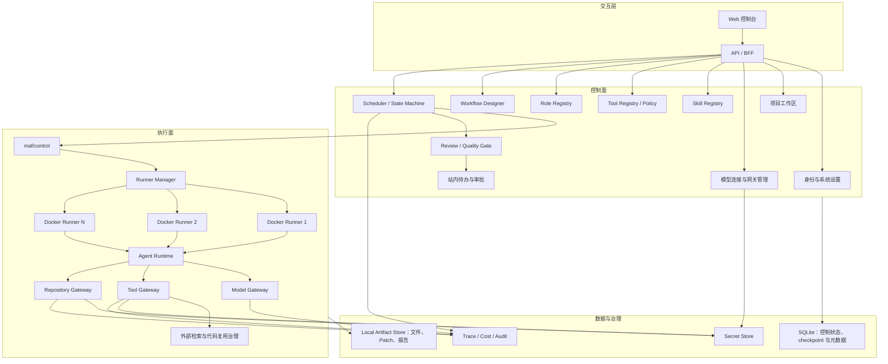
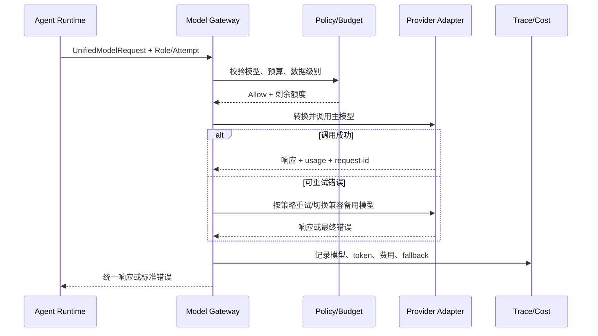
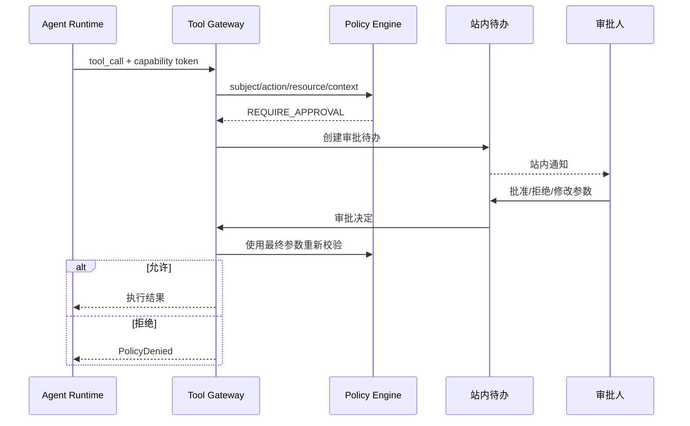
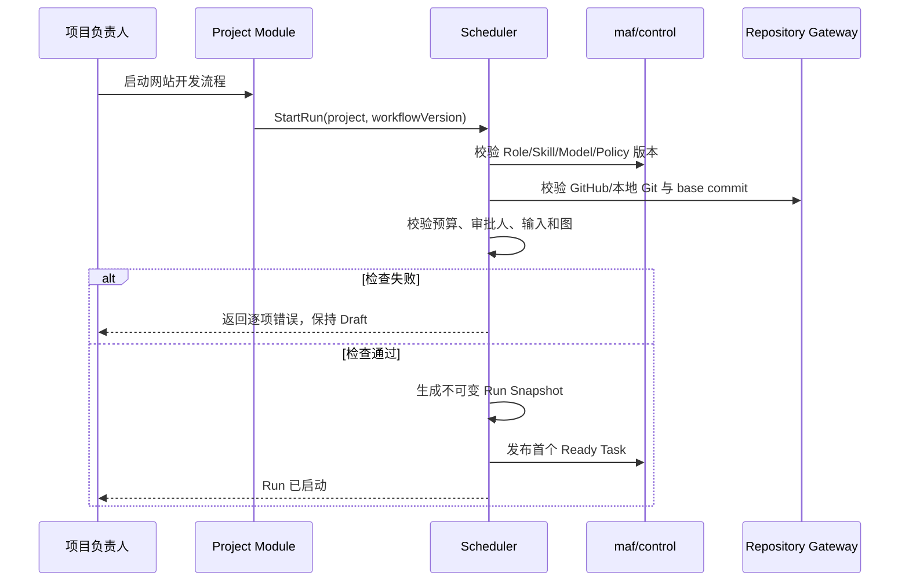
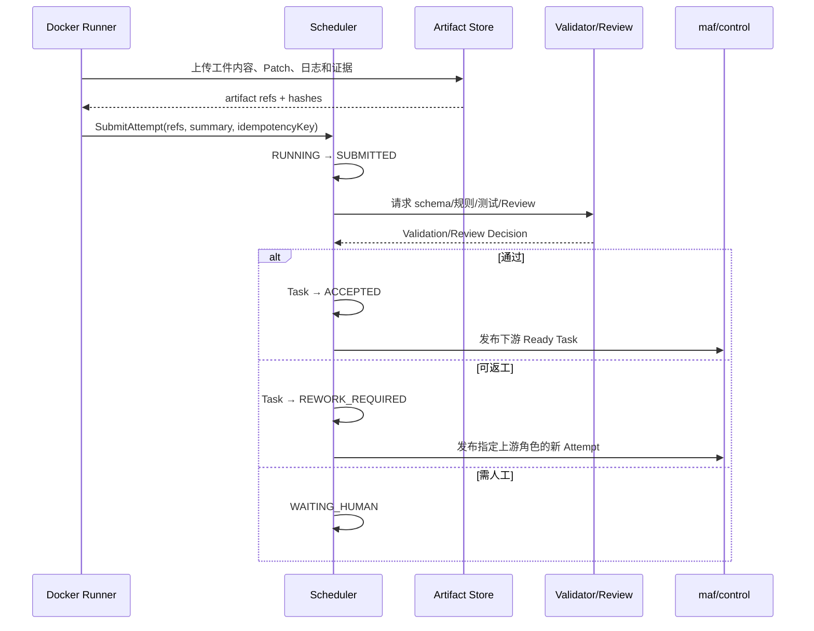
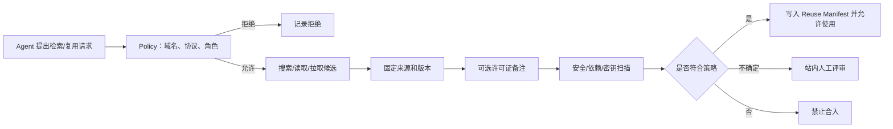
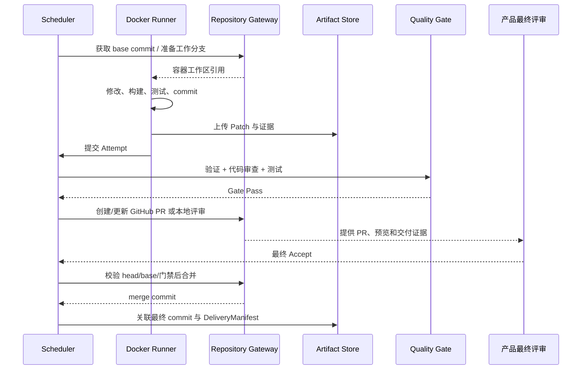
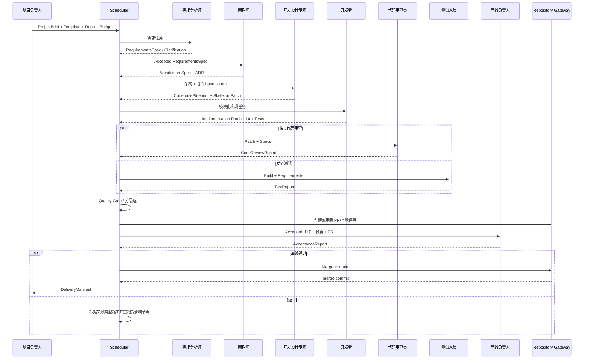
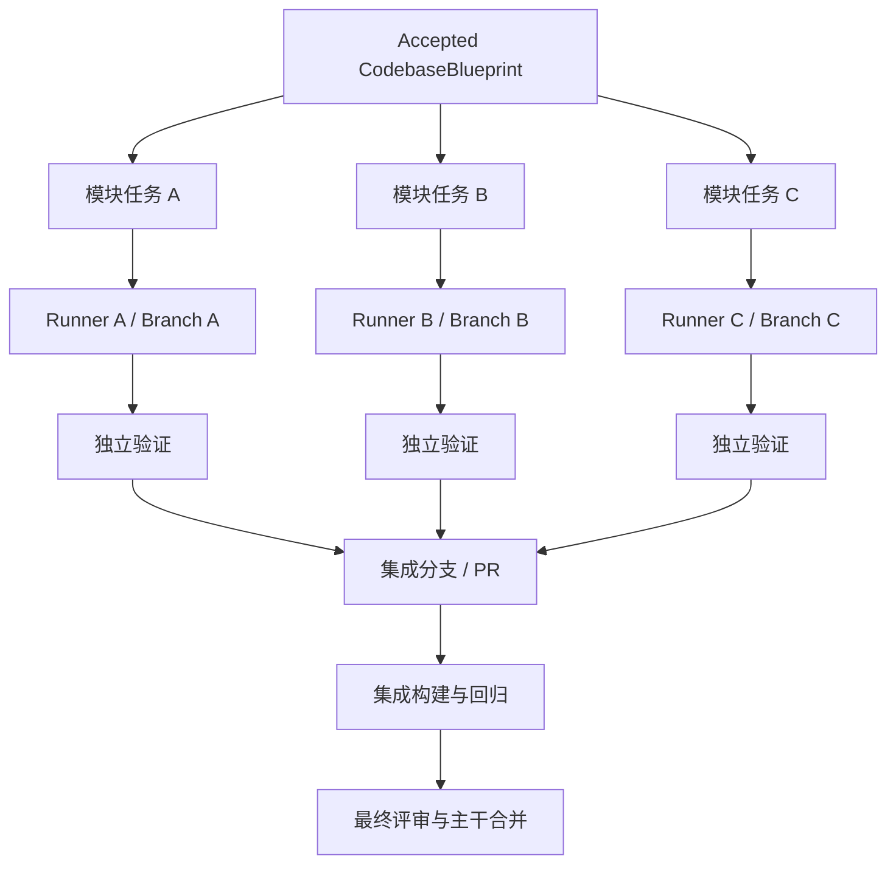

# 多 Agent 协同工具需求分析文档

**文档版本：** V1.0 Draft  
**编写日期：** 2026-07-16  
**分析范围：** MVP 及后续分布式演进边界  
**上游文档：** [多 Agent 协同工具产品需求文档（PRD）](./多Agent协同工具产品需求文档-PRD.md)  
**参考文档：** [多 Agent 协同工具市场调研与可行性报告](./多Agent协同工具市场调研与可行性报告.md)  
**文档状态：** 待产品、架构、研发与测试联合评审
**关联协议：** [GitHub 分布式协作协议](./GitHub分布式协作协议.md)

---

## 1. 文档目的

本文档位于 PRD 与系统设计文档之间，将“产品需要什么”进一步分析为“系统应由哪些模块组成、每个模块大致是什么样子、模块之间如何传递数据和协同工作”。

本文重点说明：

1. 系统的逻辑分层和模块边界；
2. 每个模块的用户界面、核心职责、核心对象、输入输出和业务规则；
3. 模块间同步调用、异步事件和状态所有权；
4. 从团队配置、运行启动、Agent 执行到 PR 合并的完整协同过程；
5. Docker Runner 从单机向多机分布式执行演进时需要保留的边界；
6. Codex、GLM、DeepSeek、MiniMax、Kimi Code 等模型如何通过用户自定义连接接入；
7. GitHub、本地 Git、外网检索和外部代码复用如何被治理；
8. 各模块的异常、恢复、权限和验收关注点。

本文不定义数据库的最终表结构、Artifact 的最终精确字段、具体类名和框架 API。这些内容在后续架构设计、数据库设计和接口设计文档中确定。本文出现的数据结构均为模块协作所需的逻辑契约示意，不是最终物理 schema。

---

## 2. 已确定的需求边界

### 2.1 MVP 边界

| 主题 | 已确认结论 | 对系统分析的影响 |
|---|---|---|
| 项目性质 | 学习和技术试验 | 优先复用开源；不按商业 SaaS 标准堆叠基础设施；许可证不作为门禁 |
| 技术原则 | 轻量、单机优先 | SQLite、LangGraph SQLite Checkpointer、本地 ArtifactStore、内嵌组件 |
| 部署 | 单组织私有部署 | 第一版不实现共享多租户运营，但领域对象保留组织边界 |
| 执行 | Docker Runner | 每个 Agent Attempt 在隔离容器中执行 |
| 后续扩展 | 多台机器分布式执行 | Scheduler 与节点通过 Git control/events/task branches 解耦，不自建节点 HTTP |
| 模型 | Codex、GLM、DeepSeek、MiniMax、Kimi Code | 需要统一 Model Gateway 和可插拔 Provider Adapter |
| 模型凭据 | 用户配置中转/API 地址与 Key | 需要连接管理、密钥存储、能力探测和角色级绑定 |
| 代码仓库 | GitHub、本地 Git | 需要统一 Repository Adapter；两种仓库的评审实现不同 |
| 通知 | 仅站内 | 待办中心和站内通知属于 P0，外部通知暂不实现 |
| 代码交付 | 创建 PR/评审分支，最终评审后合主干 | Git 状态必须纳入工作流，不允许 Agent 直接合并 |
| Artifact 字段 | 后续设计文档确定 | 本文只明确类型、职责、血缘和交互要求 |
| 外网 | 允许检索和复用外部项目 | 需要访问策略、来源与固定版本记录、安全扫描；许可证仅作可选备注 |

### 2.2 核心业务判断

系统的核心不是“Agent 之间互相发消息”，而是四条受控链路：

```text
配置链：模型/Skill/Tool/Role → Workflow Version → Run Snapshot
执行链：Task → Attempt → Docker Runner → Agent Runtime → Artifact Submission
验收链：Artifact → Validator/Review → Quality Gate → Accepted/Rework
代码链：Base Commit → Work Branch → Patch/Commit → PR → Review/Test/Acceptance → Merge
```

每条链路都必须具备明确的数据所有者、状态所有者和失败恢复方式。

### 2.3 不采用的系统模式

- 不让一个“总调度 Agent”自由决定所有流程状态；
- 不让各 Runner 直接互相控制或互相改状态；
- 不把完整聊天记录当成唯一交付物；
- 不让 Agent 直接持有长期模型 Key、GitHub Token 或生产凭据；
- 不允许 Agent 在未验证时直接改主干；
- 不把浏览器前端审批视为安全边界；
- 不让多台执行机器分别维护独立的任务真相。

---

## 3. 总体逻辑架构

### 3.1 系统分层



### 3.2 控制面与执行面的边界

| 控制面负责 | 执行面负责 |
|---|---|
| 保存和发布配置 | 按不可变配置执行一次 Attempt |
| 生成 Run Snapshot | 创建隔离容器和工作目录 |
| 判断哪些 Task 可以执行 | 调用模型、Skill 和 Tool |
| 发布功能级任务到 control | 持续回报进度和资源使用 |
| 接收工件提交并发起验证 | 上传结果、日志、Patch 和证据 |
| 决定 Accepted、Rework、Failed | 不直接决定业务验收状态 |
| 控制暂停、恢复、取消和预算 | 响应取消并在安全点终止 |
| 决定是否创建 PR、是否允许合并 | 在授权后执行具体 Git 操作 |

### 3.3 单机 MVP 与多机演进

MVP 可以把控制面、数据库、Git 工作副本和一个 Docker Runner 部署在同一台机器上，但模块之间仍按 Git 分布式边界设计：

```text
MVP：Control Plane + DB Projection + Git Repository + Docker Runner（同机）

演进：Central Scheduler + GitHub + DB Projection
                         ├── Runner Node A（编码任务）
                         ├── Runner Node B（浏览器测试）
                         └── Runner Node C（文档/分析任务）
```

必须从 MVP 开始满足：

- 节点通过自己的 Git 事件分支注册，不写死本机地址；
- Task 由中央写入 `maf/control`，节点用 Claim 事件申请，不通过 HTTP 或内存函数绑定；
- 代码、文档、Patch 和脱敏报告写任务分支；高频日志留节点本地；
- Runner 本地目录可被销毁，任务仍可重建或恢复；
- Scheduler 通过 `assignment_id + assignment_epoch` 确认当前执行者；
- 不同 Runner 可以具有不同标签和能力，例如 `code`、`browser`、`gpu`、`high-memory`；
- Git 协作使用分支、commit 和 PR，不共享可并发写入的同一工作目录。

---

## 4. 模块总览与依赖关系

| 编号 | 模块 | 核心职责 | 主要上游 | 主要下游 |
|---|---|---|---|---|
| M01 | 身份、系统设置与私有部署管理 | 用户、权限、组织设置、系统级配置 | 用户 | 所有控制面模块 |
| M02 | 项目与工作空间 | 项目输入、成员、仓库、预算和变更 | M01 | M07、M08、M11 |
| M03 | 模型连接与 Model Gateway | 用户连接、模型能力、调用、fallback、用量 | M01 | M06、M09、M14 |
| M04 | Skill Registry | Skill 导入、版本、依赖、授权和按需读取 | M01 | M06、M09 |
| M05 | Tool Registry 与 Policy Engine | 工具注册、能力策略、审批和凭据代理 | M01 | M06、M09、M15 |
| M06 | Role Registry | 角色职责、输入输出、Skill/模型/工具绑定 | M03–M05 | M07、M09 |
| M07 | Workflow Designer | 工作流图、节点、边、版本和静态检查 | M02、M06 | M08 |
| M08 | Scheduler 与状态机 | 快照、任务、状态、租约、重试、返工 | M02、M07 | M09–M15 |
| M09 | Runner Manager 与 Agent Runtime | Docker 执行、上下文构建、模型/工具循环 | M08 | M03–M05、M10–M13 |
| M10 | 外部检索与代码复用治理 | 搜索、来源、固定版本、安全和复用清单 | M05、M09 | M11、M13 |
| M11 | Artifact Store 与 Schema Registry | 工件内容、元数据、版本、血缘和验证 | M08–M10 | M12、M13、M14 |
| M12 | Review、Quality Gate 与返工 | 自动验证、独立审查、门禁和路由 | M08、M11 | M08、M15 |
| M13 | Repository Gateway 与代码交付 | GitHub/本地 Git、分支、Patch、PR、合并 | M02、M08、M09 | M11、M12、M14 |
| M14 | 运行观测、成本与审计 | 时间线、Trace、费用、指标和安全审计 | 所有模块 | 用户、运维 |
| M15 | 站内待办、澄清与审批 | 人工输入、工具审批、预算和最终评审 | M05、M08、M12、M13 | M08 |
| M16 | 网站开发团队模板 | 7 角色、工件链、门禁和返工规则 | M02–M07 | M08–M15 |

### 4.1 依赖原则

- M08 Scheduler 是运行状态的唯一所有者；
- M11 Artifact Store 是交付物元数据和血缘的唯一所有者；
- M13 Repository Gateway 是远程/本地 Git 操作状态的唯一所有者；
- M03 Model Gateway 是模型调用与用量的唯一入口；
- M05 Tool Gateway/Policy 是可执行能力授权的唯一入口；
- M14 收集事件但不反向决定业务状态；
- M16 是一组可发布配置和规则，不形成第二套 Scheduler。

---

## 5. M01 身份、系统设置与私有部署管理

### 5.1 模块定位

MVP 为单组织私有部署，本模块负责系统用户、权限、系统参数和部署级资源入口。虽然只有一个组织，所有业务资源仍带组织标识，避免以后升级多组织时重构全部数据。

### 5.2 页面大致形态

```text
系统设置
├── 用户与权限
│   ├── 用户列表
│   ├── 角色：管理员/设计者/项目负责人/审批人/观察者
│   └── 登录与会话策略
├── 系统容量
│   ├── Runner 并发
│   ├── 默认预算和超时
│   └── 存储配额
├── 数据治理
│   ├── 敏感级别
│   ├── 工件/日志/审计保留策略
│   └── 脱敏规则
└── 审计与安全
    ├── 登录记录
    ├── 权限变更
    └── 安全告警
```

### 5.3 子能力

1. **用户管理：** 创建、禁用、重置、查看最近活动；
2. **RBAC：** 给用户分配系统权限集；
3. **项目成员权限：** 在项目维度限制查看、运行、审批和管理；
4. **系统默认值：** 默认超时、最大返工、并发和预算预警比例；
5. **数据策略：** 定义敏感级别、保留策略和脱敏规则；
6. **功能开关：** 控制实验性模型、工具或节点是否可用；
7. **私有部署信息：** 展示系统版本、SQLite/Artifact 目录和 Runner 健康概况。

### 5.4 核心数据

- User；
- PermissionSet；
- UserPermissionBinding；
- OrganizationSetting；
- DataClassificationPolicy；
- RetentionPolicy；
- FeatureFlag；
- LoginSession。

### 5.5 与其他模块协同

- 所有控制面 API 在执行业务前调用本模块确认用户身份和产品权限；
- M05 根据用户和 Agent 身份继续判断工具能力权限；
- M14 接收登录、权限和设置变更审计；
- M15 根据项目成员和审批角色计算待办接收人；
- 多机阶段，Runner 是机器身份，不作为普通用户，应使用独立 Runner Credential。

### 5.6 关键规则

- 前端隐藏按钮不是授权；后端必须再次判断；
- Agent 不继承发起人的管理员权限；
- 用户被禁用后不能创建新操作，已运行 Agent 是否停止由管理员策略决定；
- 审计保留策略不能被普通项目负责人缩短；
- MVP 不做组织间共享，但不能使用全局无组织 ID 的业务记录。

---

## 6. M02 项目与工作空间模块

### 6.1 模块定位

项目是业务运行、输入资料、代码仓库、预算、成员和最终交付的聚合边界。一个项目可以启动多次 Workflow Run，但每次运行使用独立快照。

### 6.2 页面大致形态

```text
项目详情
├── 项目概览：目标、状态、负责人、预算
├── 输入资料：项目简报、附件、澄清答案
├── 团队与流程：所选模板、角色版本
├── 代码仓库：GitHub/本地 Git、默认分支、连接状态
├── 运行列表：历史运行、当前运行、成本
├── 工件与交付：最终版本、下载、PR/commit
├── 成员与权限
└── 变更请求
```

### 6.3 子能力

#### 6.3.1 项目创建

- 输入名称、业务目标、初始范围、成功标准；
- 选择网站开发模板或其他已发布模板；
- 选择 GitHub 或本地 Git 仓库；
- 设置项目预算、最长运行时间和人工审批人；
- 上传文档、图片、设计稿、API 样例和数据样例；
- 设置敏感级别和允许的模型连接范围。

#### 6.3.2 输入版本

- 初始简报保存为 `ProjectBrief` 工件；
- 每次修改生成新版本；
- 澄清回答单独保存，不能静默改写原始简报；
- 启动运行时固定输入版本；
- 后续需求变更使用 Change Request，而不是编辑运行快照。

#### 6.3.3 仓库配置

- GitHub：仓库 URL、默认分支、授权凭据引用、PR 策略；
- 本地 Git：仓库绝对路径的受控引用、默认分支、允许操作范围；
- 验证仓库是否存在、是否为 Git 仓库、是否有未提交更改、base commit 是否可读；
- 本地 Git 路径只由后端保存，Agent 只获得容器内映射路径。

#### 6.3.4 项目变更

- 用户提交范围、目标、技术约束或验收标准变更；
- 系统比较新旧输入并标记潜在影响；
- Scheduler 计算需重跑的节点；
- 用户确认新增成本和返工范围后生效。

### 6.4 核心数据

- Project；
- ProjectMember；
- ProjectInputVersion；
- RepositoryBinding；
- ProjectBudget；
- ProjectChangeRequest；
- DeliveryRecord。

### 6.5 与其他模块协同

- 向 M07 提供可选模板和项目约束；
- 向 M08 提供运行输入、预算和代码仓库引用；
- 向 M13 提供 RepositoryBinding，但不直接执行 Git 命令；
- 向 M11 提供工件归属和敏感级别；
- 向 M15 提供项目负责人和审批人；
- 从 M14 汇总项目成本、进度和质量指标。

### 6.6 失败与边界

- 仓库无法访问：项目可以保存，但不能启动代码流程；
- 本地 Git 有未提交修改：默认阻止启动，避免覆盖用户工作；
- 项目输入更新：不自动影响运行中 Run；
- 项目删除：先停止运行，再按保留策略异步清理；
- GitHub Token 失效：只影响需要 Git 操作的节点，运行进入待处理而不是丢失前序工件。

---

## 7. M03 模型连接与 Model Gateway

### 7.1 模块定位

本模块把“用户提供的网站/API 地址与 Key”和“角色使用哪个模型”解耦。控制面管理连接、模型目录和策略；执行面 Model Gateway 统一完成调用、能力校验、fallback、预算统计和日志脱敏。

### 7.2 页面大致形态

```text
模型中心
├── 连接管理
│   ├── 新建连接：名称、Base URL、协议、API Key
│   ├── 连接测试
│   └── 健康、限流、最近错误
├── 模型目录
│   ├── Codex
│   ├── GLM
│   ├── DeepSeek
│   ├── MiniMax
│   └── Kimi Code
├── 能力矩阵：Tool/Schema/视觉/上下文
├── Model Policy：主模型、fallback、参数、预算
└── 用量统计
```

### 7.3 连接与模型分层

#### Provider Connection

表示用户实际配置的调用入口：

- 连接名称；
- Base URL/网站 API 地址；
- 协议适配器；
- API Key 的 Secret 引用；
- 默认请求头和可选组织标识；
- 连接超时、代理和 TLS 策略；
- 启用状态和健康状态。

#### Model Profile

表示连接下可选的具体模型或编码 Agent 能力：

- 用户填写或同步的模型标识；
- 展示名称，例如 Codex、GLM、DeepSeek、MiniMax、Kimi Code；
- Tool calling、结构化输出、视觉、流式和上下文能力；
- 价格或仅用量统计方式；
- 推荐角色；
- 验证状态。

#### Model Policy

表示某 Role Version 的运行策略：

- 主连接 + 主模型；
- 备用连接/模型序列；
- 采样参数；
- 最大 token、超时、重试和并发；
- 数据级别限制；
- Task/Attempt 预算；
- fallback 错误范围。

### 7.4 Provider Adapter

Provider Adapter 将不同中转和厂商协议转换为统一调用协议：

```text
UnifiedModelRequest
├── messages / instructions
├── tool schemas
├── output schema
├── attachments
├── sampling parameters
├── timeout / budget
└── trace context

UnifiedModelResponse
├── text / structured output
├── tool calls
├── usage
├── provider request id
├── finish reason
└── normalized error
```

首版优先实现 OpenAI-compatible 类适配；若 Codex、Kimi Code 或其他目标连接不满足该协议，则增加独立 Adapter。具体厂商字段不进入 Role、Workflow 和 Scheduler 的核心领域对象。

### 7.5 能力探测

连接测试分四层：

1. **网络可达：** DNS、TLS、HTTP；
2. **鉴权可用：** Key 和账户权限；
3. **模型可调用：** 模型名称和基本文本响应；
4. **角色能力：** 工具调用、结构化输出、上下文和必要参数。

探测结果保存时间和测试版本。角色发布时，如果依赖能力未验证，应阻止发布或明确要求管理员豁免。

### 7.6 模型调用协同流程



### 7.7 关键规则与异常

- Key 只存 Secret Store，Model Gateway 临时读取；
- 角色只能调用 Model Policy 中列出的连接/模型；
- 一个角色失败不能自动借用其他角色的模型；
- fallback 只在兼容能力组内发生；
- 用户自带 Key 时平台统计调用量和估算成本，不负责统一结算；
- Key 失效属于配置错误，不进行无限 fallback；
- 达到运行硬预算后，Model Gateway 在发出请求前拒绝；
- 中转返回的 usage 不可信或缺失时标记估算，不伪装为精确值。

---

## 8. M04 Skill Registry

### 8.1 模块定位

Skill 是供 Agent 使用的知识、方法、规范和模板资产。该模块负责导入、版本、测试、依赖、可见性、角色绑定和运行时按需读取，不负责授予可执行工具权限。

### 8.2 页面大致形态

```text
Skill 详情
├── 基本信息：名称、说明、Owner、状态
├── 文件树：SKILL.md、references、templates、scripts
├── 版本与 Diff
├── 依赖与兼容模型
├── 声明所需工具（仅声明，不授权）
├── 绑定角色
├── 测试集与评测结果
└── 发布/废弃
```

### 8.3 核心子模块

1. **Package Importer：** 解压、路径安全、大小和文件类型检查；
2. **Metadata Parser：** 解析名称、描述、使用条件和依赖；
3. **Version Manager：** Draft、Testing、Published、Deprecated、Archived；
4. **Dependency Resolver：** 缺失依赖和循环依赖检测；
5. **Binding Service：** 将准确 Skill Version 绑定到 Role Version；
6. **Runtime Reader：** 在 Agent 请求时按权限读取正文和引用文件；
7. **Evaluation Service：** 使用样例输入比较 Skill/模型组合。

### 8.4 运行时使用方式

```text
Role Version
  → 获得已绑定 Skill 元数据清单
  → Context Builder 注入名称/描述
  → Agent 判断是否需要
  → 调用 read_skill(skill_id, version, path)
  → Skill Runtime 再次校验 Role/Task/Hash
  → 返回正文或引用文件
```

### 8.5 与其他模块协同

- M06 创建 Role Version 时选择 Published Skill Version；
- M07 发布 Workflow 时检查 Role 的 Skill 依赖是否可用；
- M08 Run Snapshot 固定 Skill 哈希；
- M09 Context Builder 只注入绑定 Skill；
- M05 检查 Skill 声明的 Tool 是否已被角色授权，但不自动授权；
- M14 记录 Skill 读取、token 消耗和质量表现。

### 8.6 关键规则与异常

- Skill 更新必须发布新版本；
- 运行中不自动升级；
- Agent 不能搜索同组织全部 Skill；
- Skill 内路径不能跳出包边界；
- Skill 声明需要 shell 但角色未授权时，角色/流程发布失败；
- Skill 文件缺失时 Task 进入配置错误，不静默跳过必需 Skill；
- Script 文件只有在被注册成 Tool 并通过策略时才能执行。

---

## 9. M05 Tool Registry、Tool Gateway 与 Policy Engine

### 9.1 模块定位

本模块管理所有会产生实际动作的能力，是“Agent 只能使用指定能力”的主要安全边界。工具可以是原生函数、HTTP/OpenAPI、MCP、浏览器、shell、文件、Git 或外部搜索。

### 9.2 页面大致形态

```text
工具中心
├── Tool/MCP 列表
├── 输入输出 Schema
├── 风险等级 R0-R3
├── 凭据引用
├── Capability Policy
│   ├── Tool allowlist
│   ├── 路径规则
│   ├── 域名/网络规则
│   ├── 参数限制
│   └── 审批规则
├── 策略模拟器
└── 调用与拒绝审计
```

### 9.3 三个逻辑组件

#### Tool Registry

- 保存工具定义、schema、版本、风险和 owner；
- 从 MCP 同步工具后进入待审核，不自动开放；
- 工具 schema 变化形成新版本或兼容性告警；
- 展示哪些 Role Version 正在使用。

#### Policy Engine

根据以下输入做 default-deny 决策：

```text
Subject：user / role / agent / attempt
Action：tool.call / file.read / file.write / network.get / git.push ...
Resource：tool、path、domain、repo、branch、secret reference
Context：project、run、task、risk、time、data classification、arguments
```

返回 Allow/Deny、原因、需要审批、约束后的参数范围和策略版本。

#### Tool Gateway

- 接收短期能力令牌；
- 校验 tool name、version 和参数；
- 向 Policy Engine 请求决策；
- 若需要审批，创建站内待办并暂停调用；
- 从 Secret Store 获取凭据并代执行；
- 返回标准化结果；
- 写 Trace、审计和幂等记录。

### 9.4 双层限制

1. **暴露层：** Context Builder 只把已授权 Tool schema 发送给模型；
2. **执行层：** Tool Gateway 对每次实际调用重新授权。

第一层减少模型误用，第二层阻止伪造和越权。两层必须同时存在。

### 9.5 高风险审批协同



### 9.6 与其他模块协同

- M06 将 Capability Policy 绑定到 Role Version；
- M08 为 Attempt 签发短期能力上下文；
- M09 仅加载授权工具；
- M10 的外网检索和代码下载全部经 Tool Gateway；
- M13 的 Git 操作通过 Repository Gateway 执行，但仍受 Policy Engine 决策；
- M15 处理审批；
- M14 记录允许、拒绝、等待和执行结果。

### 9.7 关键异常

- 未注册 Tool：直接拒绝；
- Tool 版本不匹配：不自动升级，返回配置错误；
- 能力令牌过期：Attempt 请求续签或停止；
- 审批超时：保持等待或按策略拒绝，不默认通过；
- 工具执行超时：根据幂等能力决定是否重试；
- 结果过大：写入 Artifact Store，只返回引用；
- 返回内容含密钥：先脱敏再进入 Agent 上下文。

---

## 10. M06 Role Registry

### 10.1 模块定位

Role Registry 把职责、Skill、模型、工具和输入输出契约组合成可发布角色。Role 是团队设计的核心单元，但不是正在运行的 Agent；运行时 Agent 由具体 Role Version 实例化。

### 10.2 页面大致形态

```text
角色编辑器
├── 基本信息：名称、目标、Owner
├── 职责：负责什么、禁止什么
├── 输入：允许读取哪些 Artifact 类型
├── 输出：必须提交哪些 Artifact 类型
├── Skill：绑定准确版本
├── 模型：主模型、fallback、参数、预算
├── 工具：Capability Policy、路径、域名
├── 运行限制：超时、步骤、返工
├── 单角色试运行
└── 版本 Diff / 发布
```

### 10.3 Role Version 组成

```text
RoleVersion
├── responsibility & boundaries
├── system instruction template
├── accepted task types
├── input artifact contracts
├── output artifact contracts
├── exact Skill bindings
├── Model Policy version
├── Capability Policy version
├── runtime limits
└── review / separation rules
```

### 10.4 配置校验

- 输入工件必须存在 schema 或明确非结构化类型；
- 输出工件与下游消费契约兼容；
- 必需 Skill 均为 Published；
- Skill 所需工具与 Capability Policy 不冲突；
- 模型满足工具调用/结构化输出等能力；
- 角色的禁止事项与工具权限不冲突；
- 提交者与最终审核者不能是同一 Role Version；
- 未授权 shell 的角色不能因 Prompt 中提到 shell 而获得它。

### 10.5 与其他模块协同

- 读取 M03 Model Policy、M04 Skill Version、M05 Capability Policy；
- 向 M07 提供可选 Agent Task 节点；
- M08 启动时将完整 Role Version 写入快照；
- M09 根据快照实例化 Agent；
- M14 按角色统计质量、费用和返工率。

### 10.6 试运行

试运行不进入正式项目工作流，使用：

- 独立测试输入；
- 独立测试预算；
- 测试凭据；
- 临时 Docker 工作区；
- 与生产相同的 Skill/Tool/Model 限制；
- 结构化输出和权限测试报告。

试运行可以发现配置问题，但不会自动发布角色。

---

## 11. M07 Workflow Designer

### 11.1 模块定位

Workflow Designer 用于定义确定性业务骨架，包括哪些角色执行、何时并行、如何验证、失败返回哪里、何时需要人工、怎样才算完成。

### 11.2 页面大致形态

```text
┌────────节点面板────────┐  ┌────────流程画布──────────────┐  ┌────配置面板────┐
│ Start                 │  │ Start → 需求 → 架构 → ...    │  │ Role Version  │
│ Agent Task            │  │        ↘ 返工路径             │  │ 输入映射       │
│ Function/Validator    │  │        并行 Review / Test     │  │ 输出契约       │
│ Parallel/Join         │  │                              │  │ 重试/预算      │
│ Condition/Gate        │  │                              │  │ 条件/路由      │
│ Human Approval/End    │  │                              │  │ 完成标准       │
└───────────────────────┘  └──────────────────────────────┘  └────────────────┘
```

### 11.3 节点分析

| 节点 | 输入 | 处理 | 输出 |
|---|---|---|---|
| Start | 项目输入 | 校验必填并创建运行入口 | 首批 Task 条件 |
| Agent Task | 上游 Artifact | 使用指定 Role Version 执行 | Artifact Submission |
| Function | 结构化输入 | 确定性转换/计算 | 结构化输出 |
| Validator | Artifact | schema、规则、测试 | ValidationResult |
| Parallel Split | 一个触发 | 创建多个可并行 Task | 分支任务 |
| Join | 分支状态 | 按等待全部/任意/N 个聚合 | JoinResult |
| Condition | 结构化数据 | 计算候选边 | 选中边 |
| Quality Gate | Review/验证 | 汇总门禁 | Pass/Rework/Human/Fail |
| Human Approval | 审批上下文 | 站内等待 | ApprovalDecision |
| Rework Router | 缺陷分类 | 选择静态允许的上游节点 | Rework Task |
| End | 必需工件和状态 | 检查终止条件 | Success/Failed/Cancelled |

### 11.4 输入输出映射

每个节点需要显式声明：

- 从哪些项目输入或上游工件取数据；
- 是传全文、字段切片还是引用；
- 对敏感字段是否脱敏；
- 输出对应哪个 Artifact Type；
- 多个输入版本冲突时如何选择；
- 返工时使用最新 Accepted 版本还是指定版本。

映射错误应在发布阶段尽量发现，运行时不能解析则 Task 进入配置失败。

### 11.5 静态检查

发布前检查：

- 单一 Start、可达 End、无孤立节点；
- 所有循环有退出条件；
- 并行节点有明确 Join；
- 输入输出类型兼容；
- Role、Skill、Model、Tool 版本可用；
- Git 节点只在项目存在仓库绑定时启用；
- 高风险操作存在审批；
- 最终 End 要求所有必需交付物；
- 返工路由不会绕过必要 Review。

### 11.6 与其他模块协同

- 从 M06 选择 Role Version；
- 从 M11 选择 Artifact Type 与验证器；
- 从 M12 选择 Gate 和 Review 模板；
- 从 M15 选择审批角色；
- 发布后由 M08 读取，不直接自行运行节点；
- M14 保存工作流版本质量和每个节点耗时。

---

## 12. M08 Scheduler 与状态机

### 12.1 模块定位

Scheduler 是产品运行核心，负责把 Workflow Version 实例化为 Run、Task 和 Attempt，并根据依赖、验证、预算和人工决定推进。它是唯一有权修改业务运行状态的模块。

### 12.2 内部子组件

```text
Scheduler
├── Run Starter：启动检查与快照
├── Graph Evaluator：计算可执行节点
├── Task Factory：创建 Task/Attempt
├── Task Publisher：发布功能级任务到 maf/control
├── Assignment Reconciler：epoch fencing、进度超时、重新分配
├── Submission Handler：接收工件提交
├── State Machine：合法状态转换
├── Retry Manager：技术重试
├── Rework Manager：业务返工
├── Budget Guard：预算/步骤/时长
├── Recovery Manager：重启和失联恢复
└── Completion Evaluator：最终完成判断
```

### 12.3 启动流程



### 12.4 调度算法的业务约束

- 只创建依赖已满足的 Task；
- 同一逻辑节点的一次正常执行只存在一个活动 Attempt；
- 技术重试与业务返工分开计数；
- LLM 路由只能选择工作流声明的候选边；
- 并行节点按组织和 Runner 并发能力分批派发；
- 达到预算、最大步骤、返工或时长限制后停止派发；
- 等待人工时只暂停依赖分支，独立分支可继续；
- 所有状态转换带期望版本，避免并发覆盖。

### 12.5 任务提交与验收协同



### 12.6 Git 认领、进度与多机 Runner

Task 派发包含能力要求，例如：

```text
required_capabilities: [docker, code, git]
resource_profile: standard-4c-8g
workspace_mode: git-worktree
network_policy: approved-internet
timeout: 45m
```

节点 fetch control 后提交 Claim 事件，中央在合法申请中选择满足能力且容量足够的节点：

- 接受分配时写 `assignment_id`、`assignment_epoch`、owner 和 expires_at；
- 节点看到 control 确认后才开始，周期提交结构化进度事件；
- Scheduler 不因一次进度延迟立即重复派发，先等待宽限并检查任务分支提交；
- 超时后写 LEASE_EXPIRED；重新分配时 epoch 递增；
- 旧 epoch 结果隔离，不能覆盖当前权威任务，但旧分支可供人工挑选；
- 若 push/PR 等副作用状态不明，先由 Repository Gateway 核对。

### 12.7 恢复策略

- Scheduler 重启：fetch control/node refs，从投影水位重放 Git 事件后加载非终态 Run；
- Git 重复事件：按 event_id 和 assignment epoch 去重；
- Runner 宕机：保留已 push 任务分支，清理/重建临时工作区；
- 模型调用结果已记录：不重复调用；
- Tool 副作用结果未知：进入核对状态；
- 验证中断：重新运行确定性验证器，保留旧执行记录；
- PR 已创建但响应丢失：按 source branch/head commit 查询现有 PR。

### 12.8 Scheduler 不负责的内容

- 不直接调用厂商模型；
- 不直接执行 shell 或 Git；
- 不解析 Skill 正文；
- 不存储大文件正文；
- 不代替 Review 做质量判断；
- 不让 LLM 任意修改工作流图。

---

## 13. M09 Runner Manager、Docker Runner 与 Agent Runtime

### 13.1 模块定位

Runner 是一次 Agent Attempt 的隔离执行环境。Runner Manager 管理执行节点注册、容量和任务领取；Agent Runtime 在容器中构造上下文、调用模型/工具并提交工件。

### 13.2 Runner Node 结构

```text
Runner Node
├── Runner 节点（fetch control、claim、progress、submit）
├── Docker Engine
├── Image Manager
├── Workspace Manager
├── Resource Limiter
├── Log/Artifact Uploader
└── Cleanup Worker
```

### 13.3 Runner 注册信息

- Runner ID 和机器名称；
- 版本；
- 标签：code、browser、document、gpu 等；
- Docker/系统能力；
- CPU、内存、磁盘总量与可用量；
- 允许使用的镜像；
- 最大并发；
- 进度和健康状态；
- 所属私有部署实例。

### 13.4 Docker 生命周期

```text
Task Assigned
→ 拉取/确认受信镜像
→ 创建容器和临时卷
→ 准备 Git worktree/clone 或文档工作区
→ 注入短期能力令牌和非敏感运行配置
→ 启动 Agent Runtime
→ 上传工件/日志/证据
→ 等待提交确认
→ 撤销令牌
→ 清理容器和临时卷
```

Key 和长期凭据不写入镜像、环境快照或工件。需要凭据的动作通过 Gateway 代执行。

### 13.5 Agent Runtime 子组件

```text
Agent Runtime
├── Context Builder
├── Prompt Composer
├── Skill Client
├── Model Client
├── Tool Client
├── Agent Loop Controller
├── Output Parser
├── Artifact Packager
└── Progress Reporter
```

### 13.6 Context Builder

构造上下文时按以下顺序：

1. 角色职责、禁止事项和完成条件；
2. 当前 Task 目标、Attempt 和预算；
3. 上游 Accepted Artifact 的必要字段；
4. 已绑定 Skill 的名称和简介；
5. 已授权 Tool schema；
6. 返工缺陷、证据和目标版本；
7. 输出格式和提交协议。

不默认注入：

- 其他项目数据；
- 未绑定 Skill；
- 未授权 Tool；
- 其他角色的密钥和私有中间推理；
- 无限制的完整历史对话；
- 已被新 Accepted 版本替代且无明确需要的旧工件。

### 13.7 Agent Loop

Agent Runtime 循环处理：

```text
Model Response
├── 普通内容 → 继续或形成输出
├── read_skill → 校验并读取
├── tool_call → 通过 Tool Gateway 执行
├── clarification → 提交 Scheduler，等待用户
├── artifact_submit → 打包并提交
└── blocked/failure → 标准化报告
```

Loop Controller 强制最大步骤、最大工具调用、token、时间和取消信号。

### 13.8 上下文完整性

- 工具调用与工具结果作为原子组进入历史；
- 未完成、重复或孤立 tool result 不传给模型；
- 上下文裁剪时优先保留任务目标、完成标准、Accepted Artifact 和当前工具组；
- 裁剪发生时注入明确说明；
- 大文件通过引用和按需读取，不整文件反复进入 Prompt；
- Runner 重启后从持久化事件和 Artifact 恢复必要上下文，而不是依赖内存。

### 13.9 结果提交

Runtime 先将文件上传 M11，获得不可变引用，再向 Scheduler 提交：

```text
AttemptSubmission
├── run/task/attempt identity
├── output artifact references
├── source input artifact versions
├── execution summary
├── self-check results
├── tests/evidence references
├── known risks
├── suggested next action
└── idempotency key
```

`suggested next action` 只是建议，Scheduler 不直接信任。

### 13.10 关键异常

- Docker 启动失败：Runner 基础设施错误，可重试到其他节点；
- 镜像缺失：等待管理员或使用已批准兼容镜像；
- 资源超限：终止容器，保存日志，按策略换大资源或返工；
- Runner 失联：由 Scheduler 租约机制处理；
- Artifact 上传失败：不标记 Submitted，保留可恢复临时结果到短期清理期限；
- 取消任务：Runtime 在安全点终止，未完成输出标记为临时，不作为 Accepted 输入。

---

## 14. M10 外部检索与代码复用治理

### 14.1 模块定位

为了最大程度复用成熟项目、代码和模块，系统允许 Agent 搜索公开互联网、读取文档、查询代码仓库和引入依赖。但“可以复用”不等于“可以无来源复制”，该模块负责搜索访问、候选评估、来源与固定版本追踪和安全治理。项目用于学习，许可证不作为技术选型或门禁条件。

### 14.2 能力组成

1. **Web Search Tool：** 搜索公开资料；
2. **Web Read Tool：** 读取允许协议和域名页面；
3. **Repository Search Tool：** 查询 GitHub 等公开代码仓库；
4. **Package Search Tool：** 查询语言包仓库；
5. **Source Capture：** 保存 URL、仓库、commit/tag、访问时间和摘要；
6. **License Note：** 可选记录许可证名称，仅用于学习追溯；
7. **Security Scanner：** 恶意代码、依赖漏洞、密钥和危险脚本；
8. **Reuse Manifest：** 记录最终采用、修改或放弃的外部资源。

### 14.3 页面/工件形态

项目运行中提供“外部资源”视图：

| 字段 | 说明 |
|---|---|
| 来源 | URL、仓库、包名 |
| 固定版本 | commit、tag、包版本、内容哈希 |
| 用途 | 借鉴思路、复制片段、直接依赖、修改后使用 |
| 许可证备注 | 可选信息，不影响采用决定 |
| 安全 | 扫描状态、漏洞和密钥风险 |
| 使用位置 | 对应模块、文件、需求 ID |
| 决策 | 采用、待审批、拒绝 |

最终形成 `ExternalReuseManifest`，随交付包提供。

### 14.4 检索与复用流程



### 14.5 角色使用方式

- 需求分析师：可检索竞品和领域资料，输出来源引用；
- 架构师：可检索官方技术文档、成熟架构和库；
- 开发设计专家：优先评估成熟脚手架、基础库和模块结构；
- 开发者：优先使用成熟依赖，避免无必要重复造轮子；
- 代码审查员：检查外部代码来源、固定版本和安全；
- 测试人员：可复用测试框架和公开兼容性资料。

### 14.6 网络边界

- 允许访问公开互联网不等于允许访问内网；
- 阻断 localhost、私网网段、云元数据端点和未授权内部域名；
- 默认只允许 HTTP(S) 和配置的 Git/包协议；
- 下载内容有大小、类型和超时限制；
- 二进制文件和安装脚本进入隔离扫描区；
- 所有查询记录角色、域名、时间、结果大小和来源；
- 用户可以在项目级增加或收紧域名规则。

### 14.7 与其他模块协同

- M05 决定网络和工具权限；
- M09 发起检索并消费结果；
- M11 保存 Reuse Manifest 和扫描报告；
- M12 将安全、漏洞和密钥扫描纳入代码质量门禁；
- M13 在创建 PR 前检查复用清单是否完整；
- M14 记录访问和风险事件；
- M15 处理来源不明或高风险代码审批。

---

## 15. M11 Artifact Store 与 Schema Registry

### 15.1 模块定位

Artifact Store 是多 Agent 之间正式交付的中心。聊天内容只用于执行过程；下游角色和 Quality Gate 应以 Artifact 为主要输入。

### 15.2 存储分层

```text
SQLite
├── Artifact 元数据
├── 版本、状态、哈希
├── 血缘和引用
├── schema 引用
└── Review/验证索引

Object Storage / File Store
├── 文档正文
├── 附件
├── Patch/构建产物
├── 测试报告/截图/日志
└── 大型模型或工具输出
```

### 15.3 首批 Artifact 类型

| 阶段 | Artifact | 生产者 | 消费者 |
|---|---|---|---|
| 项目输入 | ProjectBrief | 用户/M02 | 需求分析师 |
| 澄清 | ClarificationRequest/Response | Agent/用户 | 原任务及下游 |
| 需求 | RequirementsSpec | 需求分析师 | 架构师、测试、产品 |
| 架构 | ArchitectureSpec、ADR | 架构师 | 开发设计专家、审查 |
| 代码结构 | CodebaseBlueprint | 开发设计专家 | 开发者、审查 |
| 变更 | Architecture/CodeStructureChangeRequest | 开发设计专家/开发者 | 上级设计角色 |
| 代码 | Patch/Commit/BuildEvidence | 开发者/M13 | 审查、测试 |
| 外部复用 | ExternalReuseManifest | M10/代码角色 | 审查、交付 |
| 审查 | CodeReviewReport | 代码审查员 | Gate、开发角色 |
| 测试 | TestReport | 测试人员 | Gate、产品负责人 |
| 验收 | AcceptanceReport | 产品负责人 | 最终 Gate |
| 交付 | DeliveryManifest | Scheduler/M11 | 项目负责人 |

### 15.4 工件页面

```text
工件详情
├── 内容预览/下载
├── 类型、版本、状态、哈希
├── 生产者与运行位置
├── 输入来源
├── 下游影响
├── Schema 验证
├── Review 与审批
├── 版本 Diff
└── 敏感级别与保留策略
```

### 15.5 血缘

血缘至少支持：

- 最终交付向上追踪到初始 ProjectBrief；
- 需求 ID 向下追踪到架构、Blueprint、代码、测试和验收；
- 返工前后版本关系；
- 某工件变化影响哪些下游 Task；
- 某次模型/Tool 调用贡献了哪个 Artifact。

### 15.6 验证接口

Artifact Store 负责文件和元数据完整性，不独立决定业务通过：

```text
submitDraft → content hash / storage ref
finalizeSubmission → immutable submitted version
validateSchema → schema result
attachReview → review reference
markAccepted/Rejected → 仅接受 Scheduler 授权命令
resolveLineage → 上下游关系
compareVersions → 内容/结构差异
```

### 15.7 与其他模块协同

- M09 上传 Agent 输出；
- M08 控制状态和接受/拒绝命令；
- M12 写验证与 Review；
- M13 写 Patch、PR 和 commit 关联；
- M14 读取元数据生成质量指标；
- M16 定义各角色需生产和消费的类型。

### 15.8 关键规则

- Submitted 后内容不可覆盖；
- 相同 hash 可复用物理文件，但业务版本独立；
- 未完成上传不能成为正式 Artifact；
- 大文件下载使用短期授权地址；
- 敏感工件只向必要角色提供；
- 精确业务字段在后续 Schema 设计文档确定，但模块接口必须先支持 schema version。

---

## 16. M12 Review、Quality Gate 与返工模块

### 16.1 模块定位

该模块把“Agent 提交了”转换成“系统可以接受”。它编排确定性验证、LLM Review、独立角色审查和人工评审，并输出结构化决策给 Scheduler。

### 16.2 子组件

```text
Review & Gate
├── Validator Registry
├── Validation Runner
├── Rubric / Checklist Registry
├── LLM Reviewer Runner
├── Human Review Adapter
├── Decision Aggregator
├── Defect Classifier
└── Rework Recommendation Builder
```

### 16.3 验证层次

1. **完整性：** 文件存在、hash 正确、上传完成；
2. **Schema：** 类型和必填字段；
3. **规则：** 需求覆盖、TODO 关联、边界约束；
4. **执行：** build、lint、unit test、architecture test；
5. **扫描：** 安全、依赖漏洞和密钥；许可证只作备注；
6. **独立 Review：** 代码审查、测试报告；
7. **业务验收：** 产品负责人最终确认。

### 16.4 Gate 配置示例

```text
ImplementationQualityGate
├── build == passed                          [blocking]
├── unit_tests == passed                    [blocking]
├── architecture_rules == passed            [blocking]
├── code_review.blocker_count == 0           [blocking]
├── test_report.blocker_count == 0           [blocking]
├── external_reuse.security_status == passed [blocking]
├── warnings <= configured threshold         [warning]
└── final decision: pass / rework / human / fail
```

### 16.5 缺陷分类与返工

Defect Classifier 优先使用验证器错误码和 Reviewer 结构化字段，而不是重新让 LLM自由猜测：

| category | 返回节点 |
|---|---|
| REQUIREMENT | 需求分析师 |
| ARCHITECTURE | 架构师 |
| CODE_STRUCTURE | 开发设计专家 |
| IMPLEMENTATION | 开发者 |
| REVIEW_EVIDENCE | 代码审查员 |
| TEST | 测试人员 |
| ACCEPTANCE | Scheduler 人工分诊 |
| UNKNOWN | 站内人工分诊 |

### 16.6 返工包

返回角色的任务输入应包括：

- 失败的 Gate 和检查项；
- 严重级别；
- 证据和文件/需求位置；
- 被拒绝的 Artifact Version；
- 仍然有效的上游 Accepted Artifact；
- 修复完成条件；
- 最大剩余返工次数和预算；
- 受影响下游节点列表。

### 16.7 与其他模块协同

- 从 M11 读取被验工件并写 Review；
- 通过 M09/Runner 执行需要容器的验证器；
- 将决策交给 M08，自己不直接改 Task 状态；
- 需要人工时由 M15 创建待办；
- 代码门禁从 M13 获取 PR/head commit 状态；
- 从 M10 获取来源记录和安全扫描；
- 向 M14 输出通过率、缺陷和返工指标。

### 16.8 关键异常

- 验证环境失败：标记 Validation Infrastructure Error，不算业务测试失败；
- Reviewer 输出格式错误：有限重试，不直接 Approve；
- 多个 Review 冲突：按 Gate 规则或转人工；
- 缺陷无法分类：转人工分诊；
- 达到返工上限：Run 进入 WAITING_HUMAN 或 FAILED；
- 豁免：必须绑定具体检查项、版本、审批人和有效范围。

---

## 17. M13 Repository Gateway 与代码交付模块

### 17.1 模块定位

Repository Gateway 抽象 GitHub 与本地 Git 差异，负责仓库读取、分支、worktree/clone、Patch、commit、PR/平台评审和最终合并。Agent 不能直接获得足以绕过该模块的长期凭据。

### 17.2 统一 Repository Adapter

```text
RepositoryAdapter
├── validateConnection
├── resolveBaseCommit
├── prepareWorkspace
├── inspectStatus
├── createWorkBranch
├── createCommit/Patch
├── pushBranch
├── createOrUpdateReview
├── getReviewStatus
├── checkMergeability
├── merge
└── cleanupWorkspace
```

#### GitHub Adapter

- 使用 GitHub 凭据引用；
- 创建远程工作分支；
- 创建或更新 Pull Request；
- 读取 PR 状态、检查结果和 head commit；
- 最终审批后合并到主干；
- 保存 PR URL、number、merge commit。

#### Local Git Adapter

- 仓库位于受控主机路径；
- 为 Attempt 创建 worktree 或隔离 clone；
- 创建评审分支；
- 在平台生成“本地合并评审”对象，展示 diff、Review 和测试；
- 最终审批后由 Gateway 执行本地 merge；
- 保存 source branch、target branch 和 merge commit。

### 17.3 分支命名建议

```text
maf/{project-short-id}/{run-id}/{task-id}/{attempt-no}
```

分支名由系统生成并清理非法字符，避免 Agent 任意覆盖现有分支。

### 17.4 代码交付流程



### 17.5 PR 状态与工作流状态映射

| Repository 状态 | Scheduler 处理 |
|---|---|
| Branch Prepared | 允许代码 Attempt 执行 |
| Patch Submitted | 进入验证，不代表 PR 已创建 |
| PR Open/Local Review Open | 等待代码审查、测试和产品验收 |
| Changes Requested | 根据问题类别创建返工 Attempt |
| Checks Failed | 返回验证/开发节点 |
| Approved but Base Changed | 重新同步并重新验证 |
| Mergeable + Final Accepted | 允许合并 |
| Merged | 记录最终 commit，进入交付完成检查 |
| Closed Without Merge | 进入人工处理或取消 |

### 17.6 并行开发协作

未来多机 Runner 同时开发不同模块时：

- 每个 Task 使用独立分支；
- 公共接口由已接受 CodebaseBlueprint 固定；
- Scheduler 根据依赖决定集成顺序；
- 开发者不得各自在分支中无审批修改公共边界；
- 可以创建集成分支，将多个已接受模块分支按顺序合入；
- 每次集成后重新执行构建、架构测试和回归测试；
- 冲突路由给开发设计专家或指定集成角色，不让多个 Agent 互相覆盖。

### 17.7 安全与失败

- 主干默认受保护；
- Merge 必须由 Scheduler 授权并通过 Repository Gateway；
- Token 只在 Gateway 使用；
- base/head commit 在审批和合并前重新确认；
- 创建 PR 请求重试按 source branch + head commit 去重；
- 合并结果未知时先查询仓库，不重复 merge；
- 本地 Git 操作前确认仓库路径处于允许根目录；
- 清理 worktree 不删除未持久化的唯一结果。

---

## 18. M14 运行观测、成本与审计模块

### 18.1 模块定位

本模块让用户和管理员知道“现在进行到哪里、为什么停住、花了多少、谁做了什么、是否越权、结果从哪里来”。它不作为业务状态真相源，而是消费各模块事件构建查询视图。

### 18.2 页面大致形态

```text
运行详情
├── 流程图状态
├── 时间线
├── Task/Attempt 列表
├── 模型调用：模型、token、费用、fallback
├── Tool 调用：参数摘要、审批、结果
├── 工件与血缘
├── Git 分支/PR/commit
├── 预算与资源
├── 错误诊断
└── 审计导出
```

### 18.3 数据来源

- Scheduler 状态事件；
- Runner 进度和资源事件；
- Model Gateway 调用事件；
- Tool/Policy 决策事件；
- Artifact 提交和验证事件；
- Review/Gate 决策；
- Repository 分支、PR 和合并事件；
- 用户审批和配置变更。

### 18.4 三类记录

#### Trace

面向一次运行的技术链路，关联 run/task/attempt/model/tool。

#### Cost Ledger

记录 token、模型费用估算、Runner 时间和外部工具用量。历史价格不随当前配置改变。

#### Audit Event

面向安全和责任追踪，只追加，记录 actor、action、resource、decision、time 和理由。

### 18.5 诊断模型

错误统一分类：

- 用户输入；
- 配置；
- 模型临时/永久错误；
- Tool/Policy；
- Runner/Docker；
- Artifact/Schema；
- Validation/Review；
- Git/PR；
- 预算/限制；
- 内部系统。

用户视图显示原因和下一步，管理员视图显示脱敏技术细节和 trace ID。

### 18.6 多机指标

- 每台 Runner 在线状态、版本和标签；
- CPU、内存、磁盘和容器并发；
- Task 排队时间、执行时间和失败率；
- 租约过期和任务迁移次数；
- Artifact 上传速度和失败；
- 各 Runner 处理的模型/Tool 任务分布；
- 因能力标签不足导致的排队。

### 18.7 协同原则

- 业务模块先在自己的事务中写状态和 outbox event；
- M14 异步消费事件构建查询视图；
- 观测系统故障不应阻止主业务状态落库，但必须有缓冲和补发；
- 审计事件对高风险操作应与业务操作可靠关联；
- 不默认记录完整 Prompt、Key 和敏感工件正文。

---

## 19. M15 站内待办、澄清与审批模块

### 19.1 模块定位

MVP 不接入邮件和企业 IM，因此所有人工介入都集中到站内待办中心。待办既是用户交互入口，也是 Workflow 的人工等待节点。

### 19.2 待办类型

| 类型 | 发起模块 | 处理结果 |
|---|---|---|
| Clarification | Agent/Scheduler | 用户回答成为输入工件 |
| Tool Approval | Tool Gateway | 批准、拒绝或修改参数 |
| Artifact Review | Quality Gate | Approve/Request Changes/Reject |
| Budget Increase | Budget Guard | 追加、降级模型、终止 |
| Failure Triage | Scheduler/Review | 选择返工节点或终止 |
| License/Security Review | External Reuse | 允许、拒绝、要求替代 |
| Final Acceptance | Website Template | Accept/Conditional/Reject |
| Merge Approval | Repository Gateway | 允许或拒绝合主干 |

### 19.3 页面大致形态

```text
我的待办
├── 待处理：风险、项目、等待时间、截止时间
├── 已处理：决定、理由、处理时间
└── 待办详情
    ├── 为什么需要处理
    ├── 相关工件/PR/工具参数
    ├── Agent 建议和备选方案
    ├── 影响范围
    └── 批准/拒绝/修改/回答
```

### 19.4 审批规则

- 待办绑定准确对象和版本；
- 批准一次不形成永久授权；
- 处理人必须在创建时计算的允许审批人集合中；
- 参数或工件版本发生变化后旧审批失效；
- 审批超时不默认通过；
- 处理结果写 Audit，并通过事件通知 Scheduler；
- 同一待办重复提交使用幂等键返回原结果。

### 19.5 澄清协作

Agent 提交的澄清应包括：

- 问题；
- 为什么会阻断；
- 已知上下文；
- 2–3 个可选方案；
- 推荐方案；
- 用户不回答的影响。

用户回答保存为 Artifact，并触发 Scheduler 重新计算被暂停分支。

---

## 20. M16 网站开发团队模板

### 20.1 模块定位

网站开发团队模板不是独立执行引擎，而是一组预设 Role Version、Skill、Workflow、Artifact Type、Quality Gate 和返工规则。用户可以复制并调整，但每次发布形成新版本。

### 20.2 模板包组成

```text
WebsiteDeliveryTemplate
├── 7 Role Definitions
├── default Skill bindings
├── recommended Model Policies
├── Capability Policies
├── Workflow Graph
├── Artifact type declarations
├── Review rubrics
├── Quality Gates
├── Rework routing table
├── Docker/Repository requirements
└── final Delivery Manifest rules
```

### 20.3 七个角色的模块协作

| 角色 | 主要使用模块 | 输入 | 输出 | 验收者 |
|---|---|---|---|---|
| 需求分析师 | M04、M09、M10、M11 | ProjectBrief、澄清 | RequirementsSpec | 需求 Gate/产品负责人 |
| 架构师 | M04、M09–M11 | Accepted RequirementsSpec | ArchitectureSpec、ADR | 架构 Gate |
| 开发设计专家 | M04、M09、M10、M11、M13 | Requirements、Architecture、Repo | CodebaseBlueprint、骨架 Patch | 架构测试 + 架构师 |
| 开发者 | M04、M09–M11、M13 | Blueprint、实现 Task | 实现 Patch、测试证据 | 代码审查/测试 Gate |
| 代码审查员 | M04、M09–M13 | Patch、架构、Blueprint | CodeReviewReport | Quality Gate |
| 测试人员 | M04、M09、M11–M13 | 需求、构建、预览 | TestReport | Quality Gate |
| 产品负责人 | M11–M15 | 全部 Accepted 工件、预览、PR | AcceptanceReport | Final Gate/Scheduler |

### 20.4 端到端业务时序



### 20.5 开发设计专家的关键协同

开发设计专家处于架构师与开发者之间，承担“从系统设计到代码边界”的转换：

```text
ArchitectureSpec
→ 模块目录和包结构
→ 公共接口、DTO、领域类型
→ 模块依赖规则
→ 构建/lint/test/CI 基础
→ 契约与架构测试
→ 可编译最小骨架
→ 按模块拆分 Implementation Tasks
```

Scheduler 在派发开发任务前验证：

- 骨架构建通过；
- 公共接口和模块规则清楚；
- stub/TODO 均关联任务；
- 未提前完成具体业务逻辑；
- 与 ArchitectureSpec 差异已批准；
- 并行开发任务的修改范围尽量不重叠。

### 20.6 多开发者/多机器协同

当后续同时分派多个开发任务：



冲突处理：

- 模块内部冲突返回对应开发者；
- 公共接口冲突返回开发设计专家；
- 架构边界冲突返回架构师；
- 不允许 Runner A 直接修改或合并 Runner B 分支；
- 集成后必须重新验证，不能简单累加各分支“已通过”结论。

### 20.7 最终完成条件

Final Gate 检查：

- 所有必需 Artifact Accepted；
- 需求到实现和测试追踪完整；
- 构建、测试、代码审查和安全扫描通过；
- 产品负责人确认功能目标；
- PR/本地评审 head commit 与被验版本一致；
- 主干合并成功并获得 merge commit；
- DeliveryManifest、成本和已知问题生成。

---

## 21. 模块间协同协议

### 21.1 同步调用与异步事件

| 场景 | 推荐方式 | 原因 |
|---|---|---|
| UI 查询和配置保存 | 同步 API | 用户需要即时结果 |
| 配置发布静态检查 | 同步启动 + 异步长检查 | 快速返回，避免超时 |
| Task 派发 | Git control 分支 | 支持多机、幂等重试和背压 |
| Runner 进度 | Git 事件分支 | 需要及时超时判断 |
| Artifact 大文件上传 | server 流式写本地 ArtifactStore + 完成回调 | 轻量实现并限制内存占用 |
| Artifact 提交 | 同步幂等命令 | 需要明确提交是否被接受 |
| 验证/Review | 异步任务 | 耗时且可独立重试 |
| 状态变化 | 事务 + Outbox 事件 | 保证状态与事件可靠关联 |
| 审批 | 站内待办 + 事件 | 人工等待时间长 |
| 模型/Tool 调用 | Runner 到 Gateway 同步流式 | Agent Loop 需要结果 |
| PR/合并 | 幂等命令 + 仓库状态核对 | 外部副作用必须可恢复 |
| 观测指标 | 异步事件 | 不阻塞核心业务 |

### 21.2 关键逻辑契约

#### RunSnapshot

包含工作流、角色、Skill、模型、策略、输入、预算、base commit 的准确版本。只读，整个 Run 使用同一基线。

#### TaskDispatchEnvelope

包含 Task/Attempt ID、角色快照引用、输入工件引用、Runner 标签、资源规格、超时和能力令牌请求信息。不得包含长期 Key。

#### ExecutionContext

由 Agent Runtime 构造，包含任务目标、必要工件、已授权 Skill/Tool、模型策略、返工原因和输出契约。

#### AttemptSubmission

包含工件引用、输入版本、证据、摘要、风险和幂等键。它是一项提交请求，不是通过决定。

#### GateDecision

包含 Pass/Rework/Human/Fail、检查项、证据、缺陷分类、建议返工节点和受影响范围。Scheduler 验证其是否符合 Workflow 配置后执行。

#### RepositoryChangeRecord

包含 repo、base/head commit、branch、patch、PR/评审 ID、检查状态和 merge commit，用于关联代码事实与工作流事实。

### 21.3 状态所有权矩阵

| 状态/数据 | 唯一写入模块 | 其他模块行为 |
|---|---|---|
| User/Permission | M01 | 只读校验 |
| Project/Input Version | M02 | 引用，不覆盖 |
| Model Connection/Usage | M03 | Role 引用，观测读取 |
| Skill Version | M04 | Role 绑定准确版本 |
| Tool/Policy Decision | M05 | Runner 消费结果 |
| Role Version | M06 | Workflow 引用 |
| Workflow Version | M07 | Scheduler 实例化 |
| Run/Task/Attempt State | M08 | 其他模块发命令/事件，不直接写 |
| Runner Health/Lease Runtime | M08/M09 按协议分工 | Scheduler 决定业务失联状态 |
| Artifact Content/Metadata | M11 | Scheduler 授权状态变化 |
| Review/Gate Record | M12 | Scheduler 消费决策 |
| Git Branch/PR/Merge State | M13 | Scheduler 请求并核对 |
| Trace/Cost/Audit View | M14 | 消费事件，不反向改业务 |
| Human Task/Decision | M15 | Scheduler 消费决定 |

### 21.4 一致性边界

- 单模块内部关键写操作使用本地事务；
- 跨模块不使用长分布式事务；
- 状态更新与 Outbox Event 同事务写入；
- 消费方使用 event ID 去重；
- 外部模型和 Git 无法参与事务，使用幂等、状态核对和补偿；
- Artifact 上传先完成内容持久化，再提交元数据；
- Scheduler 只有看到完整 Artifact 引用后才进入 Submitted；
- 最终合并前重新检查 Gate、PR head commit 和 base 状态。

---

## 22. 关键跨模块业务流程

### 22.1 配置与发布流程

```text
管理员配置模型连接 → 能力测试
管理员注册 Tool/MCP → 风险和策略审核
设计者导入 Skill → 测试并发布
设计者创建 Role → 绑定 Skill/Model/Capability → 试运行 → 发布
设计者创建 Workflow → 连接 Role/Gate/Approval → 静态检查 → 发布
项目负责人选择模板 → 创建项目 → 配置仓库和预算
```

任一步骤引用未发布或不兼容版本时，后续发布必须被阻止。

### 22.2 运行上下文协同

```text
Project Input + Workflow Version
→ Scheduler 生成 Run Snapshot
→ Graph Evaluator 创建 Task
→ Scheduler 按 epoch 和能力分配任务
→ Runner 获取 Role/Skill/Policy/Artifact 引用
→ Context Builder 形成最小上下文
→ Agent Runtime 调用 Model/Tool
→ Artifact Store 保存结果
→ Scheduler 触发 Gate
```

### 22.3 返工协同

```text
Validator/Reviewer 发现问题
→ GateDecision 标准化缺陷类别
→ Scheduler 查 Workflow 返工路由
→ 创建新 Attempt 和 Rework Package
→ 指定角色修复并生成新 Artifact Version
→ 重新验证受影响节点
→ 重用未受影响且仍兼容的 Accepted Artifact
```

### 22.4 模型故障协同

```text
Agent Runtime 调用 Model Gateway
→ 主模型超时/429
→ 检查错误是否可重试、预算是否允许
→ 同模型重试或切换兼容 fallback
→ 记录模型、request-id、费用和原因
→ 全部失败则 Attempt 返回标准模型错误
→ Scheduler 根据节点策略重试、暂停或失败
```

### 22.5 Runner 宕机协同

```text
Runner 进度超时
→ Scheduler 递增 epoch 重新分配
→ 标记 Runner Unhealthy
→ 核对 Artifact/Tool/Git 外部副作用
→ 安全则创建恢复 Attempt 并派发其他 Runner
→ 状态不明则创建人工核对待办
→ 原 Runner 恢复后旧租约失效，不能继续提交
```

### 22.6 最终 PR 合并协同

```text
代码 Patch Accepted
→ Repository Gateway 创建/更新 PR
→ 代码审查 + 测试 + 外部复用检查
→ Product Acceptance
→ Scheduler Final Gate
→ Repository Gateway 再查 head/base/mergeability
→ 合并主干
→ 保存 merge commit
→ 生成 DeliveryManifest
→ Run Completed
```

---

## 23. 前端模块协同与用户视角

### 23.1 导航建议

```text
首页
├── 项目
├── 运行
├── 团队设计
│   ├── 角色
│   ├── Skill
│   └── 工作流
├── 资源连接
│   ├── 模型
│   ├── Tool/MCP
│   └── 代码仓库
├── 工件
├── 我的待办
├── 成本与观测
└── 系统设置
```

### 23.2 用户不应看到的底层复杂度

普通项目负责人不需要理解 Provider Adapter、租约或 Outbox。界面应转换为：

- “模型连接是否可用”；
- “当前由哪个角色处理”；
- “为什么等待”；
- “需要你回答/批准什么”；
- “本次返工针对什么问题”；
- “还剩多少预算”；
- “当前 PR 是否可以合并”；
- “最终交付包含什么”。

### 23.3 状态展示统一

流程图、时间线、列表和待办应使用同一后端状态映射，避免出现：

- 流程图显示完成，但工件仍验证中；
- PR 已合并，但 Run 仍显示开发中；
- Agent 文本说成功，但 Gate 显示失败；
- Runner 宕机后界面仍显示持续运行；
- 预算已耗尽但界面仍允许“继续自动执行”。

---

## 24. 安全与治理分析

### 24.1 信任边界

| 边界 | 不可信输入 | 防护 |
|---|---|---|
| 用户 → 控制面 | 配置、文件、URL | 认证、RBAC、校验、扫描 |
| 模型 → Agent Runtime | 文本、Tool call、参数 | schema、步骤限制、Tool allowlist |
| Node → GitHub → 控制面 | Claim、进度、问题、提交 | Git 身份、Schema、event_id、assignment epoch、commit hash |
| Tool/MCP → 平台 | 返回数据、外部副作用 | Gateway、超时、脱敏、审计 |
| 外网代码 → 工作区 | 恶意代码、漏洞、密钥 | 隔离、来源、固定版本、扫描、人工评审 |
| Docker → 宿主机 | 逃逸、资源耗尽 | 非特权、最小挂载、资源限制、更新 |
| GitHub/本地 Git → 平台 | 分支变化、冲突 | base/head 校验、保护分支、幂等 |

### 24.2 Prompt Injection 防护

- 外部网页、仓库 README 和代码注释均视为不可信数据；
- 外部内容不能改变系统角色、工具权限和完成条件；
- Tool Gateway 不信任模型对权限的自然语言解释；
- 检索结果与系统指令分区；
- Agent 不因网页要求而读取密钥或访问内网；
- 高风险调用始终按策略和审批处理。

### 24.3 外部代码复用底线

- 有来源；
- 有固定版本；
- 有来源和固定版本；许可证可选记录；
- 有安全扫描；
- 有使用位置；
- 有代码审查；
- 无法确认合法性或安全性时不合入主干。

---

## 25. 性能、容量与可恢复性分析

### 25.1 主要性能路径

- 控制面读写不是主要耗时，模型、构建和测试是长任务；
- 所有长任务异步化，UI 通过事件/轮询获取进度；
- 大文件不经过普通 JSON API；
- Workflow Graph 计算应基于数据库状态，不扫描全部日志；
- 时间线和成本使用异步构建的查询视图；
- Skill 和 Artifact 大正文按需加载。

### 25.2 背压

- Scheduler 根据 Runner 可用槽位派发；
- 按组织、项目、角色和模型连接限制并发；
- 模型连接 429 时降低对应连接并发；
- Artifact Store/网络异常时暂停新大任务；
- 高优先级人工恢复任务可以高于普通任务，但不能绕过预算和权限。

### 25.3 恢复点

| 阶段 | 持久化内容 | 恢复动作 |
|---|---|---|
| Run 启动 | Run Snapshot | 重建待执行图 |
| Task 派发 | Task/Attempt/Lease | 重新确认 Runner |
| 模型调用 | request/response metadata | 已完成则不重复调用 |
| Tool 调用 | 幂等键、审批、结果 | 查询或安全重试 |
| Artifact | 内容、hash、元数据 | 继续验证 |
| Validation | 结果、日志 | 重跑未完成验证器 |
| PR 创建 | branch、head、PR ID | 查询现有 PR |
| Merge | target、head、结果 | 查询 merge commit |

---

## 26. 模块验收重点

| 模块 | 最关键验收点 |
|---|---|
| M01 | 未授权用户不能访问项目；Agent 不继承管理员权限 |
| M02 | 项目输入和仓库配置版本化；运行快照不被后续编辑改变 |
| M03 | 五类目标模型可通过用户连接配置；每角色独立模型；fallback 受控 |
| M04 | 未绑定 Skill 不可发现/读取；版本升级不影响运行中任务 |
| M05 | 未授权 Tool 不暴露且伪造调用仍被 Gateway 拒绝 |
| M06 | 角色职责、输入输出、Skill、模型和工具形成不可变版本 |
| M07 | 顺序、并行、条件、返工、人工审批可配置；无效图不能发布 |
| M08 | Scheduler 唯一改变状态；重启可恢复；循环和预算限制生效 |
| M09 | Attempt 在 Docker 隔离；多 Runner 租约避免重复执行 |
| M10 | 外部复用内容具备来源、固定版本、使用位置和安全证据 |
| M11 | 工件不可变、有 schema version、hash 和完整血缘 |
| M12 | Agent 提交不等于通过；缺陷能正确路由到对应角色 |
| M13 | GitHub/本地 Git 均能隔离分支评审；最终通过后才合主干 |
| M14 | 运行、模型、Tool、成本、PR 和审计可关联查询 |
| M15 | 所有人工处理均通过站内待办并绑定准确版本 |
| M16 | 7 角色完整跑通并产出最终 DeliveryManifest 和 merge commit |

---

## 27. 研发拆分与依赖顺序建议

### 27.1 第一阶段：领域底座

- M01 基础用户与设置；
- M02 项目；
- M11 Artifact 元数据与存储；
- M14 基础事件、Trace 和审计；
- 统一 ID、幂等、错误码和 Outbox 规范。

### 27.2 第二阶段：配置控制面

- M03 模型连接和 Gateway；
- M04 Skill Registry；
- M05 Tool Registry/Policy；
- M06 Role Registry；
- M07 Workflow Designer 和发布检查。

### 27.3 第三阶段：执行内核

- M08 Scheduler、状态机、Git 协调和恢复；
- M09 Runner Manager、Docker Runner、Agent Runtime；
- 模型和 Tool 调用闭环；
- Artifact 提交与验证。

### 27.4 第四阶段：代码交付与质量

- M10 外部检索与复用治理；
- M12 Review/Gate/返工；
- M13 GitHub/本地 Git、分支、PR、合并；
- M15 站内待办和审批。

### 27.5 第五阶段：网站模板

- M16 七角色配置；
- Requirements → Architecture → Blueprint → Implementation；
- 代码审查和测试并行；
- 分层返工；
- 产品验收、PR 合并和最终交付。

这种顺序保证先建立唯一状态源、工件和权限，再叠加智能执行，避免先做 Agent 聊天页面后补不上治理能力。

---

## 28. 后续设计文档清单

需求分析通过后，建议继续产出：

1. **系统架构设计文档：** 技术栈、部署拓扑、服务划分、通信和高可用；
2. **核心领域模型与数据库设计：** ERD、表、索引、事务和保留策略；
3. **状态机与事件规范：** Run/Task/Attempt/Artifact/PR 的命令和事件；
4. **Artifact Schema 设计：** RequirementsSpec、ArchitectureSpec、CodebaseBlueprint、Review、Test、Acceptance 等精确字段；
5. **Model Gateway 设计：** Codex、GLM、DeepSeek、MiniMax、Kimi Code 连接与适配协议；
6. **Tool/Policy 安全设计：** 能力令牌、策略输入、审批和凭据代理；
7. **Runner 与 Docker 设计：** 镜像、挂载、网络、资源、租约和清理；
8. **GitHub/本地 Git 集成设计：** 分支、PR/评审、幂等和冲突处理；
9. **前端交互原型：** 项目、团队设计、流程画布、运行和待办；
10. **测试与验收计划：** 模块测试、故障注入、安全测试和端到端场景。

---

## 29. 需求分析结论

该产品应被分析为一套“中央控制、分布式执行、工件交接、质量门禁、Git 汇合”的系统，而不是多个模型客户端的简单集合。

最关键的模块协作关系是：

```text
Role/Skill/Model/Tool 定义“谁能做什么”
Workflow 定义“业务允许怎样走”
Scheduler 决定“现在谁应该做、状态怎样变化”
Docker Runner 执行“这一次具体任务”
Artifact Store 保存“实际交付了什么”
Review/Gate 判断“结果是否可接受、返给谁”
Repository Gateway 管理“代码怎样形成 PR 并合入主干”
Audit/Cost 解释“发生过什么、为什么、花了多少”
```

只要从 MVP 起坚持状态唯一所有者、不可变运行快照、角色能力硬限制、Artifact-first、Docker 隔离和 PR 两阶段合并，系统就能从单机私有部署平滑演进到多台机器并行执行，而不需要推翻核心业务模型。
