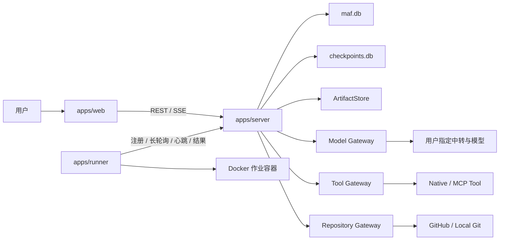
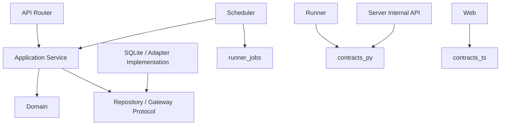

# Multi Agent Flow 项目框架与目录职责说明

> 文档状态：框架基线  
> 适用阶段：系统设计之后、业务实现之前  
> 目标：固定代码目录、文件名称、模块职责、依赖方向和后续实现顺序

---

## 1. 本阶段的交付边界

本阶段只建立整个产品的代码骨架，不实现完整业务功能。骨架需要达到以下目标：

1. 每项需求都能找到唯一的代码归属；
2. Server、Runner、Web 和共享包之间的依赖方向明确；
3. 角色只能使用被授权 Skill、Tool 和 Model 的约束有固定执行位置；
4. 工作流调度与 Agent 实际执行解耦；
5. SQLite 保持单写进程，未来可以增加多台 Runner；
6. 网站交付流程中的“开发专家”角色有独立模板和产物位置；
7. 当前只创建入口、接口、职责说明和少量稳定数据结构，不伪装成已经可运行的产品。

不在本阶段完成数据库表迁移、API 业务实现、LangGraph 图、模型真实调用、Docker 作业执行、前端页面和端到端测试。

---

## 2. 总体结构

```text
multi-agent-flow/
├── apps/                       # 可独立启动或构建的应用
│   ├── server/                 # 中央控制面、调度器和内嵌 Gateway
│   ├── runner/                 # 可多机部署的隔离执行进程
│   └── web/                    # React 管理控制台
├── packages/                   # 跨应用共享且没有应用所有权的代码
├── templates/                  # 可导入的角色、工作流和评审模板
├── migrations/                 # maf.db 的顺序迁移
├── infra/                      # Docker、Compose 和 SQLite 运行配置
├── scripts/                    # 开发、初始化、备份和验证脚本
├── tests/                      # 跨模块和系统级测试
├── doc/                        # 调研、需求、分析、设计和本框架文档
├── data/                       # 本地运行数据，不提交 Git
├── .env.example                # 无密钥的环境变量样例
├── .gitignore                  # 缓存、密钥和运行数据排除规则
├── pyproject.toml              # Python 工程与工具基线
├── package.json                # 前端工作区命令；实现 Web 时创建
├── pnpm-workspace.yaml         # Node 工作区；实现 Web 时创建
└── README.md                   # 项目入口与导航
```

### 2.1 应用关系



只有 `apps/server` 可以写业务 SQLite 和 checkpoint SQLite。Runner 即使部署到其他机器，也只能通过内部 HTTP API 与 Server 协作。

---

## 3. 根目录职责

| 路径 | 职责 | 禁止内容 |
|---|---|---|
| `apps/` | 放置有启动入口、进程生命周期或前端构建入口的应用 | 通用 DTO 和通用领域规则 |
| `packages/` | 放置两个以上应用真正共享的稳定代码 | 具体页面、FastAPI 路由和进程启动逻辑 |
| `templates/` | 保存可导入、可版本化的产品模板 | 用户运行时产生的数据 |
| `migrations/` | 保存业务数据库不可变迁移 | checkpoint 库迁移和临时 SQL |
| `infra/` | 保存部署及运行时基础设施定义 | 业务规则 |
| `scripts/` | 保存人可以显式运行的维护入口 | 被业务代码隐式调用的逻辑 |
| `tests/` | 保存跨包测试和系统测试 | 应用自身生产代码 |
| `doc/` | 保存产品和技术决策 | 运行时状态 |
| `data/` | 保存本地数据库、产物和工作区 | 应提交 Git 的源代码 |

根目录未来增加文件时，应先判断它是否属于某个应用或包。只有真正控制整个 Monorepo 的配置才能放在根目录。

---

## 4. Server 框架

### 4.1 目录树

```text
apps/server/
├── README.md
└── src/maf_server/
    ├── __init__.py
    ├── main.py
    ├── bootstrap.py
    ├── config.py
    ├── api/
    │   ├── router.py
    │   ├── dependencies.py
    │   ├── errors.py
    │   └── v1/
    │       └── router.py
    ├── core/
    │   ├── database.py
    │   ├── unit_of_work.py
    │   ├── artifact_store.py
    │   ├── secrets.py
    │   ├── events.py
    │   ├── security.py
    │   └── clock.py
    ├── modules/
    │   ├── README.md
    │   ├── iam/
    │   ├── projects/
    │   ├── model_connections/
    │   ├── skills/
    │   ├── tools/
    │   ├── roles/
    │   ├── workflows/
    │   ├── runs/
    │   ├── artifacts/
    │   ├── reviews/
    │   ├── repositories/
    │   ├── inbox/
    │   ├── audit/
    │   └── runner_jobs/
    ├── scheduler/
    │   ├── state.py
    │   ├── graph_builder.py
    │   ├── checkpointer.py
    │   ├── service.py
    │   ├── dispatcher.py
    │   ├── wakeup.py
    │   ├── lease_reaper.py
    │   ├── contracts/
    │   └── graph_nodes/
    │       ├── dispatch.py
    │       ├── evaluate.py
    │       ├── route.py
    │       └── rework.py
    └── gateway/
        ├── auth/capability_token.py
        ├── policy/service.py
        ├── secrets/service.py
        ├── model/
        │   ├── service.py
        │   ├── adapters.py
        │   └── usage.py
        ├── tool/
        │   ├── service.py
        │   ├── native.py
        │   ├── mcp.py
        │   └── approval.py
        ├── repository/
        │   ├── service.py
        │   ├── git_cli.py
        │   ├── github.py
        │   └── local_git.py
        └── external_reuse/
            ├── service.py
            └── scanner.py
```

### 4.2 Server 顶层文件

| 文件 | 职责 |
|---|---|
| `main.py` | 创建 FastAPI 应用，注册生命周期和顶层中间件；保持极薄 |
| `bootstrap.py` | 唯一的组合根，实例化数据库、Repository、Service、Gateway 和 Scheduler |
| `config.py` | 从环境变量和本地配置读取经过校验的设置，不读取业务表 |
| `api/router.py` | 组合健康检查和各 API 版本 |
| `api/dependencies.py` | 提供会话、当前用户、UoW 和应用服务等请求依赖 |
| `api/errors.py` | 把领域错误统一映射为 HTTP 错误负载 |
| `api/v1/router.py` | 将业务模块路由挂载到 `/api/v1` |

任何文件都不能在 import 阶段连接数据库、创建后台线程或启动调度任务。

### 4.3 Core 文件

| 文件 | 职责 |
|---|---|
| `core/database.py` | 创建 SQLite 连接、应用 WAL/foreign_keys/busy_timeout，并协调唯一写入入口 |
| `core/unit_of_work.py` | 定义事务边界，保证一次用例中的表更新与事件写入一致 |
| `core/artifact_store.py` | 定义按内容哈希保存和读取大文件的接口 |
| `core/secrets.py` | 定义 SecretStore Protocol，不包含具体供应商调用 |
| `core/events.py` | 定义进程内事件发布接口和持久化事件入口 |
| `core/security.py` | 当前用户、组织上下文和安全相关公共类型 |
| `core/clock.py` | 提供可替换时钟，保证超时和租约测试可确定复现 |

Core 是基础设施接口层，不拥有角色、工作流或运行等业务概念。

### 4.4 业务模块统一文件

每个 `modules/<module>/` 在实现时采用同一布局：

```text
<module>/
├── __init__.py
├── domain.py
├── schemas.py
├── repository.py
├── service.py
├── router.py
├── events.py
├── policies.py              # 只有存在模块专属业务权限时才创建
└── tests/                   # 仅与该模块强绑定的测试
```

| 文件 | 可以做 | 不可以做 |
|---|---|---|
| `domain.py` | 实体、值对象、状态机、业务不变量 | 导入 FastAPI、SQLite、LangGraph、Docker SDK |
| `schemas.py` | API DTO、查询过滤和分页对象 | 充当数据库实体或保存密钥明文 |
| `repository.py` | 本模块持久化接口与 SQLite 实现 | 查询其他模块私有表后拼装跨模块流程 |
| `service.py` | 用例编排、权限、事务、事件产生 | 直接调用供应商 SDK或 Docker |
| `router.py` | HTTP 路由、输入转换、输出映射 | 编写核心业务判断 |
| `events.py` | 本模块发布和消费的领域事件 | 放置不可序列化对象 |
| `policies.py` | 本模块业务条件判断 | 代替系统级 capability 校验 |

### 4.5 业务模块职责

| 模块 | 负责的数据与用例 | 不负责 |
|---|---|---|
| `iam` | 本地用户、登录会话、单组织边界、权限绑定 | 模型供应商身份认证 |
| `projects` | 项目、成员、项目输入版本以及工作流/仓库关联 | 运行调度 |
| `model_connections` | 用户中转地址、供应商连接、模型配置、连通性测试、密钥引用 | 实际模型调用 |
| `skills` | Skill 包导入、校验、不可变版本、内容与资产索引 | 决定某次运行可否使用 Skill |
| `tools` | Native/MCP Tool 定义、参数 Schema、风险级别和范围 | 在 Router 内直接执行 Tool |
| `roles` | 角色定义和版本，绑定 Prompt、Model Policy、Skill、Tool 与预算 | 运行中临时扩大权限 |
| `workflows` | 工作流草稿、节点、边、静态校验、发布和版本快照 | 执行 LangGraph |
| `runs` | Run、Task、Attempt 生命周期、预算、失败、取消、重试记录 | 领取 Runner 作业 |
| `artifacts` | 产物元数据、版本、哈希、Schema、血缘和访问授权 | 把大文件正文塞入 SQLite |
| `reviews` | 人工审批、代码评审、测试报告、产品验收和最终合并门禁 | 直接执行 Git merge |
| `repositories` | GitHub/Local Git 绑定、目标分支、PR 与仓库变更记录 | 执行任意 Shell 命令 |
| `inbox` | 站内待办、通知、已读状态和目标链接 | 邮件、短信等站外通知 |
| `audit` | 追加式审计事件和检索 | 修改其他模块的历史数据 |
| `runner_jobs` | Runner 注册、能力、队列、租约、心跳、进度和完成结果 | 工作流业务路由决策 |

模块协作必须通过应用服务、稳定 ID 或领域事件。一个模块不得直接导入另一个模块的 SQLite Repository 实现。

### 4.6 Scheduler 文件

| 文件 | 职责 |
|---|---|
| `state.py` | 定义小型、可序列化的 RunState，只保存 ID 和控制字段 |
| `graph_builder.py` | 将已发布 Workflow Version 编译为 LangGraph StateGraph |
| `checkpointer.py` | 创建独立 `checkpoints.db` 的 SQLite checkpointer |
| `service.py` | 启动、恢复、暂停和取消 Run |
| `dispatcher.py` | 把可执行节点持久化为 `runner_jobs`，不直连 Runner |
| `wakeup.py` | 将作业完成、人工审批和计时器转换为幂等图唤醒 |
| `lease_reaper.py` | 扫描过期租约并按策略重排队或失败 |
| `contracts/` | Scheduler 进程内命令与结果；跨进程 DTO 仍放 `contracts_py` |
| `graph_nodes/dispatch.py` | 分派一个准备就绪的 Agent 节点 |
| `graph_nodes/evaluate.py` | 校验 Attempt 结果、Artifact Schema 和 Gate |
| `graph_nodes/route.py` | 使用受限表达式选择后续边 |
| `graph_nodes/rework.py` | 构造有次数上限的返工上下文 |

采用 `graph_builder.py` 和 `graph_nodes/`，避免 Python 中 `graph.py` 与 `graph/` 同名冲突。

### 4.7 Gateway 文件

| 文件 | 职责 |
|---|---|
| `auth/capability_token.py` | 签发与校验短期、作业级 capability token |
| `policy/service.py` | 组合 PyCasbin 与参数级校验器，默认拒绝 |
| `secrets/service.py` | 授权调用发生时才从 Keyring/AES-GCM Store 取出密钥 |
| `model/service.py` | 模型策略解析、调用、fallback、审计和结果产物化 |
| `model/adapters.py` | 模型 Adapter Protocol 与 LiteLLM 适配入口 |
| `model/usage.py` | 统一 token、延迟、重试和估算费用 |
| `tool/service.py` | 对 Tool 调用做授权、路由、超时和结果归一化 |
| `tool/native.py` | 小型、进程内、白名单原生工具注册表 |
| `tool/mcp.py` | MCP 会话、能力发现、调用与错误映射 |
| `tool/approval.py` | 高风险工具调用的挂起和审批恢复 |
| `repository/service.py` | 为业务层提供统一仓库用例接口 |
| `repository/git_cli.py` | 安全封装允许的 Git 子命令和参数 |
| `repository/github.py` | GitHub 分支、PR、检查、评论和合并适配 |
| `repository/local_git.py` | 本地 bare/working tree 仓库适配 |
| `external_reuse/service.py` | 记录开源候选、版本、来源和复用决策 |
| `external_reuse/scanner.py` | 复用前进行轻量依赖和源码安全检查 |

Gateway 是唯一允许接触模型 SDK、MCP 客户端、GitHub API 和密钥明文的 Server 边界。

---

## 5. Runner 框架

### 5.1 目录树

```text
apps/runner/src/maf_runner/
├── main.py
├── config.py
├── registry.py
├── client.py
├── execute_job.py
├── execute_attempt.py
├── docker/
│   ├── manager.py
│   ├── profiles.py
│   ├── network.py
│   └── cleanup.py
├── workspace/
│   ├── generic.py
│   └── git.py
├── runtime/
│   ├── context_builder.py
│   ├── agent_loop.py
│   ├── skill_client.py
│   ├── model_client.py
│   ├── tool_client.py
│   ├── artifact_packager.py
│   └── progress.py
└── security/
    └── boundaries.py
```

### 5.2 文件职责

| 文件 | 职责 |
|---|---|
| `main.py` | Runner 进程入口；注册、长轮询、续租、执行和优雅退出 |
| `config.py` | Runner 身份、Server 地址、容量、标签和本地路径 |
| `registry.py` | 上报可用运行环境、Docker Profile 和当前健康状态 |
| `client.py` | 内部 HTTP 客户端，处理 claim、heartbeat、progress、complete/fail |
| `execute_job.py` | 管理一个租约作业的完整生命周期和最终清理 |
| `execute_attempt.py` | 在指定工作区与隔离策略中执行一个 Task Attempt |
| `docker/manager.py` | 创建、观察、停止和删除容器 |
| `docker/profiles.py` | 从白名单解析镜像、CPU、内存、进程数和超时 |
| `docker/network.py` | 应用离线、域名白名单或允许外网策略 |
| `docker/cleanup.py` | 幂等清理容器、临时卷和过期工作区 |
| `workspace/generic.py` | 为文档类任务准备空工作区 |
| `workspace/git.py` | 为代码任务准备 worktree、run 分支和变更清单 |
| `runtime/context_builder.py` | 从不可变快照构造角色执行上下文 |
| `runtime/agent_loop.py` | 有步数、时间、token 和费用上限的 Agent 循环 |
| `runtime/skill_client.py` | 只获取角色快照明确授权的 Skill Version |
| `runtime/model_client.py` | 通过 Server Model Gateway 调用模型，不接触密钥 |
| `runtime/tool_client.py` | 请求已授权 Tool，并处理需审批响应 |
| `runtime/artifact_packager.py` | 计算哈希、构造 Manifest、校验和上传产物 |
| `runtime/progress.py` | 合并日志与进度，避免高频写入中心服务 |
| `security/boundaries.py` | 拒绝越界路径、挂载、命令、URL 和输出 |

Runner 不包含工作流边选择逻辑。它只完成租约指定的一个作业，并以幂等结果回传。

---

## 6. Web 框架

### 6.1 目录树

```text
apps/web/src/
├── main.tsx
├── app/
│   ├── App.tsx
│   ├── router.tsx
│   └── providers.tsx
├── api/
│   ├── client.ts
│   ├── events.ts
│   └── contracts.ts
├── components/
├── hooks/
├── styles/
└── features/
    ├── dashboard/
    ├── projects/
    ├── model-connections/
    ├── skills/
    ├── tools/
    ├── roles/
    ├── workflow-designer/
    ├── run-monitor/
    ├── artifacts/
    ├── repository-review/
    ├── inbox/
    └── settings/
```

### 6.2 基础文件职责

| 文件 | 职责 |
|---|---|
| `main.tsx` | 挂载 React 应用 |
| `app/App.tsx` | 全局布局、错误边界、会话守卫和路由出口 |
| `app/router.tsx` | 路由表与功能域懒加载边界 |
| `app/providers.tsx` | Query Cache、主题、语言、会话和通知 Provider |
| `api/client.ts` | 统一 HTTP transport、认证、超时、错误与 request ID |
| `api/events.ts` | SSE 连接、断线重连和 last-event cursor |
| `api/contracts.ts` | 重新导出 OpenAPI 生成契约，不手写业务状态 |
| `components/` | 没有业务所有权的跨功能组件 |
| `hooks/` | 会话、权限、SSE、分页等跨功能 Hook |
| `styles/` | 主题 Token、基础样式和第三方样式覆盖 |

### 6.3 功能域职责

| 功能域 | 页面和交互范围 |
|---|---|
| `dashboard` | 项目/运行摘要、失败、待审批、Runner 健康 |
| `projects` | 项目创建、仓库绑定、工作流选择和设置 |
| `model-connections` | 中转地址、模型连接、模型清单和连通测试 |
| `skills` | Skill 编辑、导入、校验、版本和引用情况 |
| `tools` | Native/MCP Tool 注册、发现、风险和测试调用 |
| `roles` | Prompt、Model、Skill、Tool、预算和版本对比 |
| `workflow-designer` | React Flow 图编辑、静态检查、模拟和发布 |
| `run-monitor` | 图状态、时间线、Attempt、日志、费用、取消和重试 |
| `artifacts` | 产物血缘、Schema 状态、预览、Diff 和下载 |
| `repository-review` | 分支、提交、Diff、检查、PR、终审和合并 |
| `inbox` | 站内审批、人工干预、失败待办和已读状态 |
| `settings` | 本地部署设置、Runner、密钥状态和审计入口 |

每个成熟功能域内部使用 `pages/`、`components/`、`api.ts`、`queries.ts`、`forms.ts`、`types.ts` 和 `index.ts`。外部只能通过该域的 `index.ts` 使用其公开能力。

---

## 7. Packages 框架

| 包 | 文件/目录 | 职责 |
|---|---|---|
| `contracts_py` | `common.py` | 版本、时间、分页、错误和关联信息 |
|  | `runner.py` | Runner 注册、能力、claim、lease 和 heartbeat 契约 |
|  | `job.py` | Job Grant、进度、完成和失败契约 |
|  | `artifact.py` | Artifact Manifest、哈希、血缘和上传契约 |
|  | `model.py` | 不含密钥的模型请求与统一响应 |
|  | `tool.py` | Tool 请求、审批、进度和结果 |
|  | `repository.py` | Workspace、Git 变更、PR 和检查契约 |
|  | `events.py` | 运行事件和 SSE 共用的版本化 Envelope |
| `contracts_ts` | 生成文件 | 由 OpenAPI 自动生成，供 Web 使用 |
| `domain` | `ids.py` | 强类型 ID 创建和解析 |
|  | `states.py` | Run、Node、Job、Review 和 Artifact 状态及转换 |
|  | `errors.py` | 与 HTTP 无关的稳定领域错误码 |
|  | `usage.py` | token、时间、重试和预算值对象 |
| `provider_adapters` | 供应商 Adapter | 隔离 Codex/GLM/DeepSeek/MiniMax/Kimi Code 差异 |
| `tool_adapters` | Tool Adapter | 统一 Native、HTTP 和 MCP 工具接口 |
| `repository_adapters` | 仓库 Adapter | 统一 GitHub 和 Local Git 接口 |
| `artifact_schemas` | `<type>/vN.schema.json` | 可版本化业务产物 Schema |
| `policy` | `model.conf` | PyCasbin 请求、策略、效果和匹配模型 |
|  | `validators.py` | Model/Skill/Tool/Path/Network/Budget 参数边界校验 |
| `observability` | 日志和指标封装 | 统一关联 ID、审计、耗时和费用字段 |

共享包的准入原则是“至少两个应用实际使用”。仅 Server 使用的代码不能为了看起来通用而提前移入 `packages/`。

---

## 8. 网站交付模板

```text
templates/website_delivery/
├── template.yaml
├── workflow.yaml
├── roles/
│   ├── requirements_analyst.yaml
│   ├── architect.yaml
│   ├── codebase_designer.yaml
│   ├── developer.yaml
│   ├── code_reviewer.yaml
│   ├── tester.yaml
│   └── product_owner.yaml
├── skills/
├── artifact_schemas/
└── rubrics/
```

| 文件或目录 | 职责 |
|---|---|
| `template.yaml` | 模板标识、名称、入口文件和资源目录 |
| `workflow.yaml` | 角色顺序、依赖、输入输出和最终人工合并门禁 |
| `roles/*.yaml` | 角色职责和实现范围；模型、Skill、Tool 由导入后用户指定 |
| `skills/` | 建议 Skill 键及最低版本，不复制用户 Skill 内容 |
| `artifact_schemas/` | 该模板专用或覆盖后的产物 Schema |
| `rubrics/` | 代码评审、测试、验收的评分项、阻断项和通过阈值 |

标准流程为：

```text
需求分析师
  → 架构师
  → 开发专家（目录、接口、代码结构，不写业务实现）
  → 开发者（完成实现）
  → 代码评审员 + 测试人员
  → 产品经理验收
  → 人工终审 PR
  → 合并主干
```

代码评审与测试可以在实现完成后并行，但产品验收必须等待两者都产生有效报告。

---

## 9. Infra、Migration、Script 与 Test

### 9.1 Infra

| 路径 | 职责 |
|---|---|
| `infra/compose/docker-compose.yml` | 编排一个 Server 和默认 Runner；实现部署时创建 |
| `infra/docker/server.Dockerfile` | 多阶段构建 Web 静态资源与 Server 镜像 |
| `infra/docker/runner.Dockerfile` | 构建含 Git 和 Docker 客户端的 Runner 镜像 |
| `infra/docker/profiles/` | 作业可选的白名单运行镜像和资源配置 |
| `infra/sqlite/pragmas.sql` | 所有业务库连接必须应用的 SQLite 基线 |

首版不增加 PostgreSQL、Redis、消息队列、对象存储或 Kubernetes。只有实际瓶颈出现后才替换对应接口实现。

### 9.2 Migration

`migrations/` 中的文件使用 `NNNN_description.sql` 命名，已经发布的迁移不得修改。`maf.db` 使用这里的迁移；`checkpoints.db` 由 LangGraph SQLite Adapter 自己管理。

### 9.3 Script

| 文件 | 职责 |
|---|---|
| `bootstrap.ps1` | 检查环境并建立开发依赖 |
| `dev.ps1` | 启动 Web、Server 和本地 Runner |
| `init-db.ps1` | 创建或升级数据库 |
| `seed-demo.ps1` | 导入网站模板和演示定义 |
| `backup.ps1` | 一致性备份数据库、ArtifactStore 和清单 |
| `restore.ps1` | 校验备份后恢复到空数据目录 |
| `verify.ps1` | 运行格式、静态检查和测试 |

这些脚本在相应功能可工作时再创建，当前只固定名称与职责。

### 9.4 Test

| 目录 | 测试范围 |
|---|---|
| `unit/` | 领域规则、状态转换、调度决策和边界校验 |
| `contract/` | HTTP、SSE、Server–Runner 和各 Adapter 契约 |
| `integration/` | 临时 SQLite、ArtifactStore、本地 Git 和假模型组合 |
| `workflow_replay/` | 中断恢复、重复唤醒、重试、返工、取消和门禁回放 |
| `security/` | Skill/Tool/Model 越权、路径逃逸、密钥泄漏和网络绕过 |
| `e2e/` | 从项目创建到 PR 终审合并的完整浏览器流程 |
| `fixtures/` | 脱敏响应、最小仓库、Workflow、Skill 和 Artifact 样本 |

---

## 10. 运行时数据目录

`data/` 不进入 Git，运行时约定如下：

```text
data/
├── maf.db                         # 业务数据，只有 Server 写
├── checkpoints.db                 # LangGraph checkpoint，只有 Server 写
├── artifacts/
│   └── sha256/ab/cd/<hash>        # 按内容哈希分片
├── workspaces/
│   └── <run-id>/<attempt-id>/     # Runner 临时工作区
├── backups/
└── logs/
```

SQLite 只保存产物元数据、哈希、路径和血缘；大文档、日志、补丁和归档文件进入 ArtifactStore。

---

## 11. 强制依赖方向



具体规则：

1. Domain 不依赖 FastAPI、SQLite、LangGraph、Docker、GitHub 或模型 SDK；
2. Router 只能调用本模块 Service，不能直接操作 Repository；
3. Scheduler 不直接运行 Agent，只创建 Runner Job；
4. Runner 不导入 Server 业务模块，只依赖共享契约和纯领域类型；
5. Model、Tool、Repository 外部调用必须经过 Gateway；
6. Skill、Tool 和 Model 权限在发布角色时校验一次、运行调用时再校验一次；
7. Web 不直接访问供应商、GitHub 和 Runner；
8. 模型密钥不能进入 Workflow Snapshot、Runner Job、Artifact、日志或前端状态；
9. 跨模块写入由 Application Service 和 UnitOfWork 协调；
10. 跨进程结构变更必须增加契约版本并通过 contract test。

---

## 12. 命名规范

| 对象 | 规范 | 示例 |
|---|---|---|
| Python 包/文件 | `snake_case` | `model_connections`, `lease_reaper.py` |
| Python 类 | `PascalCase` | `SchedulerService`, `DispatchRequest` |
| Python 方法/变量 | `snake_case` | `start_run`, `workflow_version_id` |
| React 功能目录 | `kebab-case` | `workflow-designer` |
| React 组件 | `PascalCase.tsx` | `WorkflowCanvas.tsx` |
| API 路径 | 小写复数、短横线 | `/api/v1/model-connections` |
| 数据库表 | 复数 `snake_case` | `role_versions`, `runner_jobs` |
| 事件类型 | `领域.实体.动作.vN` | `run.attempt.completed.v1` |
| Artifact type | `snake_case` + 主版本 | `codebase_blueprint/v1` |
| 模板和角色 key | 稳定 `snake_case` | `website_delivery`, `codebase_designer` |
| 数据库迁移 | 四位序号 + 描述 | `0001_initial.sql` |

`Agent` 是执行概念，`Role` 是配置概念。数据库与接口中不要把二者混为同一个实体。

---

## 13. 关键模块协同流程

### 13.1 运行创建与执行

1. Web 调用 Run API；
2. `runs.service` 固化 Project、Workflow、Role、Skill、Tool 和 Model Policy 的版本引用；
3. `scheduler.service` 使用 `graph_builder.py` 编译工作流并写 checkpoint；
4. `graph_nodes/dispatch.py` 请求 `dispatcher.py` 创建 `runner_jobs`；
5. Runner 通过 `client.py` 长轮询领取带租约的 Job；
6. `context_builder.py` 根据 Job Grant 获取被授权上下文；
7. `agent_loop.py` 通过 model/tool client 工作，不能直接使用供应商密钥；
8. `artifact_packager.py` 上传产物并回传 Attempt Result；
9. `runner_jobs.service` 完成作业并产生幂等事件；
10. `wakeup.py` 恢复 LangGraph；
11. `evaluate.py` 校验产物与 Gate，`route.py` 选择下一节点；
12. 直到进入最终人工 PR 审核门禁或明确失败/取消。

### 13.2 权限执行

一次 Tool 或 Model 调用必须依次通过：

```text
角色快照是否授权
  → 当前 Job Grant 是否包含
  → capability token 是否有效
  → Casbin 主体/资源/动作是否允许
  → 参数、路径、网络、预算是否在边界内
  → 是否需要人工审批
  → 执行
  → 记录调用、结果和审计事件
```

任一信息缺失都按拒绝处理，不进行“智能猜测授权”。

### 13.3 网站代码交付

开发专家节点输出 `CodebaseBlueprint` 和代码骨架 Artifact，包括目录清单、公共接口、模块边界、依赖规则和待实现标记。开发者节点必须以该版本产物为输入；若需改变公共结构，应创建变更说明并进入返工或审批，而不是静默偏离。

---

## 14. 推荐实现顺序

### 阶段 A：最小基础

1. 完成 Python/Node 工作区和依赖锁定；
2. 实现配置、SQLite 连接、迁移、UnitOfWork 和 ArtifactStore；
3. 实现 `domain` 与 `contracts_py` 的真实 Pydantic 类型；
4. 建立结构化日志、错误和 request/correlation ID。

### 阶段 B：可配置对象

1. IAM 与 Project；
2. Model Connection 与 SecretStore；
3. Skill、Tool、Role 及发布快照；
4. Workflow 编辑、校验与发布；
5. 对应 Web CRUD 页面。

### 阶段 C：单机闭环

1. Run、Task、Attempt 与 Artifact；
2. `runner_jobs` 租约队列；
3. LangGraph Scheduler 和 SQLite Checkpointer；
4. 本地 Runner、Generic Workspace 和假模型；
5. 用固定响应完成网站模板回放。

### 阶段 D：真实外部能力

1. LiteLLM 模型连接；
2. Native/MCP Tool；
3. Docker Profile 与网络限制；
4. Local Git 和 GitHub；
5. 代码评审、测试、产品验收与 PR 合并门禁。

### 阶段 E：多机 Runner

1. Runner 注册、标签与容量调度；
2. capability token、续租和失联恢复；
3. 跨机器 Artifact 上传和 Workspace 清理；
4. 故障注入、重复结果和安全测试。

---

## 15. 框架完成标准

当前框架满足以下标准即可进入模块实现：

- 顶层应用、共享包、模板、基础设施和测试目录已经确定；
- Server 的 Core、业务模块、Scheduler 与 Gateway 边界已经确定；
- Runner 的进程、Docker、Workspace、Runtime 与 Security 边界已经确定；
- Web 的基础层与十二个功能域已经确定；
- 网站交付模板已包含七个角色，且开发专家位于架构师和开发者之间；
- 代码骨架没有声称未实现的功能可运行；
- Python 占位文件可以通过语法编译；
- 后续新增代码可以按本说明找到唯一归属。

本文件是目录与职责的基线。数据字段、接口负载和业务流程细节仍以《多 Agent 协同工具系统设计文档》为准；若实现中需要改变这里的边界，应先更新本文件，再进行跨模块代码修改。

